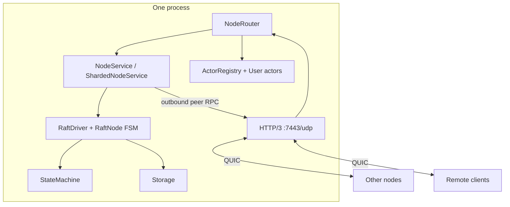
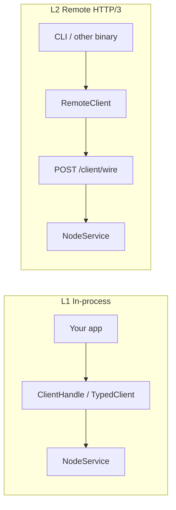

# Architecture overview

Multi-node **Raft** cluster in Rust: **pure `RaftNode` FSM** in `trembita-core`, I/O at the edges (network, storage, client). Consensus and actors run on **tokio** tasks in `trembita-actor` (one `RaftDriver` per Raft group on a physical node).

> Decision records in [decisions/](decisions/) are authoritative for design detail. Current capability list: [status.md](status.md).

## Stack

| Concern | Choice | Decision |
|---------|--------|----------|
| State machine | Generic trait + macros | [state-machine](decisions/state-machine.md) |
| Wire transport | HTTP/3 + QUIC | [wire-protocol](decisions/wire-protocol.md) |
| Serialization | postcard + serde (optional JSON wire for dev) | [wire-protocol](decisions/wire-protocol.md) |
| Client API | In-process + HTTP/3 remote | [client-and-routing](decisions/client-and-routing.md) |
| Deployment | Library-first; one app, N VPS processes | [deployment-model](decisions/deployment-model.md) |
| Elasticity | Incremental join + supervisor reconcile | [cluster-elasticity](decisions/cluster-elasticity.md) |
| Cross-node actors | Messaging, spawn, scale, migration | [cross-node-actors](decisions/cross-node-actors.md) |
| Worker placement | 1 worker / VPS; auto-spawn on join | [cluster-elasticity](decisions/cluster-elasticity.md) |
| Discovery | Seed set + DNS + joint-consensus join | [cluster-membership](decisions/cluster-membership.md) |
| Client routing | Transparent forward to leader | [client-and-routing](decisions/client-and-routing.md) |
| Keyed routing | Shard → group → leader (multi-Raft) | [multi-raft](decisions/multi-raft.md) |
| Read consistency | ReadIndex / lease / follower reads | [client-and-routing](decisions/client-and-routing.md) |
| Actor runtime | tokio tasks + supervision | [cross-node-actors](decisions/cross-node-actors.md) |
| Job backlog | `JobQueue` port; default `redb`; leader `QueueService` + autoscale | [job-queue](decisions/job-queue.md) |
| External backlog | `ExternalBacklog` port; optional [`trembita-backlog-postgres`](../crates/trembita-backlog-postgres/) | [external-backlog](decisions/external-backlog.md) |
| Event topics | `EventTopic` port; default `redb`; leader `TopicService` + voter replication | [event-topics](decisions/event-topics.md) |
| Workload fairness | `ComputeTokenPool` + `WorkloadGovernor` on each node | [workload-governor](decisions/workload-governor.md) |
| Persistence | redb (per-group files in multi-Raft) | — |
| TLS | mTLS peers + mTLS client wire | [security](decisions/security.md) |
| Observability | metrics, telemetry, dashboard | [observability](decisions/observability.md) |

## Crate layout

```
crates/
├── trembita/              # facade — primary user dependency (TrembitaApp, TrembitaCluster)
├── trembita-proto/        # IDs, log, wire types, encode/decode
├── trembita-core/         # pure Raft FSM + shard planners + reference `kv` StateMachine
├── trembita-storage/      # LogStore, HardState, Snapshot (+ redb)
├── trembita-net/          # HTTP/3 server, QUIC transport, PeerDirectory
├── trembita-runtime/      # RaftDriver, NodeService, actors, supervisor, multi-Raft
├── trembita-jobs/         # JobQueue port, redb adapter, QueueService
├── trembita-events/       # EventTopic port, redb adapter, TopicService
├── trembita-actor-store/  # ActorStateStore port, redb adapter, StoreService
├── trembita-client/       # ClientHandle, RemoteClient, saga, keyed/batch APIs
├── trembita-macros/       # StateMachine + UserActor derives
├── trembita-tools/        # reference binaries (node, ops, e2e clients)
├── trembita-sim/          # deterministic sim harness + linearizability checker
├── trembita-store-redis/  # optional ActorStateStore (Redis)
├── trembita-backlog-postgres/  # optional ExternalBacklog (Postgres SKIP LOCKED)
├── trembita-dashboard/    # admin HTTP + observability views
├── trembita-http/         # product HTTP gateway routes
└── trembita-test-support/ # shared test harness helpers

examples/                # product showcases (standalone Cargo.toml each; not workspace members)
dev/                     # certs, cluster-common.sh, compose/, 3-node trembita-node demo
```

Reference KV state machine: [`trembita_core::kv`](../crates/trembita-core/src/kv.rs) (re-exported as `trembita::kv`).

See [naming](decisions/naming.md) and [examples/README.md](../examples/README.md).

## Node internals (single-Raft; multi-Raft stacks N drivers)



One QUIC listener per node. Paths separate peer consensus, client wire, cluster control, and actor traffic. Multi-Raft adds one `RaftDriver` per hosted group behind `ShardedNodeService`.

## Client API layers



Keyed writes in multi-Raft clusters: `ProposeKeyed` / `QueryKeyed` → shard router → group driver.

## Data flows

### Write (single group)

1. Client sends `ClientRequest::Propose` to any node (L1 or L2).
2. Follower **forwards** to the leader ([client-and-routing](decisions/client-and-routing.md)).
3. Leader appends, persists, replicates via `AppendEntries` on `/peer/wire`.
4. Majority match → commit → `StateMachine::apply` → response.

### Write (multi-Raft keyed)

1. `ProposeKeyed { key, … }` → `ShardedNodeService` resolves key → shard → group.
2. Same per-group Raft path as above on the target group's leader.

### Cross-shard saga

1. `run_saga` / `run_keyed_saga` executes ordered steps via keyed client.
2. Journal persisted (`StoreSagaJournal`, `Group0SagaJournal`, or composite).
3. On failure, compensators run in reverse; `resume_saga` continues after restart.

See [multi-raft](decisions/multi-raft.md#cross-shard-transactions).

### Read

1. `ClientRequest::Query` → leader ReadIndex or lease fast path (or follower ReadIndex confirm).
2. Apply barrier → `StateMachine::query`.
3. Actor `ask` is **not** linearizable — use `query` for SM data ([client-and-routing](decisions/client-and-routing.md)).

### Election

Follower timeout → Candidate → `RequestVote` over HTTP/3 → Leader → heartbeats as `AppendEntries`.

## Multi-Raft control plane

```
Leader (group 0)
  → catalog add / join / leave / group migrate RPCs
  → RaftGroupReconciler plans group hosting (rendezvous)
  → per-group membership sync (group_voters)
  → facts refresher → supervisor reconcile (reachable_nodes)
```

Details: [multi-raft](decisions/multi-raft.md).

## Related

- [status.md](status.md) — shipped vs deferred
- [protocol.md](protocol.md) — route table
- [testing-coverage.md](testing-coverage.md) — test inventory
