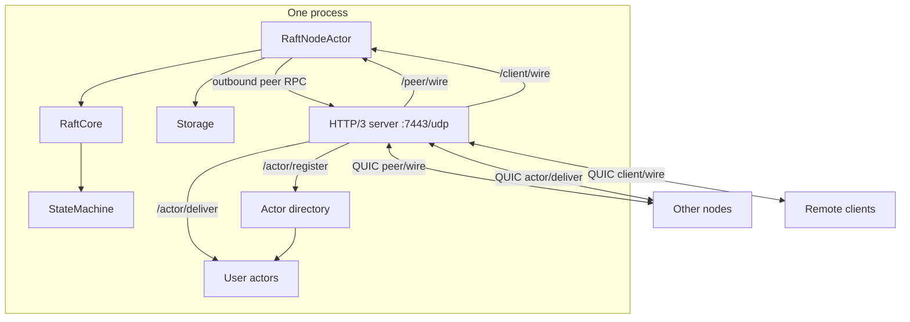
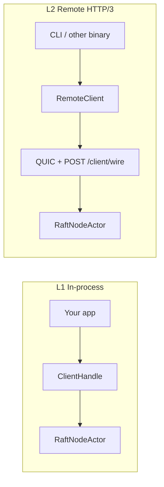

# Architecture overview

Multi-node **Raft** cluster in Rust: **one `ractor` actor per peer**, **pure `RaftCore` FSM**, I/O at the edges (network, storage, client).

> Decision records in [decisions/](decisions/) override details here as they are accepted.

## Stack (current decisions)

| Concern | Choice | ADR |
|---------|--------|-----|
| State machine | Generic trait + macros | [001](decisions/001-state-machine.md) |
| Wire transport | **HTTP/3 + QUIC** (all network I/O) | [010](decisions/010-wire-transport.md) |
| Serialization | **postcard** + serde | [011](decisions/011-serialization.md) |
| Client API | L1 `ractor`; L2 HTTP/3 remote | [002](decisions/002-client-api.md) |
| ~~gRPC/tonic~~ | Rejected | [002](decisions/002-client-api.md) |
| ~~Framed TCP~~ | Rejected | [010](decisions/010-wire-transport.md) |
| Deployment | Library-first framework; one app, N VPS processes | [004](decisions/004-deployment-model.md) |
| Elasticity | Incremental join + local/runtime actor scale | [012](decisions/012-elastic-cluster.md) |
| Cross-node actors | Messaging, spawn_remote, scale_cluster, migration | [013](decisions/013-cross-node-actors.md) |
| Worker placement | **1 worker / VPS**; auto-spawn on join | [014](decisions/014-one-worker-per-vps.md), [015](decisions/015-auto-spawn-on-join.md) |
| Discovery | `JOIN_ADDR` + **joint-consensus membership** (v1) | [007](decisions/007-discovery.md), [016](decisions/016-membership-early.md) |
| Client routing | Transparent forward (any node) | [003](decisions/003-client-routing.md) |
| Read consistency | ReadIndex linearizable `query` | [005](decisions/005-read-consistency.md) |
| Actor runtime | `ractor` + `tokio` | — |
| Persistence | `redb` | — |
| Naming | **`craft`** facade + `craft-*` crates | [009](decisions/009-naming.md) |
| TLS | mTLS peers + **mTLS client wire**; in-process exempt | [006](decisions/006-security.md) |
| Observability | metrics, telemetry, introspection, dashboard | [026](decisions/026-observability.md) |

## Crate layout

```
crates/
├── craft/           # facade — primary user dependency
├── craft-proto/     # IDs, log, peer + client wire types
├── craft-core/      # Pure Raft FSM (input/output effects)
├── craft-storage/   # LogStore, HardState, Snapshot (+ redb)
├── craft-net/       # HTTP/3 server, QUIC peer pool, router
├── craft-actor/     # CraftNodeActor, ActorRegistry, directory, migration
├── craft-client/    # ClientHandle, RemoteClient, TypedClient
├── craft-macros/    # State machine + UserActor derives
├── craft-node/      # Reference binary
├── craft-sim/       # In-memory Transport for partition tests
├── craft-store-redis/  # optional: ActorStateStore Redis impl (ADR 021)
└── craft-dashboard/    # optional: live monitoring UI (ADR 026)
```

See [ADR 009](decisions/009-naming.md).

## Node internals



One **QUIC listener** per node. Raft replication and client requests share the HTTP/3 stack; paths separate peer vs client auth.

## Client API layers



## Data flows

### Write

1. Client sends `ClientRequest::Propose` to **any** node (L1 or L2).
2. If receiver is a follower, it **forwards** to the leader ([ADR 003](decisions/003-client-routing.md)).
3. Leader appends to log, persists, replicates via `AppendEntries` over **`POST /peer/wire`**.
4. Majority match → commit → `StateMachine::apply`.
5. `ClientResponse::Ok` returned to caller (directly or proxied).

### Election

Follower election timeout → Candidate → `RequestVote` over HTTP/3 → majority → Leader → heartbeats as `AppendEntries` on `/peer/wire`.

### Read

1. Client sends `ClientRequest::Query` to any node (forwarded to leader if needed).
2. Leader runs **ReadIndex** (quorum ack + apply barrier) → `StateMachine::query`.
3. `ClientResponse::Ok` returned. Actor `ask` is not linearizable — see [ADR 005](decisions/005-read-consistency.md).

## Decisions complete; implementation topics

Strategic ADRs **001–019** are accepted. Optional medium topics in [open-questions.md](open-questions.md).

## Implementation phases

1. Workspace scaffold  
2. `craft-proto` + `craft-core` — election, replication, **joint-consensus membership** ([ADR 016](decisions/016-membership-early.md))  
3. `craft-storage`  
4. `craft-net` — HTTP/3, **`/cluster/join`**, peer pool  
5. `craft-actor` + `craft` facade + auto-spawn supervisor ([ADR 015](decisions/015-auto-spawn-on-join.md))  
6. `craft-client` + snapshots + `craft-macros`  
7. `craft-sim` — membership, partition, join/leave tests
