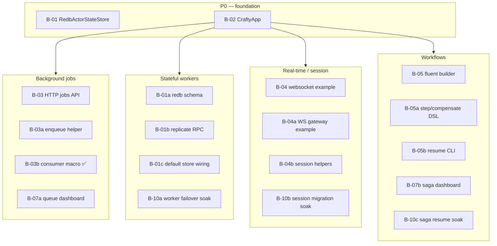

# Backlog

Product and implementation backlog for crafty **0.4.x → 1.0**. Shipped capabilities stay in [status.md](status.md); design rationale in [decisions/](decisions/).

**Product vision:** [decisions/product-scenarios.md](decisions/product-scenarios.md) — four scenarios, **no mandatory Redis**.

**Scenario guides:** [scenarios/](scenarios/README.md)

---

## Summary

| Priority     | Count | Items                           |
| ------------ | ----- | ------------------------------- |
| **P0**       | 2     | B-01 ✅, B-02 ✅                  |
| **P1**       | 4     | B-03 ✅ … B-06 ✅                 |
| **P2**       | 3     | B-07 ✅ … B-09 ✅                 |
| **P3**       | 3     | B-10 ✅ … B-12 ✅                 |
| **Optional** | 4     | O-01 … O-04                     |
| **Subtasks** | 28    | B-01a … B-12c (see epics below) |

---

## Priority legend

| Priority | Meaning                                                     |
| -------- | ----------------------------------------------------------- |
| **P0**   | Blocks “product team out of the box” for a shipped scenario |
| **P1**   | Strong DX improvement; should land in 0.2.x–0.3.x           |
| **P2**   | Polish, docs, observability                                 |
| **P3**   | 1.0 stabilization / aspirational                            |

| Status | Meaning                                                     |
| ------ | ----------------------------------------------------------- |
| 🔲     | Not started                                                 |
| 🚧     | In progress                                                 |
| ✅      | Shipped (move note to [status.md](status.md) when released) |

---

## Epic map (four scenarios)

---

## P0 — Core product gaps (Redis-free)

### B-01 ✅ `RedbActorStateStore` + voter replication

**Shipped:** 2026-08-28 — `RedbActorStateStore`, `StoreService`, `ClusterActorStateStore`, wire routes, builder auto-wire.

| Subtask       | Status |
| ------------- | ------ |
| B-01a … B-01f | ✅      |

**Acceptance:** `crafty/tests/store.rs`, `crafty-actor/src/redb_store.rs` tests.

---

### B-02 ✅ `CraftyApp` product facade

**Shipped:** 2026-08-28 — `CraftyApp`, `CraftyAppBuilder`, `env_config`, [getting-started.md](getting-started.md).

| Subtask       | Status                    |
| ------------- | ------------------------- |
| B-02a … B-02h | ✅ (B-02h getting-started) |

**Acceptance:** `crafty/tests/app.rs`, docs/getting-started.md.

---

## P1 — Scenario polish

### B-03 ✅ Background jobs — HTTP + DX

**Shipped:** 2026-08-28 — `crafty-http`, `http-jobs` feature, `crafty/tests/http_jobs.rs`. **2026-08-29** — `#[crafty::consumer]`, `CraftyApp::spawn_consumer`, DLQ requeue HTTP + `CraftyApp` parity.

| Subtask | Description                                                                 | Status                        |
| ------- | --------------------------------------------------------------------------- | ----------------------------- |
| B-03a   | Axum route `POST /jobs/{stream}` → `202` + `{ "job_id": … }`; raw or JSON envelope body | ✅ `crafty-http`               |
| B-03b   | `#[crafty::consumer("stream")]` + `CraftyApp::spawn_consumer` (no manual `run_queue_consumer` + `tokio::spawn`) | ✅ `crafty-macros`, `crafty/tests/consumer.rs` |
| B-03c   | Optional `GET /jobs/{stream}/{id}` if queue metadata extended               | ✅ `JobQueue::job_status` + HTTP GET |
| B-03d   | Optional `crafty/http-jobs` feature or `crafty-http` crate (decide in impl) | ✅ `crafty-http` + feature     |
| B-03e   | Integration test: HTTP enqueue → worker ack                                 | ✅ `crafty/tests/http_jobs.rs` |
| B-03f   | `CraftyApp` parity: batch enqueue/ack, `requeue_dead_letter`, `recurring_job` builder; HTTP `POST /jobs/{stream}/{id}/requeue` | ✅ `CraftyApp`, `crafty-http` |

---

### B-04 ✅ Real-time — WebSocket gateway

**Shipped:** 2026-08-28 — [`examples/realtime/`](../../examples/realtime/).

| Subtask | Description                                                     | Status |
| ------- | --------------------------------------------------------------- | ------ |
| B-04a   | [`examples/realtime/`](../../examples/realtime/) — axum WS + `ChatWorker` | ✅      |
| B-04b   | Homogeneous cluster showcases (same binary every node; `CRAFTY_ROLE=gateway` for edge-only) | ✅      |
| B-04c   | Auth stub + `ActorSession` open on connect                      | ✅ `GATEWAY_TOKEN` |
| B-04d   | Reconnect: handle `NoTarget`, session TTL expiry                | ✅ auto reopen in example |
| B-04e   | Optional: checkpoint last N messages to SM (comment in example) | ✅ comment on `ChatWorker` |
| B-04f   | Product HTTP `POST /actors/{group}/ask` + `/cast` on gateway (`ActorsApi`) | ✅ `crafty-http`, `CraftyApp::actors_api` |

---

### B-05 ✅ Workflows — fluent builder

**Shipped:** 2026-08-28 — `WorkflowBuilder`, `CraftyApp::run_workflow` / `resume_workflow`.

| Subtask | Description                                                                 | Status           |
| ------- | --------------------------------------------------------------------------- | ---------------- |
| B-05a   | `WorkflowBuilder` — named `.step(id, fn)`, `.compensate(id, fn)`            | ✅                |
| B-05b   | Builds `SagaPlan`; runs via `run_saga` / `CompositeSagaJournal`             | ✅                |
| B-05c   | `CraftyApp::workflow(name, builder_fn)` registration                        | ✅ `run_workflow` |
| B-05d   | Example: [`examples/workflows/`](../../examples/workflows/) — saga + enqueue + propose steps | ✅                |
| B-05e   | `crafty workflow resume <id>` CLI stub (optional, via `crafty-node` or ops) | ✅ `scripts/crafty-workflow.sh` |

---

### B-06 ✅ `crafty init` project template

**Shipped:** 2026-08-28 — `scripts/crafty-init.sh`, `templates/crafty-app/`.

| Subtask | Description                                                         | Status     |
| ------- | ------------------------------------------------------------------- | ---------- |
| B-06a   | `scripts/crafty-init.sh` or cargo-template: main + one worker       | ✅          |
| B-06b   | Generated: job stream stub + optional saga stub                     | ✅ template |
| B-06c   | `docker-compose.yml` 3-node local (dev-certs)                       | ✅          |
| B-06d   | Zero `redis://`; README points to [scenarios/](scenarios/README.md) | ✅          |

---

## P2 — Docs & observability

### B-07 ✅ Dashboard — queue + workflows

**Shipped:** 2026-08-28 — `/introspect/queues`, `/introspect/sagas`, dashboard panels, Prometheus gauges.

| Subtask | Description                                                                | Status |
| ------- | -------------------------------------------------------------------------- | ------ |
| B-07a   | Admin HTML: per-stream queue depth, active leases                          | ✅      |
| B-07b   | Admin HTML: saga records (running / done / failed) from journal or metrics | ✅      |
| B-07c   | Wire existing `crafty_saga_*` / queue metrics to dashboard views           | ✅      |

---

### B-08 ✅ De-emphasize Redis in docs & examples

**Scenario:** all

| Subtask | Description                                                                                                      | Status |
| ------- | ---------------------------------------------------------------------------------------------------------------- | ------ |
| B-08a   | Product scenario ADR + four scenario guides                                                                      | ✅      |
| B-08b   | [actor-state-redis](decisions/actor-state-redis.md) banner → [actor-state-store](decisions/actor-state-store.md) | ✅      |
| B-08c   | [status.md](status.md), [README.md](README.md), [AGENTS.md](../AGENTS.md) links                                  | ✅      |
| B-08d   | Product showcases document redb prod path (`examples/stateful-workers`, …) | ✅      |
| B-08e   | `docs/getting-started.md` — full tutorial, no Redis                                                              | ✅      |
| B-08f   | README root: link scenarios + positioning paragraph                                                              | ✅      |

---

### B-09 ✅ Production runbook bundle

**Shipped:** 2026-08-28 — [ops/production-runbook.md](ops/production-runbook.md).

| Subtask | Description                                                                                                           | Status |
| ------- | --------------------------------------------------------------------------------------------------------------------- | ------ |
| B-09a   | `docs/ops/production-runbook.md` — scale VPS, seeds, firewall UDP 7443                                                | ✅      |
| B-09b   | Merge pointers: [backup-restore](ops/backup-restore.md), [rolling-upgrade](ops/rolling-upgrade.md), [certs](certs.md) | ✅      |
| B-09c   | Multi-Raft rebalance pointer (when to add groups)                                                                     | ✅      |
| B-09d   | Link from [scenarios/README](scenarios/README.md)                                                                     | ✅      |

---

## P3 — 1.0 stabilization

### B-10 ✅ Soak / chaos per scenario

**Shipped:** 2026-08-28 — `benchmarks/src/bin/soak_{actor_store,saga,session}.rs`, scheduled CI.

| Subtask | Description                                                       | Status                                |
| ------- | ----------------------------------------------------------------- | ------------------------------------- |
| B-10a   | Soak: stateful worker + `RedbActorStateStore` failover loop       | ✅ `soak_actor_store`                  |
| B-10b   | Soak: WebSocket session + worker kill → reconnect path            | ✅ `soak_session` (in-process session) |
| B-10c   | Soak: saga mid-flight + leader kill → `resume_saga`               | ✅ `soak_saga`                         |
| B-10d   | Soak: job queue (extend existing `soak_queue`) — document CI lane | ✅ `.gitlab-ci.yml` `bench` job        |

---

### B-11 ✅ API freeze + semver

**Shipped:** 2026-08-28 — ADRs + CHANGELOG policy.

| Subtask | Description                                       | Status                                                                        |
| ------- | ------------------------------------------------- | ----------------------------------------------------------------------------- |
| B-11a   | Public API audit (`CraftyApp`, facade re-exports) | ✅ [public-api-1.0.md](decisions/public-api-1.0.md)                            |
| B-11b   | `missing_docs = deny` on published crates         | ✅ shipped 2026-08-29 |
| B-11c   | CHANGELOG policy for 1.0 breaking changes         | ✅ [CHANGELOG.md](../CHANGELOG.md)                                             |

---

### B-12 ✅ Jepsen / Antithesis (aspirational)

**Shipped:** 2026-08-28 — evaluation + go/no-go ([jepsen-1.0.md](decisions/jepsen-1.0.md)).

| Subtask | Description                                                                     | Status |
| ------- | ------------------------------------------------------------------------------- | ------ |
| B-12a   | Evaluate Jepsen harness scope (Raft + queue + saga)                             | ✅      |
| B-12b   | Document go/no-go criteria in [testing-strategy](decisions/testing-strategy.md) | ✅      |

---

## Optional integrations (explicitly not P0)

| Id   | Item                             | Notes                                                                |
| ---- | -------------------------------- | -------------------------------------------------------------------- |
| O-01 | `crafty-store-redis` maintenance | Keep as optional adapter                                             |
| O-02 | PostgreSQL `ActorStateStore`     | Only if external integration demand                                  |
| O-03 | Redis Cluster auto-discovery     | Deferred in [actor-state-redis](decisions/actor-state-redis.md)      |
| O-04 | Kubernetes operator              | **Non-goal** per [product-scenarios](decisions/product-scenarios.md) |
| O-05 | Self-update coordinator          | ✅ [upgrade-coordinator](decisions/upgrade-coordinator.md) — `crafty_core::upgrade`, facade coordinator, `crafty-http` API, `examples/self-update` |

---

## Wave mapping (suggested releases)

| Release   | Epics / items                                           |
| --------- | ------------------------------------------------------- |
| **0.2.x** | B-01 (all subtasks), B-02 (all subtasks), B-03, B-08e–f |
| **0.3.x** | B-04, B-05, B-06, B-07, B-08d                           |
| **0.5.x** | B-09, B-10                                              |
| **1.0**   | B-11; evaluate B-12                                     |

---

## Per-scenario checklist (what “done” looks like)

### Background jobs ✅ runtime / ✅ product layer

| Done when | Item                                                        |
| --------- | ----------------------------------------------------------- |
| ✅         | `RedbJobQueue`, `ClusterJobQueue`, autoscale, E2E           |
| ✅         | B-03 HTTP `202`, B-02c jobs on `CraftyApp`, B-07a dashboard |

### Stateful workers ✅ store + migration

| Done when | Item                                                  |
| --------- | ----------------------------------------------------- |
| ✅         | Migration, supervisor, `RedbActorStateStore`, SM path |
| ✅         | B-02d `worker_groups`, `workers`, `cast`, `ask` on `CraftyApp` |
| ✅         | B-10a soak                                            |

### Real-time / session ✅ routing / ✅ gateway

| Done when | Item                                                          |
| --------- | ------------------------------------------------------------- |
| ✅         | `ActorSession`, consistent-hash, cross-node ask, B-04 example |
| ✅         | B-02g `app.session` + `cast_session`                          |
| ✅         | B-10b soak                                                    |

### Workflows ✅ journal / ✅ builder

| Done when | Item                                                             |
| --------- | ---------------------------------------------------------------- |
| ✅         | `run_saga`, Meta-Raft journal, cross-shard saga, B-05 fluent API |
| ✅         | B-05d example, B-07b dashboard, B-10c soak                       |

---

## How to update this file

1. Pick **B-NN** or **B-NNx** subtask; set 🚧 while working.
2. On release, note version in item or update [status.md](status.md).
3. New items: next id; link scenario + ADR.
4. Reference GitLab issues as `#<number>` in commits/MRs.

## Related

- [status.md](status.md) · [scenarios/README.md](scenarios/README.md) · [decisions/product-scenarios.md](decisions/product-scenarios.md)

