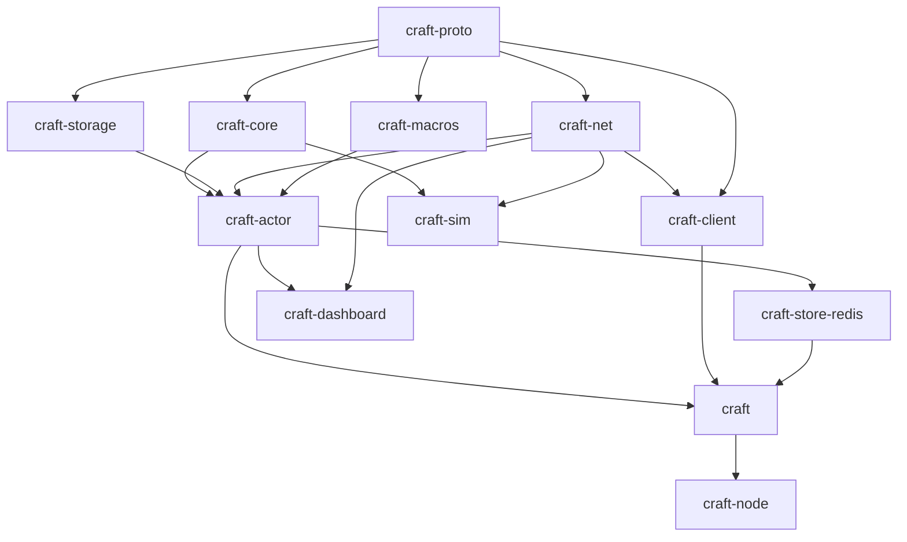

# craft — Full-featured backlog

Implementation backlog derived from ADRs 001–028. Organized by **epics**, with a **dependency graph** and **parallel tracks** so independent work can proceed simultaneously.

Legend: **[P]** parallelizable within its wave · **→** depends on · effort **S/M/L/XL**.

---

## Dependency graph (crates)

**Critical path:** `proto → core → actor → facade → node`.  
**Parallel opportunity:** once `proto` is stable, `core`, `storage`, `net`, `macros` proceed **in parallel**.

---

## Waves & parallel tracks

### Wave 0 — Foundations (mostly sequential)

| ID | Task | Effort | Deps | Status |
|----|------|--------|------|--------|
| W0.1 | Cargo workspace, `craft-*` crate stubs, compile | S | — | ✅ done |
| W0.2 | CI: fmt, clippy -D warnings, test, MSRV, (publish dry-run at release) ([ADR 028](decisions/028-library-and-publishing.md)) | M | W0.1 | ✅ done (fast + nightly lanes) |
| W0.3 | `rustfmt.toml`, `clippy.toml`, license files (MIT/Apache) | S | W0.1 | ✅ done |
| W0.4 | `craft-proto`: `NodeId/Term/LogIndex`, `LogEntry`, RPC enums, client + join + actor wire types, `postcard` codec ([ADR 011](decisions/011-serialization.md)) | L | W0.1 | ✅ done (+ roundtrip tests) |

`craft-proto` (W0.4) is the gate for all parallel tracks. **Wave 0 complete** — `cargo build/fmt/clippy -D warnings/test` all green; the parallel tracks (A/B/C/D) can now begin.

---

### Wave 1 — Parallel core tracks (after `craft-proto`)

Four **independent tracks** — different owners can work simultaneously.

#### Track A — Consensus core (`craft-core`) — critical path
| ID | Task | Effort | Status |
|----|------|--------|--------|
| A1 | Pure FSM scaffolding: effects-as-data `Output`, roles, config, deterministic RNG, `Log` | M | ✅ done |
| A2 | Leader election (randomized timeout, vote rules, up-to-date check) | L | ✅ done |
| A3 | Log replication (prevLog matching, conflict truncation, commit index, backtracking, Figure-8 term rule) | L | ✅ done |
| A4 | **Joint-consensus membership** (add/remove, C_old,new) ([ADR 016](decisions/016-membership-early.md)) | XL | **done** |
| A5 | ReadIndex linearizable reads ([ADR 005](decisions/005-read-consistency.md)) | M | **done** |
| A6 | Snapshot install + log compaction | L | **done** |
| A7 | Unit + `proptest` for safety invariants | L | ✅ done (34 core tests + sim suite) |

**Track A complete:** `craft-core` implements the full single-Raft-group FSM as a pure, I/O-free state machine (ADR 030): leader election, log replication, **joint-consensus membership (A4)**, **ReadIndex linearizable reads (A5)**, and **snapshot install + log compaction (A6)**. Elections use **Pre-Vote** (Raft thesis §9.6) so isolated/removed nodes cannot disrupt a live leader by inflating terms. The FSM is modeled with value objects — `LogId (term,index)`, `Round`, and a `Configuration` value object that owns quorum arithmetic — rather than scattered primitives. Covered by 75 unit/rule tests plus a `craft-sim` deterministic harness (Track I1–I4 partial) running liveness, grow/shrink membership (including removing the current leader), linearizable-read, snapshot catch-up, and 250 randomized fault schedules asserting election safety, commit agreement, and monotonic application.

> **Note (A6):** the log carries a snapshot boundary `(snapshot_index, snapshot_term)`; `compact(up_to, data)` discards the applied prefix, and a leader ships `InstallSnapshot` (carrying the configuration, since config entries may be compacted away) to followers whose next index falls below the boundary. A follower installs the snapshot, emits `LoadSnapshot` for the runtime to reset its state machine, and resumes replication. Chunked transfer (`offset`/`done`) is wired in the protocol but sent single-chunk for now.

> **Note (A4):** membership uses the standard two-phase joint consensus — a change appends a transitional `C_old,new` requiring majorities in *both* voter sets, then the leader appends the final `C_new`; a leader removed from `C_new` steps down once it commits. New nodes join as followers and catch up before/while being promoted.

> **Note (A5):** ReadIndex captures the leader's commit index, confirms leadership via a heartbeat `Round` acked by a quorum, and only serves the read once an entry of the current term is committed and applied through the read index. Loss of leadership fails pending reads (`ReadFailed`) so the client retries against the new leader.

#### Track B — Persistence (`craft-storage`) **[P]**
| ID | Task | Effort |
|----|------|--------|
| B1 | `LogStore`/`HardStateStore`/`SnapshotStore` traits | M |
| B2 | In-memory impl (tests) | S |
| B3 | `redb` impl + crash-recovery tests | L |
| B4 | `RaftStorageView` adapter for `craft-core` | M |

#### Track C — Transport (`craft-net`) **[P]**
| ID | Task | Effort |
|----|------|--------|
| C1 | `Transport` trait + address/peer map | M |
| C2 | QUIC/HTTP/3 server via `quinn`+`h3` ([ADR 010](decisions/010-wire-transport.md)) | L |
| C3 | rustls mTLS peers; **dedicated peer connection** ([ADR 027](decisions/027-future-work-and-risks.md) R2) | L |
| C4 | Route dispatch: `/peer/wire`, `/client/wire`, `/cluster/join`, `/actor/*` | M |
| C5 | Peer connection pool + reconnect/backoff | M |
| C6 | `postcard` framing over HTTP/3 bodies | S |

#### Track D — Macros (`craft-macros`) **[P]**
| ID | Task | Effort |
|----|------|--------|
| D1 | `StateMachine` derive (encode/decode glue) ([ADR 001](decisions/001-state-machine.md)) | M |
| D2 | `UserActor` derive (message serde bounds, migratable) | M |
| D3 | Compile-fail tests (trybuild) | S |

---

### Wave 2 — Integration (`craft-actor`) — after A, B, C, D

Depends on core + storage + net + macros. Some sub-tasks **[P]** among themselves.

| ID | Task | Effort | Notes |
|----|------|--------|-------|
| E1 | `RaftNodeActor` (ractor): mailbox → `RaftInput` → execute `RaftOutput` | XL | core of node |
| E2 | Timers: election + heartbeat | M | [P] after E1 skeleton |
| E3 | Applier loop → `StateMachine::apply` | M | [P] |
| E4 | Client handling + **transparent forward** ([ADR 003](decisions/003-client-routing.md)) | M | → E1 |
| E5 | Join handling → membership change ([ADR 017](decisions/017-join-rpc.md), [ADR 020](decisions/020-join-version-skew.md)) | L | → A4 |
| E6 | `ActorRegistry`: local spawn/spawn_pool/scale_local/stop ([ADR 012](decisions/012-elastic-cluster.md)) | L | [P] |
| E7 | Cross-node directory + `resolve`/`cluster` ([ADR 013](decisions/013-cross-node-actors.md)) | L | → C4 |
| E8 | Remote delivery `/actor/deliver`, routing RR + keyed ([ADR 019](decisions/019-cluster-routing.md)) | M | → E7 |
| E9 | `spawn_remote` / `scale_cluster` + placement ([ADR 013](decisions/013-cross-node-actors.md)) | L | → E7 |
| E10 | **ClusterSupervisor** (leader-only) reconcile ([ADR 018](decisions/018-supervisor-leader.md)) | L | → E5,E9 |
| E11 | Auto-spawn workers on join ([ADR 015](decisions/015-auto-spawn-on-join.md)) | M | → E10 |
| E12 | Migration on leave/crash + drain timeout ([ADR 022](decisions/022-drain-timeout.md)) | L | → E9 |
| E13 | 1-worker-per-VPS enforcement + dev mode ([ADR 014](decisions/014-one-worker-per-vps.md)) | S | [P] |
| E14 | Restart policies ([ADR 026](decisions/026-observability.md) §5) | M | [P] |

---

### Wave 3 — Parallel feature crates (after `craft-actor` core)

Independent tracks again.

#### Track F — Client (`craft-client`) **[P]**
| ID | Task | Effort |
|----|------|--------|
| F1 | `ClientHandle` (in-process, ractor) | M |
| F2 | `RemoteClient` (HTTP/3 + client mTLS) ([ADR 006](decisions/006-security.md)) | M |
| F3 | `TypedClient<M>` encode/decode | S |
| F4 | Retry/leader-follow ergonomics (forward already server-side) | S |

#### Track G — Redis store (`craft-store-redis`) **[P]**
| ID | Task | Effort |
|----|------|--------|
| G1 | `ActorStateStore` trait in `craft-actor` | S |
| G2 | Redis impl (`fred`/`redis`) get/set/del/CAS/TTL ([ADR 021](decisions/021-actor-state-redis.md)) | M |
| G3 | Example worker using store + idempotency | S |

#### Track H — Observability (`craft-dashboard` + admin) **[P]**
| ID | Task | Effort |
|----|------|--------|
| H1 | Admin HTTP `:8080`: `/health`, `/ready` ([ADR 025](decisions/025-health-admin-port.md)) | M |
| H2 | Prometheus `/metrics` ([ADR 026](decisions/026-observability.md)) | M |
| H3 | Telemetry event stream (`cluster.events()`) | M |
| H4 | Introspection JSON API `/introspect/*` | L |
| H5 | Live dashboard UI + SSE `/dashboard` | L |
| H6 | Opt-in message tracing | M |

#### Track I — Simulation (`craft-sim`) **[P]** (can start once core+net traits exist)
| ID | Task | Effort | Status |
|----|------|--------|--------|
| I1 | In-memory network (delay/drop/partition/isolate) | M | ✅ done |
| I2 | Virtual clock; deterministic seeded scheduler + reorder | L | ✅ done |
| I3 | Fault injectors + safety-invariant assertions (election safety, agreement, monotonic apply) | L | ✅ done |
| I4 | Scenarios: election, replication, partition, join/leave, migrate, scale_cluster | L | partial (election/replication/partition/membership done; actor migrate+scale pending) |
| I5 | Linearizability checker (`porcupine`-style) over sim histories ([ADR 029](decisions/029-testing-strategy.md)) | L | pending |

#### Track T — Testing & CI (cross-cutting) **[P]** ([ADR 029](decisions/029-testing-strategy.md))
| ID | Task | Effort | Notes |
|----|------|--------|-------|
| T1 | `cargo-nextest` wiring + fast/nightly CI lanes | S | [P] anytime |
| T2 | `proptest` harness for Raft safety invariants | M | → A1 |
| T3 | `trybuild` compile-fail suite (macros) | S | → D3 (same) |
| T4 | `craft-fuzz`: `postcard`/wire decoders (`cargo-fuzz`) | M | → W0.4 |
| T5 | Storage crash-recovery tests (kill mid-write, reopen) | M | → B3 |
| T6 | In-process integration: N nodes, loopback QUIC + mTLS | M | → C3 |
| T7 | `testcontainers-rs` Redis integration for `ActorStateStore` | M | → G2 |
| T8 | E2E `docker-compose` cluster + real mTLS certs | L | → J3 |
| T9 | Chaos injection in E2E (`pumba`/`toxiproxy`: partition, latency) | L | → T8 |
| T10 | `criterion` benches (append, apply, deliver) + soak harness | M | → E1 |

---

### Wave 4 — Facade, binary, examples, publish

| ID | Task | Effort | Deps |
|----|------|--------|------|
| J1 | `craft` facade: `CraftCluster::builder()`, re-exports | M | actor, client |
| J2 | Builder options: node_id, listen, join, allow_join, resource_profile, auto_workers, drain_timeout, admin_listen, actor_state_store | M | J1 |
| J3 | `craft-node` reference binary + CLI/env | M | J1 |
| J4 | Examples: KV store, three-node local, VPS join, Redis worker | L | J1 |
| J5 | `docs.rs` metadata, README quickstart, CHANGELOG | M | — [P] |
| J6 | `examples/certs/` script + `docs/certs.md` ([ADR 024](decisions/024-cert-provisioning.md)) | M | — [P] |
| J7 | Release tooling (`cargo release`, publish order) ([ADR 028](decisions/028-library-and-publishing.md)) | M | all |

---

## Parallelization summary

| Wave | Can run in parallel |
|------|---------------------|
| 0 | Mostly sequential (proto gates everything) |
| 1 | **Track A / B / C / D** — 4 concurrent streams |
| 2 | `craft-actor` sub-tasks partly parallel (E2/E3/E6/E13/E14 alongside E1) |
| 3 | **Track F / G / H / I** — 4 concurrent streams |
| — | **Track T (testing/CI)** spans all waves; T1 starts at W0, others follow their target task |
| 4 | J5/J6 anytime; J1–J4, J7 near the end |

**Minimum critical path:** W0.1 → W0.4 → A1→A2→A3→A4 → E1→E5→E10→E11 → J1 → J3.  
Everything else (storage, net polish, macros, client, redis, observability, sim, docs) fans out around it.

## Suggested team split (if parallel)

| Stream | Owns |
|--------|------|
| **Consensus** | Track A + E1/E5/E10/E12 + Track I |
| **Platform/net** | Track C + E7/E8/E9 + client (F) |
| **Storage/state** | Track B + Track G |
| **DX/observability** | Track D + Track H + examples/docs (J4/J5/J6) |

Testing (Track T) is **cross-cutting**: each stream writes tests for its own code; the Consensus stream owns the sim harness + linearizability checker; DX owns CI lanes + E2E/chaos infra. See [ADR 029](decisions/029-testing-strategy.md).

## Milestones

| Milestone | Contains | Demoable |
|-----------|----------|----------|
| **M1 core** | W0, Track A (A1–A3), B, C skeleton | single-node replicate (in-memory) |
| **M2 cluster** | A4, E1–E5, C full | 3-node elect + replicate + join over HTTP/3 |
| **M3 actors** | E6–E13, F, G | cross-node actors, auto-spawn, Redis state |
| **M4 ops** | H, migration E12, sim I | dashboard, metrics, partition tests |
| **M5 release** | J1–J7 | `cargo add craft`, examples, docs.rs |

## Related

- [architecture.md](architecture.md) · [README.md](README.md) (ADR index) · [open-questions.md](open-questions.md)
