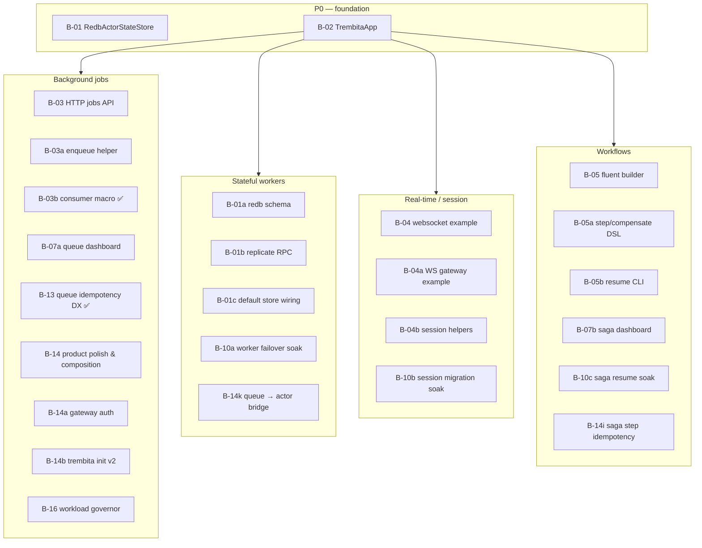

# Backlog

Product and implementation backlog for trembita. Shipped capabilities stay in [status.md](status.md); design rationale in [decisions/](decisions/).

**Product vision:** [decisions/product-scenarios.md](decisions/product-scenarios.md) — jobs, event topics, workers, sessions, workflows; **no mandatory Redis**.

**Scenario guides:** [scenarios/](scenarios/README.md)

---

## Open work

Epics **B-01 … B-18** are **shipped** (see [Shipped epics](#shipped-epics-archive) below). **B-19** and **B-20** are shipped. **B-21 … B-26** (capability DX) are shipped; follow-up is **[B-27](#b-27--capability-dx-wave-3)**. Remaining items are optional integrations and maintenance — not blockers for product scenarios.

| Id | Item | Status | Notes |
|----|------|--------|-------|
| B-20 | Recurring schedules — facade + HTTP | ✅ | [B-20](#b-20--recurring-schedules-facade--http-schedulesapi) |
| B-19 | Event outbox port | ✅ | [ADR](decisions/event-outbox.md) — `EventOutboxSource` + leader drainer |
| B-19 | Introspect API (`RouteTable`) | ✅ | [ADR](decisions/introspect-api.md) — `IntrospectApi` on default / merged gateway surfaces |
| CF-010 | `dedup_key` lifecycle docs | shipped | Rustdoc on [`EnqueueOptions::dedup_key`](../crates/trembita-jobs/src/queue/mod.rs); scenario table already in [background-jobs](scenarios/background-jobs.md) |
| CF-017 | Stale external backlog `Done` settle | shipped | `Settlement::Done { attempts }`; [`PgBacklog`](../crates/trembita-backlog-postgres/src/lib.rs) guards on `claimed` + attempts |
| O-01 | `trembita-store-redis` maintenance | ongoing | Keep as optional adapter |
| O-02 | PostgreSQL `ActorStateStore` | deferred | Only if external integration demand |
| O-03 | Optional OTLP metrics adapter (`trembita-metrics-otlp`) | ✅ | Facade `otlp-metrics`; [`init_metrics_with_otlp`](../crates/trembita-metrics-otlp/src/lib.rs) |
| O-04 | Governor finer signals (in-flight HTTP, consumer in-flight, optional `ConsumerTune::max_in_flight`) | deferred | [workload-governor § Future work](decisions/workload-governor.md#future-work) |
| O-06 | Automatic queue sharding under sustained enqueue pressure | deferred | [job-queue § Future work](decisions/job-queue.md#future-work); manual `job_queue_sharded` shipped |
| B-21 | Capability DX — ops, routes, hide product actor path | ✅ | [ADR](decisions/capability-dx.md) Accepted |
| B-22 | Greenfield wire — gateway-only product ingress | ✅ | [ADR](decisions/capability-greenfield-wire.md) Accepted |
| B-23 | Capability migration story (showcase cleanup) | ✅ | [B-23](#b-23--capability-migration-story-) |
| B-24 | Capability parity — no regression vs actors | ✅ | [B-24](#b-24--capability-parity--no-regression) |
| B-25 | Capability registration DX — `cap_handler` + register chain | ✅ | [B-25](#b-25--capability-registration-dx) |
| B-26 | Capability DX wave 2 — async handler, group macro, typed session mount | ✅ | [B-26](#b-26--capability-dx-wave-2) |
| B-27 | Capability DX wave 3 — OpCtx, queued idempotency, scaffold parity, gateway/obs | ✅ | [B-27](#b-27--capability-dx-wave-3) |

For new feature epics, use the next **B-NN** id and link the scenario + ADR.

### B-27 — Capability DX wave 3

**Priority:** P2 (P1 subtasks: B-27e, B-27i)  
**Scenario:** [capabilities](scenarios/capabilities.md), [background-jobs](scenarios/background-jobs.md), [realtime-sessions](scenarios/realtime-sessions.md)  
**ADR:** [capability-dx](decisions/capability-dx.md) — closes gaps noted after B-25/B-26 (ADR vs shipped surface, templates, queue bridge).

Post-ship review (2026-09): B-27i + cap HTTP dedup + scaffold `ping`/`onboarding` on `#[cap_handler]` shipped; `OpCtx` store/deps (B-27a–b), one-op-per-file layout, full showcase `domain/` polish remain.

| Subtask | Wave | Description | Status |
| ------- | ---- | ----------- | ------ |
| B-27a | 1 | **`OpCtx::deps`** — [`CapDeps`](../../crates/trembita/src/capability/deps.rs) + [`.cap_deps`](../../crates/trembita/src/app/builder.rs) | ✅ |
| B-27b | 1 | **`OpCtx::cap_store`** — [`CapStore`](decisions/actor-state-store.md) / [`trembita::capstore`](../../crates/trembita/src/capstore.rs) | ✅ |
| B-27c | 2 | **`OpCtx::ingress`** — [`CapIngress`](../../crates/trembita/src/capability/ingress.rs) via wire + HTTP headers | ✅ |
| B-27d | 2 | **Typed handler errors** — [`CapError::domain`](../../crates/trembita/src/capability/error.rs) + HTTP 400 mapping | ✅ |
| B-27e | 1 | **CLI templates** — [`ping.rs.tpl`](../crates/trembita-cli/templates/trembita-app/src/capabilities/ping.rs.tpl) + [`onboarding.rs.tpl`](../crates/trembita-cli/templates/trembita-app/src/capabilities/onboarding.rs.tpl) on `#[cap_handler]` + `cap_register_chain!` (finishes intent of B-25c for scaffold) | ✅ |
| B-27f | 2 | **Capability layout** — `trembita doctor` checks `capabilities/` + queued wiring | ✅ |
| B-27g | 2 | **`domain/` module** — showcases (`stateful-workers`, `realtime`) | ✅ |
| B-27h | 3 | **Multi-op manifest** — [`cap_register_chain!`](../../crates/trembita/src/lib.rs) | ✅ |
| B-27i | 1 | **Queued idempotency** — [`capability/queue`](../crates/trembita/src/capability/queue.rs) bridge honors `IdempotencyOpts` / job `dedup_key`; optional link `#[cap_handler(key = …)]` → enqueue dedup | ✅ |
| B-27j | 2 | **Manifest / doctor validate** — warn on queued routes without `queue_stream` / `default_queue_for` | ✅ |
| B-27k | 2 | **Greenfield queue story** — [getting-started §5](getting-started.md#5-product-workers) | ✅ |
| B-27l | 2 | **Gateway helpers** — [`cap_queued_wait`](../../crates/trembita/src/gateway/cap_handlers.rs), [`cap_schedule`](../../crates/trembita/src/gateway/cap_handlers.rs) | ✅ |
| B-27m | 3 | **Cap observability** — `tracing` spans at [`CapHost`](../../crates/trembita/src/capability/host.rs) dispatch | ✅ |
| B-27n | 2 | **Integration test kit** — [`boot_local_app_with_capabilities`](../../crates/trembita-test-support/src/capability.rs) | ✅ |
| B-27o | 2 | **Showcase polish** — [`realtime`](../examples/realtime/) `domain/` + `LineCount` op | ✅ |
| B-27p | 3 | **OpenAPI / JSON Schema from `CapRequest`** — deferred post-1.0 (optional) | 🔲 deferred |

**Out of scope (unchanged):** RAM `#[actor(migratable)]`, custom non-`CapWire` session bytes, linearizable inline ask — see [capability-parity](scenarios/capability-parity.md).

### B-25 — Capability registration DX

**Priority:** P2  
**ADR:** [capability-dx](decisions/capability-dx.md)

| Subtask | Description | Status |
| ------- | ----------- | ------ |
| B-25a | `#[cap_handler]` + `{handler}_register` (routes at call site, not on macro) | ✅ |
| B-25b | `cap_register_chain!` + `CapOp::key_cap` | ✅ |
| B-25c | Showcases + scaffold on register chain (no manual `CapOp::new`) | ✅ |

### B-26 — Capability DX wave 2

**Priority:** P2  
**ADR:** [capability-dx](decisions/capability-dx.md)

| Subtask | Description | Status |
| ------- | ----------- | ------ |
| B-26a | `#[cap_handler]` on `async fn` → `CapOp::for_request_async` | ✅ |
| B-26b | Group registration DSL macro (`cap_group!`) | ❌ rejected — plain `CapGroup` builder + `cap_register_chain!` |
| B-26c | Typed sticky websocket mount (`mount_sticky_websocket::<Req>`) | ✅ |
| B-26d | Queue/topic names `{group}.{op}` on `CapRequest` + group helpers | ✅ |

### B-21 — Capability DX (product API)

**Priority:** P1  
**Scenario:** all product paths — stateful workers, jobs, gateway  
**ADR:** [capability-dx](decisions/capability-dx.md) (**Accepted**)

Typed **ops** registered in `CapManifest`; **routes** (`Inline`, `Queued`, …) chosen at call site.
Apps do not implement runtime worker traits. Internal `CapHost` dispatches to `async fn run`.

| Subtask | Wave | Description | Status |
| ------- | ---- | ----------- | ------ |
| B-21a | 1 | **ADR accepted** + scenario one-pager | ✅ |
| B-21b | 1 | **`trembita::capability`** — `CapManifest`, `CapGroup`, `Route`, `OpCtx`, `CapError` | ✅ |
| B-21c | 1 | **Runtime registry + `CapHost`** — envelope dispatch, keyed inline | ✅ |
| B-21d | 1 | **Adapters** — `Inline`, `InlineFire`, `Queued` + `Via` / `CallBuilder` | ✅ |
| B-21e | 1 | **`AppManifest::capabilities`** apply + integration test | ✅ |
| B-21f | 1 | **Migrate `examples/stateful-workers`** to capability layout | ✅ |
| B-21g | 2 | `QueuedWait`, `Scheduled`, `Session` routes | ✅ |
| B-21h | 2 | Gateway `cap_fire` / `cap_invoke` / `cap_enqueue`; deprecate `WorkerOpts` in docs | ✅ |
| B-21i | 2 | `trembita init` → `capabilities/` scaffold | ✅ |
| B-21j | 3 | `Route::Event` stub; prelude exports; advanced-only `UserActor` docs | ✅ |

**Acceptance (wave 1):** two ops, one group, inline + queued on same handler type, test on `LocalNetwork`.

### B-22 — Greenfield wire (product ingress)

**Priority:** P2  
**ADR:** [capability-greenfield-wire](decisions/capability-greenfield-wire.md) (**Accepted**)

| Subtask | Description | Status |
| ------- | ----------- | ------ |
| B-22a | Default gateway / scaffold without actors HTTP API unless opted in | ✅ |
| B-22c | getting-started + scenarios: capabilities first; `UserActor` → Advanced | ✅ (scenarios + getting-started §5) |
| B-22d | Examples/scripts: primary path not `/actors/.../cast` | ✅ |
| B-22e | `Route::Event` topic ingress (`.event_ingress` + bridge) | ✅ |
| B-22f | `publish_event()` call-site egress for `Route::Event` | ✅ |

### B-23 — Capability migration story ✅

**Priority:** P3  
**ADR:** [capability-greenfield-wire](decisions/capability-greenfield-wire.md)

Shipped: orders capability idempotency; legacy `processor.rs` removed; RAM `migrate-demo` documented as advanced-only.

| Subtask | Description | Status |
| ------- | ----------- | ------ |
| B-23a | Per-op idempotency + store as default migration (not RAM snapshot) | ✅ (orders capability showcase) |
| B-23b | Rewrite `migrate-demo` on capabilities or document `UserActor` as advanced-only | ✅ (documented; RAM demo kept) |
| B-23c | Remove dead `processor.rs` from showcase | ✅ |

### B-24 — Capability parity (no regression) ✅

**Priority:** P2  
**Principle:** Same cluster power, better DX — [capability-parity](scenarios/capability-parity.md)

| Subtask | Description | Status |
| ------- | ----------- | ------ |
| B-24a | Scenario parity matrix doc | ✅ |
| B-24b | `examples/realtime` → cap `chat` + `CapWire` session cast | ✅ |
| B-24c | Workflows showcase → cap ops in saga steps | ✅ |
| B-24d | `trembita new --template realtime` cap chat (scaffold) | ✅ |

### B-18 ✅ Leader task primitive

**Priority:** P1  
**Scenario:** all — any custom leader-only reconcile (DB schedules, external systems, placement)  
**ADR:** [leader-task](decisions/leader-task.md)

`is_leader()` is a snapshot; operators and internal loops need a **session**: periodic work while holding Raft leadership, correct idle on step-down, optional one-shot on acquire.

| Subtask | Wave | Description | Status |
| ------- | ---- | ----------- | ------ |
| B-18a   | 1 | **ADR** — `LeaderSession`, `LeaderGate`, `run_leader_loop`, facade sketch | ✅ |
| B-18b   | 1 | **`LeaderSession` + `LeaderGate`** — pure transition state machine in `trembita-runtime` | ✅ |
| B-18c   | 1 | **`run_leader_loop`** — interval + `watch` stop + `run_on_acquire` | ✅ |
| B-18d   | 1 | **Facade** — `TrembitaClusterBuilder::on_leader` + task tracked in shutdown bundle | ✅ |
| B-18e   | 2 | **Migrate internal loops** — feeder, drainer, autoscalers, supervisor tick, topic bootstrap, GC/schedule wrappers | ✅ |
| B-18f   | 2 | **Tests** — unit transitions; sim failover; integration `first_in_term` (topic bootstrap) | ✅ |
| B-18g   | 2 | **Docs** — rustdoc, cross-refs in [schedule-source](decisions/schedule-source.md) / [external-backlog](decisions/external-backlog.md); [testing-coverage.md](testing-coverage.md) | ✅ |

**Acceptance:** User registers `on_leader` and body runs only on leader, stops within one facts-refresh period after step-down; `first_in_term` fires once per leadership term; internal feeder + supervisor loops use `run_leader_loop`; sim regression on A→B election.

---

### B-19 — Introspect API (`RouteTable`)

**Priority:** P1  
**Scenario:** all — custom operator UIs (session auth, multi-page apps)  
**ADR:** [introspect-api](decisions/introspect-api.md)

Introspection JSON (`/introspect/cluster`, `/actors`, `/queues`, `/sagas`, …) ships on the **unified HTTP listener** via [`OpsApi`](../crates/trembita-http/src/ops_routes.rs) ([`TrembitaApp::from_env`](../crates/trembita/src/app/runtime.rs) default surfaces, explicit gateway merges, or `trembita-node` / `spawn_cluster_ops_http`). Product `/jobs/*`, `/actors/*`, `/workflows/*` mount from app registration on the same bind unless opted out — see [env.md](env.md) and [unified-listener](decisions/unified-listener.md).

| Subtask | Wave | Description | Status |
| ------- | ---- | ----------- | ------ |
| B-19a   | 1 | **ADR** — `IntrospectApi`, routes, gateway wiring on unified `TREMBITA_LISTEN` | ✅ |
| B-19b   | 1 | **`IntrospectApi` in `trembita-http`** — [`RouteTable`](../crates/trembita-http/src/routing/table.rs) over `Arc<dyn Observer>`, `AuthFn` | ✅ |
| B-19c   | 1 | **Facade** — `TrembitaApp::introspect_api`, explicit ops/introspect route tables in `.surfaces()` | ✅ |
| B-19d   | 1 | **Re-exports** — `Observer` + view types from `trembita` / `trembita-http` for app handlers | ✅ |
| B-19e   | 2 | **Tests** — route unit tests; integration auth + JSON parity for introspect routes | ✅ |
| B-19f   | 2 | **Docs** — `trembita-http` README, [observability](decisions/observability.md) cross-link, [testing-coverage.md](testing-coverage.md) | ✅ |

**Suggested MR slices**

| MR | Subtasks | Wave | Effort |
| -- | -------- | ---- | ------ |
| **MR-1** (router + gateway) | B-19a–d | 1 | ~2 days |
| **MR-2** (tests + docs) | B-19e–f | 2 | ~1 day |

**Acceptance:** App merges `ops_api().route_table()` and product API tables in `GatewayOpts::surfaces()`; operator UI fetches `/introspect/*` and `/jobs/*` on the same HTTP bind (host-separated surfaces optional); `AuthMode::Identity` / session gates as needed. See [unified-listener](decisions/unified-listener.md).

---

### B-20 — Recurring schedules: facade + HTTP (`SchedulesApi`)

**Priority:** P1  
**Scenario:** [background-jobs](scenarios/background-jobs.md) — operator-controlled cron without a parallel schedule store  
**Consumer:** [quazala-trembita](https://gitlab.com/lemarco/quazala-trembita) — remove Postgres `job_definitions` / bespoke `/jobs/toggle` once trembita owns schedules  
**GitLab:** [work item #1](https://gitlab.com/lemarco/trembita/-/work_items/1)  
**Related:** [schedule-source](decisions/schedule-source.md) (poll port shipped); [JobsApi](../crates/trembita-http/src/routes.rs) (queue ops shipped)

**Problem:** [`ScheduleSource`](../../crates/trembita-jobs/src/schedule_source.rs) covers DB-backed reconcile, but product admin UIs that **mutate** schedules (enable, retime) still need either (a) a bespoke app HTTP layer that only writes Postgres and waits for the next poll, or (b) direct access to replicated schedule state. [`TrembitaApp`](../../crates/trembita/src/app/runtime.rs) exposes `jobs_api` for queue introspection/enqueue; there is **no symmetric surface for `RecurringJob`** — `upsert_schedule` lives on the queue service internally, not on the facade or HTTP. [schedule-source § Alternatives](decisions/schedule-source.md#alternatives-considered) rejected “HTTP schedule admin on trembita”; adoption feedback reopens that for apps mounting trembita routes behind session auth (same pattern as B-19 + B-03).

**Goal:** Operator apps can list/upsert/remove recurring schedules per stream without maintaining a second control-plane table, and without redeploy for toggle/retime.

| Subtask | Wave | Description | Status |
| ------- | ---- | ----------- | ------ |
| B-20a   | 1 | **ADR** — extend or supersede schedule-source rejection: `SchedulesApi` routes + auth; leader-forwarded mutations; relationship to `ScheduleSource` (poll remains for bulk/external sync) | ✅ |
| B-20b   | 1 | **Facade** — `TrembitaApp::list_schedules(stream)`, `upsert_schedule`, `remove_schedule(name)` — same replication path as queue schedule ops | ✅ |
| B-20c   | 1 | **`SchedulesApi` in `trembita-http`** — e.g. `GET/PUT/DELETE /jobs/{stream}/schedules[/{name}]` with JSON `RecurringJob`; `AuthFn` like `JobsApi` | ✅ |
| B-20d   | 1 | **Builder** — `TrembitaApp::schedules_api`, optional default gateway merge; `without_schedules_api()` opt-out mirroring jobs | ✅ |
| B-20e   | 2 | **Tests** — HTTP round-trip; leader failover: upsert on new leader visible after election; disabled schedule stops enqueue | ✅ (HTTP round-trip; failover in `schedule_source` tests) |
| B-20f   | 2 | **Docs** — scenario guide “runtime cron”; cross-link B-03/B-19 operator UI pattern (`/jobs/*` + `/jobs/{stream}/schedules`) | ✅ [triggers-and-pipelines](scenarios/triggers-and-pipelines.md) |

**Out of scope (app-owned):** Postgres `ScheduleSource` adapter, admin UI pages, external-backlog pause (feeder `depth` / `instances` remains app config).

**Acceptance:** From an app with session-gated gateway: list schedules for a registered stream; upsert changes cron expression or `enabled`; remove by name; change survives leader restart and is replicated to voters; pairs with existing `GET /jobs/{stream}` for in-flight/DLQ (B-03).

**Suggested MR slices**

| MR | Subtasks | Wave | Effort |
| -- | -------- | ---- | ------ |
| **MR-1** (facade + ADR) | B-20a, B-20b | 1 | ~2 days |
| **MR-2** (HTTP + gateway) | B-20c, B-20d | 1 | ~2 days |
| **MR-3** (tests + docs) | B-20e, B-20f | 2 | ~1 day |

---

### CF-010 — `dedup_key` lifecycle docs

**Status:** Shipped (`0.2.1`).

**Acceptance:** [`EnqueueOptions::dedup_key`](../crates/trembita-jobs/src/queue/mod.rs) rustdoc states the key is held while a job exists and released after ack; [background-jobs § lifecycle](scenarios/background-jobs.md#dedup_key-lifecycle) remains the scenario reference.

### CF-017 — Stale external backlog `Done` settle

**Status:** Shipped (`0.2.1`, breaking).

**Acceptance:** `Settlement::Done { attempts }` / `BacklogSettleOutcome::Done { attempts }`; ack path passes queue attempt counter; [`PgBacklog`](../crates/trembita-backlog-postgres/src/lib.rs) updates only `claimed` rows with matching `attempts`; regression test for ignored stale `Done`.

---

## Summary (shipped epics)

| Priority     | Count | Items                           |
| ------------ | ----- | ------------------------------- |
| **P0**       | 2     | B-01 ✅, B-02 ✅                  |
| **P1**       | 6     | B-03 ✅ … B-06 ✅, B-14 ✅, B-16 ✅ |
| **P2**       | 4     | B-07 ✅ … B-09 ✅, B-13 ✅        |
| **P3**       | 3     | B-10 ✅ … B-12 ✅                 |
| **Optional** | 5 open | O-01 … O-04, O-06 (O-05 self-update ✅ shipped) |
| **Subtasks** | 58 | B-01a … B-16i — all shipped (see archive) |

---

## Shipped epics (archive)

Historical record of product epics B-01 … B-16. Current capabilities: [status.md](status.md).

## Priority legend

| Priority | Meaning                                                     |
| -------- | ----------------------------------------------------------- |
| **P0**   | Blocks “product team out of the box” for a shipped scenario |
| **P1**   | Strong DX improvement; should land in 0.2.x–0.3.x           |
| **P2**   | Polish, docs, observability                                 |
| **P3**   | 1.0 stabilization / aspirational                            |

| Status | Meaning                                                     |
| ------ | ----------------------------------------------------------- |
| 🔲     | Not started                                                 |
| 🚧     | In progress                                                 |
| ✅      | Shipped (move note to [status.md](status.md) when released) |

---

## Epic map (product scenarios)

---

## P0 — Core product gaps (Redis-free)

### B-01 ✅ `RedbActorStateStore` + voter replication

**Shipped:** 2026-08-28 — `RedbActorStateStore`, `StoreService`, `ClusterActorStateStore`, wire routes, builder auto-wire.

| Subtask       | Status |
| ------------- | ------ |
| B-01a … B-01f | ✅      |

**Acceptance:** `trembita/tests/store.rs`, `trembita-actor-store/src/redb_store.rs` tests.

---

### B-02 ✅ `TrembitaApp` product facade

**Shipped:** 2026-08-28 — `TrembitaApp`, `TrembitaAppBuilder`, `env_config`, [getting-started.md](getting-started.md).

| Subtask       | Status                    |
| ------------- | ------------------------- |
| B-02a … B-02h | ✅ (B-02h getting-started) |

**Acceptance:** `trembita/tests/app.rs`, docs/getting-started.md.

---

## P1 — Scenario polish

### B-03 ✅ Background jobs — HTTP + DX

**Shipped:** 2026-08-28 — `trembita-http`, `http-jobs` feature, `trembita/tests/http_jobs.rs`. **2026-08-29** — `#[trembita::consumer]`, `TrembitaApp::spawn_consumer`, DLQ requeue HTTP + `TrembitaApp` parity.

| Subtask | Description                                                                 | Status                        |
| ------- | --------------------------------------------------------------------------- | ----------------------------- |
| B-03a   | `JobsApi` route `POST /jobs/{stream}` → `202` + `{ "job_id": … }`; raw or JSON envelope body ([`RouteTable`](../crates/trembita-http/src/routing/table.rs)) | ✅ `trembita-http`               |
| B-03b   | `#[trembita::consumer("stream")]` + `TrembitaApp::spawn_consumer` (no manual `run_queue_consumer` + `tokio::spawn`) | ✅ `trembita-macros`, `trembita/tests/consumer.rs` |
| B-03c   | Optional `GET /jobs/{stream}/{id}` if queue metadata extended               | ✅ `JobQueue::job_status` + HTTP GET |
| B-03d   | Optional `trembita/http-jobs` feature or `trembita-http` crate (decide in impl) | ✅ `trembita-http` + feature     |
| B-03e   | Integration test: HTTP enqueue → worker ack                                 | ✅ `trembita/tests/http_jobs.rs` |
| B-03f   | `TrembitaApp` parity: batch enqueue/ack, `requeue_dead_letter`, `recurring_job` builder; HTTP `POST /jobs/{stream}/{id}/requeue` | ✅ `TrembitaApp`, `trembita-http` |

---

### B-04 ✅ Real-time — WebSocket gateway

**Shipped:** 2026-08-28 — [`examples/realtime/`](../examples/realtime/).

| Subtask | Description                                                     | Status |
| ------- | --------------------------------------------------------------- | ------ |
| B-04a   | [`examples/realtime/`](../examples/realtime/) — native WS + cap `chat` | ✅      |
| B-04b   | Homogeneous cluster showcases (same binary every node; no role env) | ✅ |
| B-04c   | Auth stub + `ActorSession` open on connect                      | ✅ `GATEWAY_TOKEN` |
| B-04d   | Reconnect: handle `NoTarget`, session TTL expiry                | ✅ auto reopen in example |
| B-04e   | Optional: checkpoint last N messages to SM (comment in example) | ✅ comment on `ChatState` |
| B-04f   | Product HTTP `POST /actors/{group}/ask` + `/cast` on gateway (`ActorsApi`) | ✅ `trembita-http`, `TrembitaApp::actors_api` |

---

### B-05 ✅ Workflows — fluent builder

**Shipped:** 2026-08-28 — `WorkflowBuilder`, `TrembitaApp::run_workflow` / `resume_workflow`.

| Subtask | Description                                                                 | Status           |
| ------- | --------------------------------------------------------------------------- | ---------------- |
| B-05a   | `WorkflowBuilder` — named `.step(id, fn)`, `.compensate(id, fn)`            | ✅                |
| B-05b   | Builds `SagaPlan`; runs via `run_saga` / `CompositeSagaJournal`             | ✅                |
| B-05c   | `TrembitaApp::workflow(name, builder_fn)` registration                        | ✅ `run_workflow` |
| B-05d   | Example: [`examples/workflows/`](../examples/workflows/) — saga + enqueue + propose steps | ✅                |
| B-05e   | `trembita workflow resume <id>` CLI stub (optional, via `trembita-node` or ops) | ✅ `scripts/trembita-workflow.sh` |

---

### B-06 ✅ `trembita init` project template

**Shipped:** 2026-08-28 — `scripts/trembita-init.sh`, `crates/trembita-cli/templates/trembita-app/`.

| Subtask | Description                                                         | Status     |
| ------- | ------------------------------------------------------------------- | ---------- |
| B-06a   | `scripts/trembita-init.sh` or cargo-template: main + one worker       | ✅          |
| B-06b   | Generated: job stream stub + optional saga stub                     | ✅ template |
| B-06c   | `docker-compose.yml` 3-node local (dev-certs)                       | ✅          |
| B-06d   | Zero `redis://`; README points to [scenarios/](scenarios/README.md) | ✅          |

---

## P2 — Docs & observability

### B-07 ✅ Dashboard — queue + workflows

**Shipped:** 2026-08-28 — `/introspect/queues`, `/introspect/sagas`, dashboard panels, Prometheus gauges.

| Subtask | Description                                                                | Status |
| ------- | -------------------------------------------------------------------------- | ------ |
| B-07a   | Admin HTML: per-stream queue depth, active leases                          | ✅      |
| B-07b   | Admin HTML: saga records (running / done / failed) from journal or metrics | ✅      |
| B-07c   | Wire existing `trembita_saga_*` / queue metrics to dashboard views           | ✅      |

---

### B-08 ✅ De-emphasize Redis in docs & examples

**Scenario:** all

| Subtask | Description                                                                                                      | Status |
| ------- | ---------------------------------------------------------------------------------------------------------------- | ------ |
| B-08a   | Product scenario ADR + four scenario guides                                                                      | ✅      |
| B-08b   | [actor-state-redis](decisions/actor-state-redis.md) banner → [actor-state-store](decisions/actor-state-store.md) | ✅      |
| B-08c   | [status.md](status.md), [README.md](README.md), [AGENTS.md](../AGENTS.md) links                                  | ✅      |
| B-08d   | Product showcases document redb prod path (`examples/stateful-workers`, …) | ✅      |
| B-08e   | `docs/getting-started.md` — full tutorial, no Redis                                                              | ✅      |
| B-08f   | README root: link scenarios + positioning paragraph                                                              | ✅      |

---

### B-09 ✅ Production runbook bundle

**Shipped:** 2026-08-28 — [ops/production-runbook.md](ops/production-runbook.md).

| Subtask | Description                                                                                                           | Status |
| ------- | --------------------------------------------------------------------------------------------------------------------- | ------ |
| B-09a   | `docs/ops/production-runbook.md` — scale VPS, seeds, firewall UDP+TCP on `TREMBITA_LISTEN`                            | ✅      |
| B-09b   | Merge pointers: [backup-restore](ops/backup-restore.md), [rolling-upgrade](ops/rolling-upgrade.md), [certs](certs.md) | ✅      |
| B-09c   | Multi-Raft rebalance pointer (when to add groups)                                                                     | ✅      |
| B-09d   | Link from [scenarios/README](scenarios/README.md)                                                                     | ✅      |

---

### B-13 ✅ Job queue — delivery semantics & idempotency DX

**Scenario:** [background-jobs](scenarios/background-jobs.md)  
**ADR:** [job-queue](decisions/job-queue.md) — at-least-once is intentional; **exactly-once as a queue toggle is out of scope**.

Document the contract, show effectively-once patterns, and improve consumer ergonomics without promising false delivery guarantees.

**Non-goals:** `QueueOpts { exactly_once: true }`, auto-dedup by payload hash, unbounded processed-key table inside queue redb.

| Subtask | Description | Priority slice | Status |
| ------- | ----------- | -------------- | ------ |
| B-13a   | [background-jobs.md](scenarios/background-jobs.md): **Delivery semantics** — at-least-once vs effectively-once; table of what trembita guarantees vs what the app must do; three idempotency layers (`dedup_key` enqueue, `ActorStateStore`/SM processing, saga step keys) | MR-1 | ✅ |
| B-13b   | **Effectively-once recipe** — short guide (section or `docs/scenarios/` doc): enqueue `dedup_key` + worker CAS in store + ack after durable mark; link [stateful-workers example](../examples/stateful-workers/) and [`idempotent_worker`](../crates/trembita-store-redis/examples/idempotent_worker.rs) | MR-1 | ✅ |
| B-13c   | [job-queue.md](decisions/job-queue.md): one-line consequence — exactly-once delivery mode not planned; point to B-13 recipe | MR-1 | ✅ |
| B-13d   | `QueueOpts` / `JobOpts::default_max_attempts(u32)` — stream default when `EnqueueOptions::max_attempts` is unset (`0` = inherit stream default; explicit `0` on enqueue still means unlimited) | MR-1 | ✅ |
| B-13e   | `JobContext` in `#[consumer]` — expose `job_id`, `attempts`, optional `dedup_key` from [`LeasedJob`](../crates/trembita-jobs/src/queue/mod.rs); thread through `run_queue_consumer` → `JobConsumer` | MR-2 | ✅ |
| B-13f   | `ConsumerOpts::idempotency(...)` helper — key fn + `ActorStateStore` prefix; CAS `processing` → handler → `done` → ack (effectively-once, not a magic flag) | MR-2 | ✅ |
| B-13g   | [background-jobs example](../examples/background-jobs/): idempotent handler demo — HTTP `?dedup=` retry + simulated redelivery; `trigger.sh` like stateful-workers | MR-1 | ✅ |
| B-13h   | Cross-links: background-jobs ↔ [stateful-workers](scenarios/stateful-workers.md) ↔ [workflows](scenarios/workflows.md) (step `dedup_key`) | MR-1 | ✅ |
| B-13i   | Prometheus: `trembita_queue_redeliveries_total{stream}` + attempts histogram (optional) | later | ✅ |
| B-13j   | Dashboard / `/introspect/queues`: surface jobs with `attempts > 1` as idempotency smell | later | ✅ |
| B-13k   | **Queue token semantics** — `lease_id` monotonicity + stale-token invalidation; `dedup_key` lifecycle (ack release, dead-letter hold); external-backlog note; rustdoc on `LeaseId`; regression tests in [`queue.rs`](../crates/trembita/tests/queue.rs) | MR-1 | ✅ |

**Suggested MR slices**

| MR | Subtasks | Effort |
| -- | -------- | ------ |
| **MR-1** (minimal useful) ✅ | B-13a, B-13b, B-13c, B-13d, B-13g, B-13h | ~1–2 days |
| **MR-2** (consumer DX) ✅ | B-13e, B-13f + integration test (redelivery → side effect once) | ~2–3 days |
| **MR-3** (observability) ✅ | B-13i, B-13j | backlog |

**Acceptance:** MR-1 docs + example runnable; MR-2 `trembita/tests/` redelivery idempotency regression; no public API promising exactly-once.

---

### B-14 ✅ Product polish & cross-scenario composition

**Scenarios:** [background-jobs](scenarios/background-jobs.md), [realtime-sessions](scenarios/realtime-sessions.md), [workflows](scenarios/workflows.md), [stateful-workers](scenarios/stateful-workers.md)  
**Follows:** B-13 ✅ (delivery semantics + consumer idempotency DX)

Gateway production readiness, queue lifecycle polish, and glue between product scenarios — without new delivery guarantees or mandatory external infra.

| Subtask | Wave | Description | Status |
| ------- | ---- | ----------- | ------ |
| B-14a   | 1 | **Gateway auth hook** — [`GatewayIdentity`](../crates/trembita/src/gateway/identity.rs) / [`AuthMode::Identity`](../crates/trembita-http/src/routing/auth.rs) on product routes; document pattern; extend [`examples/realtime/`](../examples/realtime/) beyond `GATEWAY_TOKEN` query stub ([product-scenarios](decisions/product-scenarios.md)) | ✅ |
| B-14b   | 1 | **`trembita init` v2** — [`templates/trembita-app/`](../crates/trembita-cli/templates/trembita-app/): `JobOpts` + `#[consumer]` + `IdempotencyOpts::by_dedup_key` + `default_max_attempts(5)`; remove bare `TODO` stub ([B-06](backlog.md#b-06--trembita-init-project-template)) | ✅ |
| B-14c   | 1 | **E2E HTTP jobs via gateway (docker)** — `POST /jobs/{stream}/batch` through product gateway in `e2e/` (QUIC queue E2E exists; HTTP gateway path does not) | ✅ |
| B-14d   | 2 | **`IdempotencyOpts` TTL** — optional `retain_for` / `with_ttl` on done markers in `ActorStateStore`; default forever for payment-style keys; doc high-volume cleanup | ✅ |
| B-14e   | 2 | **Graceful consumer drain** — on shutdown: stop leasing, wait for in-flight handlers (timeout), then ack/nack; `RunOpts` or `ConsumerOpts` hook to avoid noisy redelivery metrics | ✅ |
| B-14f   | 2 | **Typed job payloads** — optional serde envelope for `#[consumer]` (e.g. `#[consumer_json("emails", WelcomeEmail)]` or generic `JobConsumer` payload decode); keep raw `&[u8]` as default | ✅ |
| B-14g   | 2 | **HTTP queue parity** — stream `default_max_attempts` as query/body on enqueue; expose `attempts`, `dedup_key`, redelivery hints on `GET /jobs/{stream}/{id}` where metadata exists | ✅ |
| B-14h   | 2 | **E2E idempotency + failover** — extend `./e2e/queue.sh` (or sibling): redelivery under leader kill with `IdempotencyOpts` → one side effect | ✅ |
| B-14i   | 3 | **Saga step idempotency helper** — `WorkflowBuilder` sugar wrapping enqueue + `dedup_key(step_key)` (parallel to B-13f for consumers); aligns with [workflows § Future polish](scenarios/workflows.md#future-polish) | ✅ |
| B-14j   | 3 | **State placement cheat sheet** — one doc (`docs/scenarios/state-placement.md` or scenarios README section): SM vs `JobQueue` vs `ActorStateStore` vs saga journal — when to use which | ✅ |
| B-14k   | 3 | **Queue → actor bridge** — example + doc pattern: job consumer delegates side effects via `TrembitaApp::cast` / `ask` to stateful worker group (orchestration without duplicating handler logic) | ✅ |

**Suggested MR slices**

| MR | Subtasks | Wave | Effort |
| -- | -------- | ---- | ------ |
| **MR-1** (gateway + onboarding) | B-14a, B-14b, B-14c | 1 | ~3–4 days |
| **MR-2** (queue lifecycle) | B-14d, B-14e, B-14g, B-14h | 2 | ~3–4 days |
| **MR-3** (composition) | B-14i, B-14j, B-14k | 3 | ~2–3 days |
| **MR-4** (typed jobs, optional) | B-14f | 2 | ~2 days — can ship independently |

**Acceptance:** MR-1 gateway auth documented + init template runnable; MR-2 no unbounded idempotency key growth for TTL users + clean shutdown story; MR-3 one cross-scenario doc + one bridge example.

---

### B-15 ✅ External backlog port (Postgres / existing work table)

**Scenario:** [background-jobs](scenarios/background-jobs.md)  
**ADR:** [external-backlog](decisions/external-backlog.md)

Teams with backlog in Postgres/MySQL get leader-fed queue windows, dedup on re-enqueue, settlement, and honest autoscale depth — without reimplementing the feeder loop.

| Subtask | Wave | Description | Status |
| ------- | ---- | ----------- | ------ |
| B-15a   | 1 | **`ExternalBacklog` trait** — `depth`, `claim`, `settle`; `InMemoryExternalBacklog` for tests | ✅ |
| B-15b   | 1 | **`run_backlog_feeder`** — leader-only top-up to `pending_target × consumers` | ✅ |
| B-15c   | 1 | **Settlement wiring** — ack/nack/reclaim → durable outbox → `settle` drainer | ✅ |
| B-15d   | 1 | **Autoscale depth** — `effective_queue_depth` feeds worker + membership policies | ✅ |
| B-15e   | 1 | **`JobOpts::backlog`** + `TrembitaClusterBuilder::job_queue_external_backlog` | ✅ |
| B-15f   | 2 | **`trembita-backlog-postgres`** — `PgBacklog` with `SKIP LOCKED` | ✅ |
| B-15g   | 2 | **Integration test** — `trembita/tests/external_backlog.rs` | ✅ |

**Acceptance:** In-memory backlog → consumer → `Settlement::Done { attempts }`; autoscale reads external `depth()` when registered.

---

### B-16 ✅ Workload governor (compute tokens)

**Scenario:** all four — homogeneous nodes, no static roles  
**ADR:** [workload-governor](decisions/workload-governor.md)

Every VPS runs the same binary. **Compute tokens** arbitrate gateway ingress vs job/actor work on one node: API protected when hot; spare capacity goes to jobs when ingress is quiet (e.g. overnight) — **without** cluster rescale or `TREMBITA_ROLE`.

| Subtask | Wave | Description | Status |
| ------- | ---- | ----------- | ------ |
| B-16a   | 1 | **ADR + scenario notes** — compute token model, signal/action table, deprecate roles | ✅ |
| B-16b   | 1 | **`ComputeTokenPool`** — process-wide semaphore, RAII `ComputeGuard`, configurable `max_tokens` | ✅ |
| B-16c   | 1 | **Acquire hooks** — gateway product routes + `run_queue_consumer` handler wrap + optional actor ask | ✅ |
| B-16d   | 1 | **`WorkloadGovernor`** — per-node loop: `ConnectionTracker` + queue depth → tune consumers / token ceiling | ✅ |
| B-16e   | 1 | **`WorkloadOpts`** + `TrembitaAppBuilder::workload` — presets (`Balanced`, `ApiFirst`, `JobsOpportunistic`) | ✅ |
| B-16f   | 2 | **Deprecate `TREMBITA_ROLE`** — `#[deprecated]` on `NodeRole` / env helpers; update docs & examples | ✅ |
| B-16g   | 2 | **Remove role env** — delete `TREMBITA_ROLE`, `TREMBITA_GATEWAY_ONLY`, `TREMBITA_NO_CONSUMER` (semver major) | ✅ |
| B-16h   | 2 | **Tests** — governor lowers consumer batch when connections high; boosts when idle + depth | ✅ |
| B-16i   | 3 | **Metrics** — `trembita_compute_tokens_in_use`, throttle/tune event counters | ✅ |

**Acceptance:** Single-node soak: simulated idle gateway → consumer throughput rises; simulated connection load → API p99 stable and job poll throttles. No `TREMBITA_ROLE` in docs or showcases.

---

### B-17 ✅ External compute load

**Scenario:** background jobs — subprocess-heavy handlers colocated with gateway  
**ADR:** [external-load](decisions/external-load.md)

Weighted token acquire and an optional load port so the workload governor accounts for Chromium/ffmpeg/shell-out work the cooperative pool cannot observe.

| Subtask | Wave | Description | Status |
| ------- | ---- | ----------- | ------ |
| B-17a   | 1 | **ADR** — `compute_cost`, `ExternalLoad`, governor mapping | ✅ |
| B-17b   | 1 | **`ComputeTokenPool::acquire_weighted`** + `JobOpts::compute_cost` | ✅ |
| B-17c   | 1 | **`ExternalLoad` port** + `WorkloadOpts::external_load` | ✅ |
| B-17d   | 1 | **Governor** — map external units to protective tune | ✅ |
| B-17e   | 2 | **Tests** — weighted acquire; external load triggers protection | ✅ |
| B-17f   | 2 | **Metrics** — `trembita_compute_external_load_units` | ✅ |

**Acceptance:** `compute_cost(4)` on an 8-token pool limits concurrent handlers to 2; `ManualExternalLoad` at ceiling triggers protective consumer tune with zero gateway connections.

---

## P3 — 1.0 stabilization

### B-10 ✅ Soak / chaos per scenario

**Shipped:** 2026-08-28 — `benchmarks/src/bin/soak_{actor_store,saga,session}.rs`, scheduled CI.

| Subtask | Description                                                       | Status                                |
| ------- | ----------------------------------------------------------------- | ------------------------------------- |
| B-10a   | Soak: stateful worker + `RedbActorStateStore` failover loop       | ✅ `soak_actor_store`                  |
| B-10b   | Soak: WebSocket session + worker kill → reconnect path            | ✅ `soak_session` (in-process session) |
| B-10c   | Soak: saga mid-flight + leader kill → `resume_saga`               | ✅ `soak_saga`                         |
| B-10d   | Soak: job queue (extend existing `soak_queue`) — document CI lane | ✅ `.gitlab-ci.yml` `bench` job        |

---

### B-11 ✅ API freeze + semver

**Shipped:** 2026-08-28 — ADRs + CHANGELOG policy.

| Subtask | Description                                       | Status                                                                        |
| ------- | ------------------------------------------------- | ----------------------------------------------------------------------------- |
| B-11a   | Public API audit (`TrembitaApp`, facade re-exports) | ✅ [public-api-1.0.md](decisions/public-api-1.0.md)                            |
| B-11b   | `missing_docs = deny` on published crates         | ✅ shipped 2026-08-29 |
| B-11c   | CHANGELOG policy for 1.0 breaking changes         | ✅ [CHANGELOG.md](../CHANGELOG.md)                                             |

---

### B-12 ✅ Jepsen / Antithesis (aspirational)

**Shipped:** 2026-08-28 — evaluation + go/no-go ([jepsen-1.0.md](decisions/jepsen-1.0.md)).

| Subtask | Description                                                                     | Status |
| ------- | ------------------------------------------------------------------------------- | ------ |
| B-12a   | Evaluate Jepsen harness scope (Raft + queue + saga)                             | ✅      |
| B-12b   | Document go/no-go criteria in [testing-strategy](decisions/testing-strategy.md) | ✅      |

---

## Optional integrations (explicitly not P0)

Moved to [Open work](#open-work). **O-05** (self-update coordinator) shipped — see [upgrade-coordinator](decisions/upgrade-coordinator.md).

---

## Per-scenario checklist (what “done” looks like)

### Background jobs ✅ runtime / ✅ product layer

| Done when | Item                                                        |
| --------- | ----------------------------------------------------------- |
| ✅         | `RedbJobQueue`, `ClusterJobQueue`, autoscale, E2E           |
| ✅         | B-03 HTTP `202`, B-02c jobs on `TrembitaApp`, B-07a dashboard |
| ✅         | B-13 delivery semantics docs + effectively-once recipe      |
| ✅         | B-13k queue token semantics (`lease_id`, `dedup_key` lifecycle) |
| ✅         | B-13g idempotent consumer example; B-13e/f consumer DX      |
| ✅         | B-14d/e/g/h queue lifecycle + HTTP parity + failover E2E    |
| ✅         | B-14k queue → actor orchestration example                   |

### Stateful workers ✅ store + migration

| Done when | Item                                                  |
| --------- | ----------------------------------------------------- |
| ✅         | Migration, supervisor, `RedbActorStateStore`, SM path |
| ✅         | B-02d `worker_groups`, `workers`, `cast`, `ask` on `TrembitaApp` |
| ✅         | B-10a soak                                            |
| ✅         | B-14k consumer delegates to actor group               |

### Real-time / session ✅ routing / ✅ gateway

| Done when | Item                                                          |
| --------- | ------------------------------------------------------------- |
| ✅         | `ActorSession`, consistent-hash, cross-node ask, B-04 example |
| ✅         | B-02g `app.session` + `cast_session`                          |
| ✅         | B-10b soak                                                    |
| ✅         | B-14a gateway auth beyond `GATEWAY_TOKEN` stub                |

### Workflows ✅ journal / ✅ builder

| Done when | Item                                                             |
| --------- | ---------------------------------------------------------------- |
| ✅         | `run_saga`, Meta-Raft journal, cross-shard saga, B-05 fluent API |
| ✅         | B-05d example, B-07b dashboard, B-10c soak                       |
| ✅         | B-14i saga step idempotency helper                             |
| ✅         | B-14j state placement cheat sheet (cross-scenario)               |

### Event topics ✅ runtime

| Done when | Item                                                        |
| --------- | ----------------------------------------------------------- |
| ✅         | `EventTopic`, `RedbEventTopic`, voter replication, compaction |
| ✅         | `TopicOpts`, `.topics()`, `TrembitaApp::publish`, subscription consumers |
| ✅         | ADR + [event-topics.md](scenarios/event-topics.md) scenario guide |
| ✅         | `topic_failover` integration test                           |

---

## How to update this file

1. Pick **B-NN** or **B-NNx** subtask; set 🚧 while working.
2. On release, note version in item or update [status.md](status.md).
3. New items: next id; link scenario + ADR.
4. Reference GitLab issues as `#<number>` in commits/MRs.

## Related

- [status.md](status.md) · [scenarios/README.md](scenarios/README.md) · [decisions/product-scenarios.md](decisions/product-scenarios.md)

