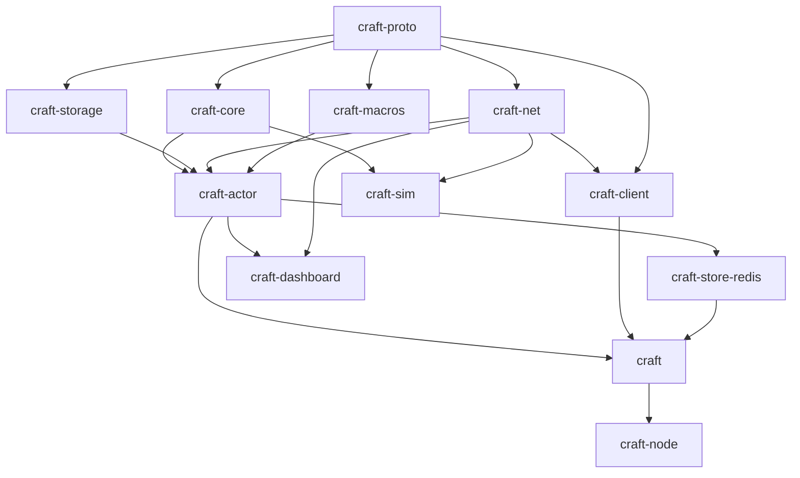

# craft — Full-featured backlog

Implementation backlog derived from ADRs 001–028. Organized by **epics**, with a **dependency graph** and **parallel tracks** so independent work can proceed simultaneously.

Legend: **[P]** parallelizable within its wave · **→** depends on · effort **S/M/L/XL**.

---

## Dependency graph (crates)

**Critical path:** `proto → core → actor → facade → node`.  
**Parallel opportunity:** once `proto` is stable, `core`, `storage`, `net`, `macros` proceed **in parallel**.

---

## Waves & parallel tracks

### Wave 0 — Foundations (mostly sequential)

| ID | Task | Effort | Deps | Status |
|----|------|--------|------|--------|
| W0.1 | Cargo workspace, `craft-*` crate stubs, compile | S | — | ✅ done |
| W0.2 | CI: fmt, clippy -D warnings, test, MSRV, (publish dry-run at release) ([ADR 028](decisions/028-library-and-publishing.md)) | M | W0.1 | ✅ done (fast + nightly lanes) |
| W0.3 | `rustfmt.toml`, `clippy.toml`, license files (MIT/Apache) | S | W0.1 | ✅ done |
| W0.4 | `craft-proto`: `NodeId/Term/LogIndex`, `LogEntry`, RPC enums, client + join + actor wire types, `postcard` codec ([ADR 011](decisions/011-serialization.md)) | L | W0.1 | ✅ done (+ roundtrip tests) |

`craft-proto` (W0.4) is the gate for all parallel tracks. **Wave 0 complete** — `cargo build/fmt/clippy -D warnings/test` all green; the parallel tracks (A/B/C/D) can now begin.

---

### Wave 1 — Parallel core tracks (after `craft-proto`)

Four **independent tracks** — different owners can work simultaneously.

#### Track A — Consensus core (`craft-core`) — critical path
| ID | Task | Effort | Status |
|----|------|--------|--------|
| A1 | Pure FSM scaffolding: effects-as-data `Output`, roles, config, deterministic RNG, `Log` | M | ✅ done |
| A2 | Leader election (randomized timeout, vote rules, up-to-date check) | L | ✅ done |
| A3 | Log replication (prevLog matching, conflict truncation, commit index, backtracking, Figure-8 term rule) | L | ✅ done |
| A4 | **Joint-consensus membership** (add/remove, C_old,new) ([ADR 016](decisions/016-membership-early.md)) | XL | **done** |
| A5 | ReadIndex linearizable reads ([ADR 005](decisions/005-read-consistency.md)) | M | **done** |
| A6 | Snapshot install + log compaction | L | **done** |
| A7 | Unit + `proptest` for safety invariants | L | ✅ done (34 core tests + sim suite) |

**Track A complete:** `craft-core` implements the full single-Raft-group FSM as a pure, I/O-free state machine (ADR 030): leader election, log replication, **joint-consensus membership (A4)**, **ReadIndex linearizable reads (A5)**, and **snapshot install + log compaction (A6)**. Elections use **Pre-Vote** (Raft thesis §9.6) so isolated/removed nodes cannot disrupt a live leader by inflating terms. The FSM is modeled with value objects — `LogId (term,index)`, `Round`, and a `Configuration` value object that owns quorum arithmetic — rather than scattered primitives. Covered by 75 unit/rule tests plus a `craft-sim` deterministic harness (Track I1–I4 partial) running liveness, grow/shrink membership (including removing the current leader), linearizable-read, snapshot catch-up, and 250 randomized fault schedules asserting election safety, commit agreement, and monotonic application.

> **Note (A6):** the log carries a snapshot boundary `(snapshot_index, snapshot_term)`; `compact(up_to, data)` discards the applied prefix, and a leader ships `InstallSnapshot` (carrying the configuration, since config entries may be compacted away) to followers whose next index falls below the boundary. A follower installs the snapshot, emits `LoadSnapshot` for the runtime to reset its state machine, and resumes replication. Chunked transfer (`offset`/`done`) is wired in the protocol but sent single-chunk for now.

> **Note (A4):** membership uses the standard two-phase joint consensus — a change appends a transitional `C_old,new` requiring majorities in *both* voter sets, then the leader appends the final `C_new`; a leader removed from `C_new` steps down once it commits. New nodes join as followers and catch up before/while being promoted.

> **Note (A5):** ReadIndex captures the leader's commit index, confirms leadership via a heartbeat `Round` acked by a quorum, and only serves the read once an entry of the current term is committed and applied through the read index. Loss of leadership fails pending reads (`ReadFailed`) so the client retries against the new leader.

#### Track B — Persistence (`craft-storage`) **[P]**
| ID | Task | Effort | Status |
|----|------|--------|--------|
| B1 | `LogStore`/`HardStateStore`/`SnapshotStore` traits | M | **done** |
| B2 | In-memory impl (tests) | S | **done** |
| B3 | `redb` impl + crash-recovery tests | L | **done** |
| B4 | Storage integration into the driver + restart recovery | M | **done** |

> **Track B progress (B1–B3):** `craft-storage` defines three storage ports — `HardStateStore` (term + vote), `LogStore` (append-only with suffix-truncate and prefix-purge), and `SnapshotStore` — plus value types `HardState`, `SnapshotMeta`, and `Snapshot`. Two adapters implement them: an in-memory `MemoryStorage` test double and a crash-safe `RedbStorage` backed by a single `redb` file (log entries keyed by index + a metadata table for hard state, snapshot, and the purge boundary, each write committed in its own transaction). A single store-contract test suite runs against **both** backends (so the simulator's in-memory double provably matches production), and a dedicated test reopens a `redb` file across "process lifetimes" to prove hard-state, compaction, and snapshot durability. `redb` is pinned to `2.x` to hold the workspace MSRV at 1.85 (ADR 028).

> **B4 done — durability & restart recovery.** The core (`RaftNode`) now tracks a durability watermark and exposes `take_persist() -> Option<Persist>`: the exact hard-state (`term`/`voted_for`) and log delta (`truncate_from` + appended entries) accumulated since the previous call, produced by routing every log mutation through instrumented helpers. `RaftDriver` owns a `Box<dyn RaftStorage>` (the new `craft-storage::RaftStorage` supertrait bundling all three ports) and persists this delta **synchronously at the top of `drain`, before surfacing any effect** — so a follower never ack's an unflushed entry and a node never reveals an unrecorded vote (Raft §5.1–§5.3), and because a commit is reported to its client only after that fsync, a non-durable commit is never acknowledged. On restart, `RaftNode::restore` / `RaftDriver::recover` rebuild the node from the stored hard state + log as a follower with `commit_index`/`last_applied` reset to 0; the state machine is rebuilt by replaying the recovered log as the node re-establishes a commit index (no snapshot ⇒ full-log replay). Nodes that opt out of durability use `RaftDriver::new`, backed by a no-op `NullStorage`. Tested at both layers: core `take_persist`/`restore` unit tests (election, plain propose, follower conflict-truncation, restore round-trip) and driver-level tests over a shared `MemoryStorage` proving writes are persisted as they commit and that state (incl. last-write-wins values and an advanced term) survives a simulated crash + recovery.

> **A6 durability done — snapshots survive restart.** The core exposes `stored_snapshot() -> Option<SnapshotState>` (boundary `LogId` + configuration + bytes) and a `restore_with_snapshot` constructor that seeds the log boundary and retained suffix with `commit_index`/`last_applied` at the boundary. `RaftDriver::compact()` snapshots the state machine at `last_applied` (the only boundary consistent with the captured bytes), compacts the core, then `save_snapshot` + `purge_prefix` so the reclaimed prefix is durable. A follower installing a leader-shipped snapshot (`Output::LoadSnapshot`) restores the machine and persists it the same way; the install path now marks the log dirty at the boundary so `take_persist` reconciles the stored suffix (truncating conflicting entries the install discarded) before the prefix is purged. `RaftDriver::recover` loads any stored snapshot, restores the machine from it, and rebuilds the core over the retained suffix — so a restart never re-applies the snapshotted prefix. Covered by 2 new core tests (`stored_snapshot`, `restore_with_snapshot`) and 2 driver tests (compact→purge→restart round-trip; a follower persisting an installed snapshot). Auto-triggering compaction on a log-size/entry-count policy is a runtime concern (facade, Wave 4).

#### Track C — Transport (`craft-net`) **[P]**
| ID | Task | Effort | Status |
|----|------|--------|--------|
| C1 | `Transport` trait + address/peer map | M | **done** |
| C2 | QUIC/HTTP/3 server via `quinn`+`h3` ([ADR 010](decisions/010-wire-transport.md)) | L | **done** |
| C3 | rustls mTLS peers; **dedicated peer connection** ([ADR 027](decisions/027-future-work-and-risks.md) R2) | L | **done** (mTLS handshake; dedicated peer connection = C5) |
| C4 | Route dispatch: `/peer/wire`, `/client/wire`, `/cluster/join`, `/actor/*` | M | **done** |
| C5 | Peer connection pool + reconnect/backoff | M | **done** — per-`(peer, TrafficClass)` connection cache (consensus isolated from client/actor, ADR 027 R2) + exponential reconnect backoff |
| C6 | `postcard` framing over HTTP/3 bodies | S | **done** |

> **Track C progress (C1, C4, C6):** `craft-net` now owns the transport-agnostic wire contract, split into four pure/near-pure, fully-tested modules. `route` defines the fixed `/raft/v1/*` route table as a `Route` enum with `path`/`from_path`/`method` and a per-route `TrafficClass` (peer consensus is isolated from client/actor/cluster traffic for the dedicated-connection requirement of ADR 027 R2). `wire` frames `postcard` bodies of `craft-proto` types with the `application/x-postcard` content-type, a protocol-version check (missing header ⇒ v1), and a 16 MiB body-size guard that rejects oversized inputs *before* allocating on decode. `peer` provides the `PeerDirectory` (`NodeId → SocketAddr` book) and an IPv6-safe HTTPS route-URL builder. `transport` defines the **`Transport`/`RequestHandler` ports** (object-safe boxed-future signatures so the runtime can hold an `Arc<dyn Transport>`) plus typed `send_peer_rpc`/`send_client_request` helpers and an in-memory `LocalNetwork` switch (with `attach`/`detach` to model crash/partition) — the same abstraction ADR 010 says the simulator and QUIC stack must share. Covered by 22 tests (16 wire/route/peer + 6 async transport: peer/client round-trips, unreachable + detach/partition, `Arc<dyn Transport>`, and 50 concurrent sends).
>
> **mTLS (C3 core):** the `tls` module builds the `quinn` server/client configs for mutual auth (ADR 006) — `server_config` requires every incoming peer/client to present a cert chaining to the cluster CA (`WebPkiClientVerifier`), `client_config` presents this node's cert and trusts the CA, both over the `craft/1` ALPN and the explicitly-selected `ring` crypto provider (so embedding never fights the host over the process-default provider). Under the default-on `dev-certs` feature, `ClusterCa` mints a self-signed CA and per-node identities whose Common Name / DNS SAN binds a cert to its `NodeId` (`craft-node-<id>`); production instead feeds operator certs to `NodeIdentity::from_der`. Three tests run a **real loopback `quinn` handshake**: mutual auth succeeds (both ends see the peer cert), a client signed by a foreign CA is rejected, and a server-name mismatch fails.
>
> **Live HTTP/3 transport (C2):** the `quic` module wires the mTLS configs into real endpoints. `QuicServer` runs the accept loop, turns each authenticated QUIC connection into an `h3` server connection, drains the request body (enforcing the 16 MiB cap → `413`), dispatches the path to a `RequestHandler` (unknown route → `404`, handler error → `500`), and writes the `postcard` response. `QuicTransport` implements the `Transport` port over an `h3` client: it resolves a peer's address via the `PeerDirectory`, dials it with mTLS + the `craft-node-<id>` server name, caches one connection/`SendRequest` per peer (spawning the connection driver) and evicts it on error so the next call reconnects. Four end-to-end tests exchange real `postcard` RPCs over authenticated HTTP/3 on loopback: peer-RPC and client-request round-trips, cached-connection reuse, and an unreachable (directory-absent) peer. Track C essentials are now complete. **C5 done:** the pool keys cached connections by `(NodeId, TrafficClass)` (so latency-sensitive consensus RPCs never share a QUIC connection with bulk client/actor streams — the dedicated peer connection of ADR 027 R2) and a dial that fails arms a pure, deterministic exponential [`BackoffPolicy`] (`base 100 ms → ×2 → cap 5 s`); a dial still inside its backoff window short-circuits to `Unreachable` instead of hammering a dead peer, and a success clears it. 3 unit tests cover the backoff schedule/state machine. Remaining polish: mapping the presented peer cert back to a `NodeId` for per-connection authorization.

#### Track D — Macros (`craft-macros`) **[P]**
| ID | Task | Effort | Status |
|----|------|--------|--------|
| D0 | `StateMachine` + `Command`/`Query` trait API in `craft-core` ([ADR 001](decisions/001-state-machine.md)) | M | **done** |
| D1 | `StateMachine` derive (encode/decode glue) ([ADR 001](decisions/001-state-machine.md)) | M | **n/a** — serde blanket impls |
| D2 | `UserActor` derive (message serde bounds, migratable) | M | **done** (as `#[remote_actor]` attribute) |
| D3 | Compile-fail tests (trybuild) | S | **done** |

> **Track D progress (D0):** the application state-machine port from ADR 001 now lives in `craft-core`: the `StateMachine` trait (`apply`/`query`/`snapshot`/`restore` with associated `Command`/`Query`/`Response`/`Error` types) plus `Command` and `Query` marker traits. The "encode/decode glue" ADR 001 wanted from a derive is instead provided by **blanket impls** over any `serde` type that also meets the replication bounds — `Command: Clone + Send + 'static`, `Query: Send + 'static` — so a borrowed or non-`Clone` command simply fails to compile (the exact owned/clone-safe check ADR 001 specified), and **D1's bespoke derive is unnecessary**. A reference in-memory KV machine and 10 tests cover set/delete/append (incl. the error path leaving state untouched), the applied-index watermark, snapshot↔restore replacement, malformed-snapshot rejection, determinism (byte-identical snapshots for identical input), and the `Command`/`Query` codec round-trips.

> **Track D done (D2/D3).** Since a `UserActor` `impl` carries user logic (`start`/`handle`) that a derive cannot generate, D2 ships as an **attribute macro** `#[craft_actor::remote_actor]` (re-exported from `craft-macros`) applied to the `impl UserActor for T` block: it appends serde-backed `postcard` implementations of `encode_config` / `decode_config` / `decode_message` for any not already present (so a single method can still be overridden by hand), enforcing the "message serde bounds" of D2 — a non-`serde` `Config`/`Message` fails to compile. An optional `#[remote_actor(migratable)]` flag also sets `const MIGRATABLE = true` (the `migration_snapshot`/`restore_migration` bodies remain the author's, as they carry state, not a mechanical codec). Covered by 6 positive tests (config/message round-trips, invalid-bytes → `Decode` error, default-not-migratable, `migratable` const, hand-written-codec-preserved) plus a **D3/T3 trybuild** compile-fail suite asserting the macro's own diagnostics (unknown option; applied to a non-`UserActor` block).

---

### Wave 2 — Integration (`craft-actor`) — after A, B, C, D

Depends on core + storage + net + macros. Some sub-tasks **[P]** among themselves.

| ID | Task | Effort | Notes |
|----|------|--------|-------|
| E1 | `RaftNodeActor` (ractor): mailbox → `RaftInput` → execute `RaftOutput` | XL | **done (async loop)** — `spawn_node` runs a tokio event loop owning `RaftDriver`, dispatching `NetEffect`s over a `craft-net` `Transport` and feeding peer replies back; `NodeHandle` + `NodeService` bridge clients/peers. (Uses a tokio task, not `ractor`; ractor supervision arrives with E6+.) |
| E2 | Timers: election + heartbeat | M | **done** — runtime tick timer (`RuntimeConfig::tick_period`) drives the core's tick-based election/heartbeat clock |
| E3 | Applier loop → `StateMachine::apply` | M | **done** — `RaftDriver` applies committed cmds in order, serves ReadIndex queries, restores snapshots; single-node + 3-node routed tests |
| E4 | Client handling + **transparent forward** ([ADR 003](decisions/003-client-routing.md)) | M | **done** — client propose/query correlated to responses; a follower transparently forwards `/client/wire` requests to the leader over the transport (bounded by `forward_timeout`) and returns its response; `Error` when no leader is known |
| E5 | Join handling → membership change ([ADR 017](decisions/017-join-rpc.md), [ADR 020](decisions/020-join-version-skew.md)) | L | **done** — `/cluster/join` → leader runs joint-consensus membership change; version-skew hard-reject (ADR 020), duplicate/joins-disabled rejects, follower forwards to leader, `Accepted` on commit. `allow_join` gates acceptance |
| E6 | `ActorRegistry`: local spawn/spawn_pool/scale_local/stop ([ADR 012](decisions/012-elastic-cluster.md)) | L | **done** — local `UserActor` runtime: `spawn`/`spawn_pool`/`scale_local`/`stop`, `ActorRef`/`PoolRef` with RR + keyed routing and `ask` via `RpcReplyPort`; production one-worker-per-name guard (ADR 014). tokio-based (not `ractor`), matching E1 |
| E7 | Cross-node directory + `resolve`/`cluster` ([ADR 013](decisions/013-cross-node-actors.md)) | L | **done** — `ActorDirectory` merged cluster view (per-node authoritative, monotonic-`epoch` state-based LWW; empty snapshot revokes), `resolve(ActorId)`/`lookup`/`cluster(name)→ClusterRef` with RR + keyed target selection; `DirectorySync` publishes the local snapshot over `/actor/register` and serves inbound as a `RequestHandler`. Proto: `ActorId`/`ActorTypeId`/`ActorRegistration`/`DirectoryUpdate`/`RegisterAck` + `send_directory_update`; `UserActor::MIGRATABLE`; `ActorRegistry::local_registrations`. Cross-node *delivery* is E8 |
| E8 | Remote delivery `/actor/deliver`, routing RR + keyed ([ADR 019](decisions/019-cluster-routing.md)) | M | **done** — `ClusterMessaging.cast`/`cast_keyed` resolve a target instance via the directory (E7) then deliver locally (`ActorRegistry::deliver_local`) or ship an `ActorEnvelope` over `/actor/deliver`; serves inbound as a `RequestHandler` → `DeliverAck`. Wire ingress is type-erased via `UserActor::decode_message` (default = local-only `NotAddressable` opt-out); proto `ActorEnvelope{to,from,req_id,payload,reply_expected}` + `DeliverAck` + `send_actor_deliver`. Fire-and-forget (cast) only; cross-node `ask` deferred (fields reserved). 2-node LocalNetwork tests for RR local+remote split, keyed pinning, no-target, remote-missing-instance, and non-addressable rejection |
| E9 | `spawn_remote` / `scale_cluster` + placement ([ADR 013](decisions/013-cross-node-actors.md)) | L | **done** — `ClusterControl.spawn_remote` (local, or `SpawnRequest` over `/actor/spawn` reconstructed by a per-node type factory via `register_type::<A>()`) and `scale_cluster` driving a group to a cluster-wide count. Pure `plan_scale` planner implements the one-worker-per-node model (ADR 014): stable keep/spawn/remove diff vs directory + live membership, `InsufficientNodes` when `total > nodes`. `scale_cluster` executes spawns and applies local removals; remote teardown returned in the plan for the supervisor (E10). Proto `SpawnRequest`/`SpawnReply` + `send_actor_spawn`; `UserActor::encode_config`/`decode_config` (default `NotSpawnable`). 13 tests: planner (fill/keep/cap/scale-down/dead-node/prune) + wire spawn (self/remote/unknown-type/not-spawnable) + scale (place/reject/demote) |
| E10 | **ClusterSupervisor** (leader-only) reconcile ([ADR 018](decisions/018-supervisor-leader.md)) | L | **done** — `ClusterSupervisor` holds a declarative set of managed groups (`manage::<A>(name, total, config)`) and a `reconcile()` that runs **only on the leader** (skips with `ran_as_leader=false` otherwise), diffing desired vs directory+membership via the E9 planner and executing spawns through `ClusterControl`. Idempotent once the directory converges; per-group errors surfaced without aborting the pass. Leadership/membership abstracted behind the `ClusterState` port (runtime wires the real one; mock for tests). `manage` registers the type factory so any node can place the group. 4 tests: follower-skip, one-per-node placement, idempotency, over-capacity error. Non-leader `scale_cluster` forwarding is a runtime concern (later) |
| E11 | Auto-spawn workers on join ([ADR 015](decisions/015-auto-spawn-on-join.md)) | M | **done** — `ClusterSupervisor::manage_auto::<A>(name, config)` declares an auto-worker group whose target **tracks the live membership** (one per node): a node that joins gets a worker on the next leader reconcile, a node that leaves has its instance planned for removal. Spawns are now **idempotent** end-to-end (local `NameExists` → no-op; remote `SpawnReply` treats `NameExists` as success, ADR 013), so reconcile is safe even before the directory converges. `Target::{Fixed,PerLiveNode}` resolved per pass; blanket `ClusterState for Arc<T>`. 3 added tests: auto-worker on joiner, idempotent reconcile w/o directory, departed-node removal plan. Reconcile trigger on membership-commit is wired when the facade embeds the supervisor into the runtime |
| E12 | Migration on leave/crash + drain timeout ([ADR 022](decisions/022-drain-timeout.md)) | L | **done** — **Graceful drain** (ADR 022): actor instances run a serial mailbox that also carries a snapshot-capture control item, so `ActorRegistry::stop_graceful(name, timeout)` sets a `draining` flag (new sends rejected with `SendError::Draining`/`DeliverError::Draining`), lets queued + in-flight work finish, and force-aborts on timeout, returning `DrainOutcome::{Completed,TimedOut}`. `DEFAULT_DRAIN_TIMEOUT = 60s`. **Migration** (ADR 013): `UserActor::{migration_snapshot,restore_migration}` (stateless defaults: empty snapshot / no-op); `ClusterControl::migrate::<A>(from, to_node, config, drain_timeout)` captures the source's snapshot **via the mailbox** (ordered after queued messages), ships `MigrateRequest` over `/actor/migrate`, and the target factory spawns a replacement via `spawn_restoring` (restore before first message), then the source is drained+stopped; generation bumped. Idempotent target (`NameExists` → success). 5 tests: drain completes / times-out-and-rejects, stateful state transfer + source teardown, non-local + same-node rejection. Wiring leave/crash → auto-migrate into the runtime is a facade concern (Wave 4) |
| E13 | 1-worker-per-VPS enforcement + dev mode ([ADR 014](decisions/014-one-worker-per-vps.md)) | S | **done** — production is the default (one worker per node per name); `spawn_pool`/`scale_local` above 1 are rejected with `{Spawn,Scale}Error::MultiWorkerDisabled` (ADR-named), a repeat `spawn` is `NameExists`, and `scale_cluster` caps at one-per-live-node via the E9 planner. `ActorRegistry::{new,new_dev}` + the documented `placement_mode() -> PlacementMode::{Production,DevelopmentMulti}` API. Added the **resource** value objects `ResourceProfile::{UseAllAvailable,Limited}` (default all) and `VpsResources::{detect,from_parallelism}` (parallelism lives *inside* the one worker, ADR 014) with 5 unit tests; registry gains 1 placement-mode test. Facade `--dev-multi-workers` / `RAFT_DEV_MULTI_WORKERS` env plumbing + startup warning land with the `craft` builder (Wave 4) |
| E14 | Restart policies ([ADR 026](decisions/026-observability.md) §5) | M | **done** — OTP-style `RestartPolicy::{Never,OnFailure{max_restarts,window},Always}` (default `Never`). A `handle` error is craft's *failure* signal: `Never` keeps state (non-fatal, current default), `Always` rebuilds fresh state via `start`, `OnFailure` restarts within a sliding-window budget then **escalates** (instance stops + deregisters). `ActorRegistry::spawn_supervised::<A>(name, cfg, policy)` (supervised `Config: Clone`); `ActorRef::restart_count()` exposes the running tally. Rebuild is a per-task `Box<dyn Fn>` (Send, no Sync); the roster moved behind its own `Arc` so an escalating task can self-deregister without keeping the pool alive. 3 tests: never-keeps-state, always-resets, on-failure budget-then-escalate. Telemetry/metrics surfacing of restarts folds into Track H |

---

### Wave 3 — Parallel feature crates (after `craft-actor` core)

Independent tracks again.

#### Track F — Client (`craft-client`) **[P]** — **done**
| ID | Task | Effort | Status |
|----|------|--------|--------|
| F1 | `ClientHandle` (in-process) | M | done¹ |
| F2 | `RemoteClient` (HTTP/3 + client mTLS) ([ADR 006](decisions/006-security.md)) | M | done |
| F3 | `TypedClient<M>` encode/decode | S | done |
| F4 | Retry/leader-follow ergonomics (forward already server-side) | S | done |

**Track F notes.** Added a raw-bytes `Client` trait (native async-in-trait,
`propose`/`query`) plus `ClientError`, `RetryPolicy`, `RemoteClient`, and
`TypedClient<C, M>`. `RemoteClient` works over any `craft_net::Transport`
(live QUIC/HTTP/3 or the in-memory `LocalNetwork`), rotating across seed
`targets` with per-attempt timeouts, backoff, and `NotLeader` leader-follow —
followers already forward server-side (ADR 003), so the client only needs one
reachable node. `TypedClient<C, M>` wraps any `Client` with a `StateMachine`'s
command/query/response types via `postcard`. Integration tests spin up a real
3-node `NodeService` cluster over `LocalNetwork` and assert: typed
propose/query through any node, a write submitted to a *follower-only* target
being forwarded to the leader, and failover when the first seed is detached.
¹ **F1**: the in-process (L2 L1) handle is `craft_actor::NodeHandle`
(zero-copy `propose`/`query` on an embedded node); `craft-client` deliberately
does not re-wrap it (that would force a `craft-actor` dependency and duplicate
the API). `LocalNetwork` gives the same in-process ergonomics for tests.

#### Track G — Redis store (`craft-store-redis`) **[P]** — **done**
| ID | Task | Effort | Status |
|----|------|--------|--------|
| G1 | `ActorStateStore` trait in `craft-actor` | S | done |
| G2 | Redis impl (`fred`/`redis`) get/set/del/CAS/TTL ([ADR 021](decisions/021-actor-state-redis.md)) | M | done |
| G3 | Example worker using store + idempotency | S | done |

**Track G notes.** `ActorStateStore` (object-safe, boxed-future port matching
the transport style) lives in `craft-actor::store` alongside `StoreError` and an
in-process `InMemoryStore` (lazy-TTL `HashMap`) for tests/dev. Methods:
`get`/`set`(+TTL)/`delete`/`compare_and_set` (the primitive for optimistic
concurrency and single-writer idempotency). `craft-store-redis::RedisStore`
implements it with the `redis` crate's auto-reconnecting `ConnectionManager`
(clone-per-call), `PSETEX` for TTL, and a binary-safe Lua CAS script; supports
key prefixing for multi-tenant isolation. G3: `examples/idempotent_worker.rs`
shows a CAS-guarded exactly-once handler (runs on `InMemoryStore`, one-line swap
to `RedisStore`). Real Redis is covered by `testcontainers` tests gated
`#[ignore]` (verified green against a live container) and wired into a scheduled
`store-redis` heavy CI job with Docker-in-Docker, keeping the fast lane
Docker-free.

#### Track H — Observability (`craft-dashboard` + admin) **[P]** — **done**
| ID | Task | Effort | Status |
|----|------|--------|--------|
| H1 | Admin HTTP `:8080`: `/health`, `/ready` ([ADR 025](decisions/025-health-admin-port.md)) | M | done |
| H2 | Prometheus `/metrics` ([ADR 026](decisions/026-observability.md)) | M | done |
| H3 | Telemetry event stream (`cluster.events()`) | M | done |
| H4 | Introspection JSON API `/introspect/*` | L | done |
| H5 | Live dashboard UI + SSE `/dashboard` | L | done |
| H6 | Opt-in message tracing | M | scaffolded¹ |

**Track H notes.** `craft-dashboard` provides the full read-only admin surface
on the separate admin port (ADR 025), built on hyper HTTP/1.1:

- **H2 `Metrics`** — a small, always-on, dependency-light Prometheus registry
  (counter/gauge/summary families, deterministic sorted labels, text
  exposition) rendered at `GET /metrics`.
- **H3 `EventBus`/`CraftEvent`** — BEAM-`:telemetry`-style bounded broadcast;
  slow subscribers' lagged events are skipped and counted (`dropped()`), never
  backpressuring producers. `EventSubscription::recv` transparently skips gaps.
- **H4 `Observer` port + view types** — `Readiness`, `ClusterView`,
  `ActorView`, `NodeView` served as JSON at `/ready`, `/introspect/cluster`,
  `/introspect/actors[/{id}]`, `/introspect/node/{id}`. Decoupled from the
  concrete `StateMachine` via boxed-future trait so the facade implements it.
- **H1 `AdminServer`** — `/health` (liveness), `/ready` (200/503 from
  `Readiness::is_ready`), plus the above; GET-only, JSON bodies.
- **H5** — a single self-contained embedded `/dashboard` HTML page (cluster
  map, actor table, live event log) that tails `GET /dashboard/events` (SSE
  fed from the `EventBus`); read-only per ADR 026 §6.

Tested over real TCP sockets against a fake `Observer` (every route incl. SSE
streaming, 200/404/400/503 cases) plus unit tests for the metrics encoder and
event bus. ¹ **H6**: the types are in place (`TraceOpts`,
`CraftEvent::MessageTraced`); enabling per-actor tracing is wired when the
facade connects the runtime to the `EventBus` (facade Track E), so the runtime
emits the events these surfaces render.

#### Track I — Simulation (`craft-sim`) **[P]** (can start once core+net traits exist)
| ID | Task | Effort | Status |
|----|------|--------|--------|
| I1 | In-memory network (delay/drop/partition/isolate) | M | ✅ done |
| I2 | Virtual clock; deterministic seeded scheduler + reorder | L | ✅ done |
| I3 | Fault injectors + safety-invariant assertions (election safety, agreement, monotonic apply) | L | ✅ done |
| I4 | Scenarios: election, replication, partition, join/leave, migrate, scale_cluster | L | ✅ done |
| I5 | Linearizability checker (`porcupine`-style) over sim histories ([ADR 029](decisions/029-testing-strategy.md)) | L | ✅ done |

**Track I notes (Wave 3).** **I5** adds a `porcupine`/Knossos-style
linearizability checker (`craft_sim::{History, Model}`): the Wing–Gong / Lowe
DFS over a doubly linked history with `(state, linearized-set)` memoization,
deciding whether a concurrent history has a legal total order respecting
real-time precedence. Unit tests cover sequential/concurrent register histories
(linearizable and not — stale reads, never-written values, real-time-ordered
clients, overlapping reads, empty history). An integration test replays the
deterministic Raft simulator as a replicated single-register with a write
concurrent with a `ReadIndex` read each round and asserts the recorded history
is linearizable, plus a corrupted-read variant the checker rejects. **I4**
finishes the actor scenarios over `LocalNetwork`: `scale_cluster` scaling a
group one-per-node across a 3-node cluster then relocating off a *dead* node
(reaping its instance), and a stateful counter migrating across *two* hops
(node 1→2→3) with its state and generation preserved end to end.

#### Track T — Testing & CI (cross-cutting) **[P]** ([ADR 029](decisions/029-testing-strategy.md))
| ID | Task | Effort | Notes |
|----|------|--------|-------|
| T1 | `cargo-nextest` wiring + fast/nightly CI lanes | S | [P] anytime |
| T2 | `proptest` harness for Raft safety invariants | M | → A1 |
| T3 | `trybuild` compile-fail suite (macros) | S | **done** (with D3) |
| T4 | `craft-fuzz`: `postcard`/wire decoders (`cargo-fuzz`) | M | → W0.4 |
| T5 | Storage crash-recovery tests (kill mid-write, reopen) | M | → B3 |
| T6 | In-process integration: N nodes, loopback QUIC + mTLS | M | → C3 |
| T7 | `testcontainers-rs` Redis integration for `ActorStateStore` | M | → G2 |
| T8 | E2E `docker-compose` cluster + real mTLS certs | L | → J3 |
| T9 | Chaos injection in E2E (`pumba`/`toxiproxy`: partition, latency) | L | → T8 |
| T10 | `criterion` benches (append, apply, deliver) + soak harness | M | → E1 |

---

### Wave 4 — Facade, binary, examples, publish

| ID | Task | Effort | Deps |
|----|------|--------|------|
| J1 | `craft` facade: `CraftCluster::builder()`, re-exports | M | **done** — `CraftCluster<M>` + `CraftClusterBuilder<M>` assemble a whole node from one call: consensus runtime (`spawn_node`), actor registry/control/messaging/directory, the leader-only `ClusterSupervisor`, and telemetry (`EventBus`/`Metrics`). A private `NodeRouter<M>` fans the fixed `/raft/v1/*` routes to the four sub-handlers so `craft-net` still sees one handler per node. Three background loops run per node: a **facts refresher** (mirrors consensus status — now incl. live `voters`, added to `NodeStatus` — into the supervisor's `ClusterState`), **directory anti-entropy** (periodic `DirectorySync::publish`), and the **supervisor reconcile** loop (leader-only). `start_local(&LocalNetwork)` is the tested entry (in-proc + single-process multi-node dev/sim). Re-exports `dashboard`, telemetry types, and the existing crate facades. Live-QUIC `start_quic` (prod transport) rolls with J3 |
| J2 | Builder options: node_id, members, raft_config, tick_period, allow_join, dev_multi_workers, forward_timeout, reconcile/publish periods, event_capacity, admin_addr, register_actor / manage / manage_auto | M | **done** — fluent, all `#[must_use]`. `manage_auto::<A>` wires ADR 015 auto-workers into the reconcile loop; `admin_addr` spawns the ADR 025 `AdminServer` over a `CraftObserver<M>` (readiness/cluster/actors/node views from the live handle + directory). A bad admin bind is logged, not fatal. `dev_multi_workers` selects `ActorRegistry::new_dev`. 3 facade E2E tests over `LocalNetwork`: elect+propose/query, auto-place a worker per node, and admin endpoints reporting live cluster/actor state. `resource_profile`/`actor_state_store` builder knobs + `listen`/`join` land with J3 (QUIC) |
| J3 | `craft-node` reference binary + CLI/env + facade `start_quic` (QUIC transport, mTLS, `LISTEN_ADDR`/`JOIN_ADDR`) | M | J1 |
| J4 | Examples: KV store, three-node local, VPS join, Redis worker | L | J1 |
| J5 | `docs.rs` metadata, README quickstart, CHANGELOG | M | — [P] |
| J6 | `examples/certs/` script + `docs/certs.md` ([ADR 024](decisions/024-cert-provisioning.md)) | M | — [P] |
| J7 | Release tooling (`cargo release`, publish order) ([ADR 028](decisions/028-library-and-publishing.md)) | M | all |

---

## Parallelization summary

| Wave | Can run in parallel |
|------|---------------------|
| 0 | Mostly sequential (proto gates everything) |
| 1 | **Track A / B / C / D** — 4 concurrent streams |
| 2 | `craft-actor` sub-tasks partly parallel (E2/E3/E6/E13/E14 alongside E1) |
| 3 | **Track F / G / H / I** — 4 concurrent streams |
| — | **Track T (testing/CI)** spans all waves; T1 starts at W0, others follow their target task |
| 4 | J5/J6 anytime; J1–J4, J7 near the end |

**Minimum critical path:** W0.1 → W0.4 → A1→A2→A3→A4 → E1→E5→E10→E11 → J1 → J3.  
Everything else (storage, net polish, macros, client, redis, observability, sim, docs) fans out around it.

## Suggested team split (if parallel)

| Stream | Owns |
|--------|------|
| **Consensus** | Track A + E1/E5/E10/E12 + Track I |
| **Platform/net** | Track C + E7/E8/E9 + client (F) |
| **Storage/state** | Track B + Track G |
| **DX/observability** | Track D + Track H + examples/docs (J4/J5/J6) |

Testing (Track T) is **cross-cutting**: each stream writes tests for its own code; the Consensus stream owns the sim harness + linearizability checker; DX owns CI lanes + E2E/chaos infra. See [ADR 029](decisions/029-testing-strategy.md).

## Milestones

| Milestone | Contains | Demoable |
|-----------|----------|----------|
| **M1 core** | W0, Track A (A1–A3), B, C skeleton | single-node replicate (in-memory) |
| **M2 cluster** | A4, E1–E5, C full | 3-node elect + replicate + join over HTTP/3 |
| **M3 actors** | E6–E13, F, G | cross-node actors, auto-spawn, Redis state |
| **M4 ops** | H, migration E12, sim I | dashboard, metrics, partition tests |
| **M5 release** | J1–J7 | `cargo add craft`, examples, docs.rs |

## Related

- [architecture.md](architecture.md) · [README.md](README.md) (ADR index) · [open-questions.md](open-questions.md)
