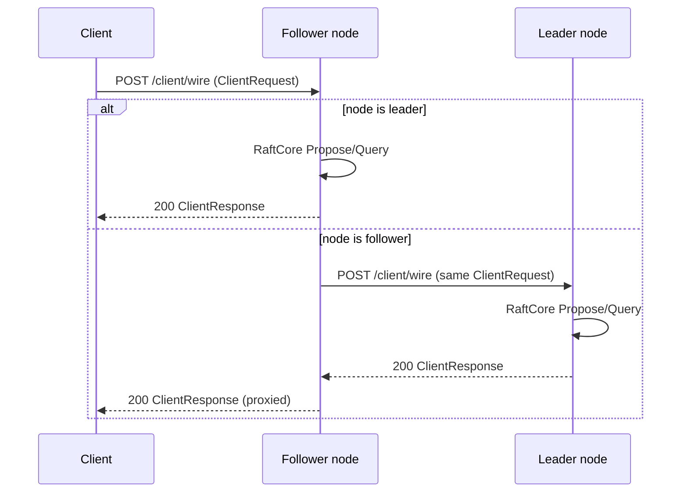

# ADR 003: Client routing

**Status:** Accepted  
**Date:** 2026-07-05

## Context

With the [Rust-native client API](002-client-api.md), a client may connect to **any** node via HTTP/3. Only the leader can append to the log (and serve linearizable queries per [ADR 005](005-read-consistency.md)). When a **follower** receives `ClientRequest`, we must define behavior.

This applies to **`RemoteClient` (HTTP/3)** and **`ClientHandle` (in-process)** — the local actor applies the same routing rule.

## Decision

**Option B — Transparent forward.**

Any node accepts client requests on `POST /raft/v1/client/wire`. If the node is **not** the leader, it **forwards** the request to the current leader over the cluster HTTP/3 stack and **returns the leader’s response** to the client. The client does not need leader discovery or retry logic for normal operation.

## Flow



### Leader address

Follower uses **Raft state** for the known leader:

- `leader_id` from recent `AppendEntries` / election
- Resolved to `SocketAddr` via static cluster config ([ADR 007](007-discovery.md))

If **no leader is known** (election in progress), the node responds with:

| HTTP | Body |
|------|------|
| `503` | `postcard(ClientResponse::Error { code: NO_LEADER, ... })` |

Optional header `Retry-After: 1` — client may retry the **same** node (not required for v1 SDK).

`ClientResponse::NotLeader` remains in the schema for compatibility but is **not** the primary success-path response under forward routing.

## Implementation notes

### Where forwarding lives

- **`raft-actor`:** `RaftNodeActor` handles `NodeMsg::Client(ClientRequest)`
- If `role != Leader` → delegate to **`ClientForwarder`** in `raft-net`
- Forwarder reuses the **peer QUIC pool** to `POST /raft/v1/client/wire` on the leader’s address
- **Do not** loop: forward target must be the leader; leader handles locally

### Idempotency

- `req_id` in `ClientRequest` is preserved across the forward hop
- Leader deduplicates via bounded in-memory cache (same as direct propose)
- Follower does not cache responses — stateless proxy

### Timeouts

- Client-facing deadline applies to **follower + leader** combined
- Follower uses a slightly shorter internal deadline when calling leader (e.g. client_timeout − margin) so the client receives `504`/`Error` before hanging

### In-process (`ClientHandle`)

Same rule without HTTP:

```rust
// Follower actor forwards ClientMsg to leader actor ref via internal forwarder
// or synchronous call to leader's HTTP/3 loopback — implementation choice in raft-actor
```

Prefer **same code path** as HTTP forward where possible (loopback HTTP/3 or shared `ClientForwarder` trait).

## Options not chosen

| Option | Why not |
|--------|---------|
| **A — Redirect** | User chose forward — clients stay dumb |
| **C — Hybrid** | User chose full server-side forward, not client retry |

## Consequences

**Positive**

- Any node address works behind a load balancer
- Simple client / CLI — connect anywhere, no leader cache required
- Uniform behavior for `Propose` and `Query`

**Negative**

- Extra hop latency on non-leader contacts
- Follower depends on leader reachability; leader partition affects follower client path
- More implementation complexity (timeouts, forward errors, no forward loops)
- Follower carries client traffic load

**Mitigations**

- Load balancers can prefer sticky routing to leader once health checks expose leader role (optional later)
- Forward failures surface as `503`/`504` with clear `ClientResponse::Error` codes
- Metrics: `raft_client_forward_total`, `raft_client_forward_latency`

## Related

- [002-client-api.md](002-client-api.md)
- [010-wire-transport.md](010-wire-transport.md)
- [005-read-consistency.md](005-read-consistency.md)
- [protocol.md](../protocol.md)
