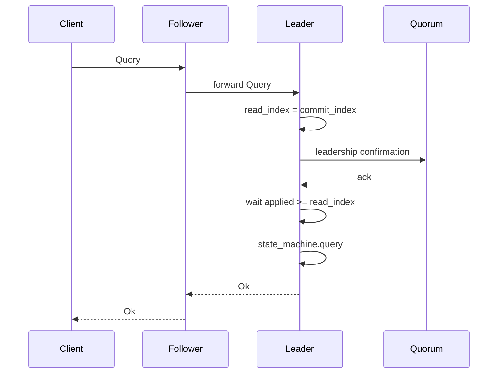

# ADR 005: Read consistency

**Status:** Accepted  
**Date:** 2026-07-05

## Context

Writes go through Raft log replication. **Reads** of authoritative state must define a consistency level. With [ADR 003](003-client-routing.md), client queries are **forwarded to the leader**; this ADR defines what the leader does before answering.

The framework has two read paths:

| Path | Consistency |
|------|-------------|
| `client.query` → `StateMachine::query` | **Linearizable** (this ADR) |
| `actor.ask` → user actor | Best-effort / local; not linearizable unless user designs otherwise |

## Decision

**Option A — Leader-only + ReadIndex for `query`.**

### Writes (unchanged)

`ClientRequest::Propose` → leader appends to log → replicate → commit → `StateMachine::apply`.

### Reads (`ClientRequest::Query`)

1. Request arrives at any node; follower **forwards** to leader ([ADR 003](003-client-routing.md)).
2. Leader runs **ReadIndex** before `StateMachine::query`:
   - Record `read_index = commit_index` (or current applied barrier).
   - Confirm leadership (heartbeat quorum / `read_index` ack from majority).
   - Wait until `applied_index >= read_index`.
   - Execute `state_machine.query(q)`.
3. Return `ClientResponse::Ok` with encoded result (directly or via forward proxy).



### Lease reads (added post-v1)

The leader may serve `query` **without** a ReadIndex round-trip while it holds a
valid **leadership lease** — the "lease read" originally deferred here for clock
sensitivity. Implemented in `craft-core` (`RaftNode::lease_read`) and taken
automatically by the driver's `query` fast path:

- A quorum ack of a heartbeat round grants a lease lasting `election_timeout_min
  / 2` logical ticks, measured from when the round was **broadcast** (before any
  follower even received it) — conservative by construction.
- Halving the *minimum* election timeout guarantees the lease expires on the
  leader before any follower (which reset its election timer on the acked
  heartbeat) could time out and elect a new leader; the margin absorbs
  cross-node clock drift (the original deferral reason).
- The lease is surrendered immediately on step-down and reset on election, so a
  deposed or fresh leader never serves a stale lease read.
- A read is served only when an entry of the current term has committed (leader
  completeness) and the state machine has applied through the read index;
  otherwise `query` falls back to full ReadIndex.

### Still deferred

- **Follower reads** — serving `query` from a non-leader after a leader
  read-index round-trip (etcd-style). The lease path already removes the
  round-trip on the leader; cross-node follower reads remain future work.
- **Linearizable actor `ask`** — out of scope; use `query` for authoritative reads

### API

```rust
// Linearizable — ReadIndex on leader
cluster.client().query(GetBalance { id }).await?;

// Not linearizable — actor workflow / cache
registry.cluster("workers")?.ask(WorkerMsg::Status).await?;
```

`StateMachine::query` remains **required** in v1 ([ADR 001](001-state-machine.md)).

## Implementation notes

- ReadIndex logic lives in **`craft-core`** (`read_index.rs`); leader-only path in `RaftCore::step`.
- Leader tracks pending reads in `ReadState { index, query, reply_port }` until apply barrier satisfied.
- Read does **not** append to Raft log.
- Forward path: follower timeout budget covers forward + ReadIndex on leader.

## Linearizability test plan ([ADR 029](029-testing-strategy.md))

Reads are the easiest place to *silently* violate linearizability, so ReadIndex gets dedicated, layered verification.

### Invariant under test

A history of client `propose`/`query` operations is **linearizable**: there exists a total order consistent with real-time (an op that completes before another begins must be ordered before it) in which each `query` returns the value of the most recent preceding `propose`.

### Layers

| Layer | What it checks | How |
|-------|----------------|-----|
| **Unit** (`craft-core`) | ReadIndex state machine: read is released only after (a) leadership confirmed for its term and (b) `applied_index >= read_index` | Drive `RaftInput` (heartbeat acks, apply progress) and assert the pending `ReadState` is not resolved early |
| **Property** (`proptest`) | No read observes state older than a write that completed before the read began | Generate interleavings of propose/query against the pure FSM; assert monotonic read values |
| **Deterministic sim** (`craft-sim`) ⭐ | End-to-end linearizability under faults | Concurrent clients issue propose/query; record a wall-of-history; feed to checker |
| **Linearizability checker** (I5, `porcupine`-style) | The recorded history is linearizable against a model register/KV | Reject any history with a stale/torn read; **print the seed** on failure |

### Adversarial scenarios (must stay linearizable or explicitly error, never return stale-OK)

1. **Stale leader read** — old leader partitioned after a new leader commits a write; the old leader's `query` must **fail leadership confirmation** (ReadIndex quorum) rather than answer stale.
2. **Read during election** — no leader; `query` blocks/times out, never guesses.
3. **Read straddling commit** — write committed but not yet applied on leader; read must **wait for the apply barrier** before executing `query`.
4. **Forwarded read across leader change** — follower forwards; leader changes mid-flight; client ret/forward resolves to the new leader or errors (never stale).
5. **Partition heal** — minority-side `query` must not succeed with stale data.

### Real-wire confirmation (E2E, nightly)

A small `docker-compose` scenario with `pumba` partitions runs concurrent clients and pipes the observed history through the same checker — confirming the ReadIndex path holds over real HTTP/3 + mTLS, not just in sim.

### Acceptance

- ReadIndex unit + property suites green in the fast CI lane.
- Sim linearizability checker green across a fixed seed sweep for scenarios 1–5.
- No test may assert a stale read as success; stale-under-partition must surface as an **error/timeout**, not a wrong value.

## Consequences

**Positive**

- Correct reads across elections and partitions
- Clear split: `query` = truth, `actor ask` = fast/local
- Aligns with Raft expectations for a consistency framework

**Negative**

- Extra latency on every `query` (quorum confirmation)
- All read load on leader (mitigated: actor reads for non-authoritative data)

## Alternatives rejected

| Option | Why not |
|--------|---------|
| **B — Leader-local, no ReadIndex** | Stale reads after partition |
| **C — Defer reads** | Conflicts with `StateMachine::query` in ADR 001 |

## Related

- [003-client-routing.md](003-client-routing.md)
- [001-state-machine.md](001-state-machine.md)
- [002-client-api.md](002-client-api.md)
