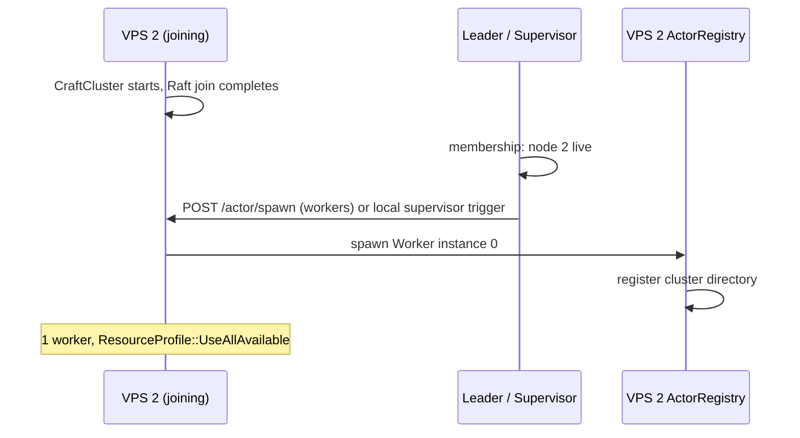

# ADR 015: Auto-spawn workers on VPS join

**Status:** Accepted  
**Date:** 2026-07-05

## Context

[ADR 014](014-one-worker-per-vps.md): production = **1 worker per VPS**. [ADR 012](012-elastic-cluster.md): users deploy new VPSes with `JOIN_ADDR`. When a node joins the cluster, something must spawn the worker on that node.

Options were: framework auto-spawn (**A**), user hook (**B**), or manual/`main` only (**C**). User chose **A**.

## Decision

**The framework auto-spawns configured workers when a node becomes a cluster member.**

Users declare default workers on `CraftCluster::builder()`. **`ClusterSupervisor`** (leader-coordinated, see [open-questions.md](../open-questions.md) #6) ensures each live node runs exactly the configured workers — including **newly joined nodes**.

### Builder configuration

```rust
CraftCluster::builder()
    .node_id(env("NODE_ID"))
    .listen(env("LISTEN_ADDR"))
    .join(env_optional("JOIN_ADDR"))
    .allow_join(env_bool("RAFT_ALLOW_JOIN"))
    .state_machine(MyState::default())
    .auto_workers([
        AutoWorkerSpec {
            name: "workers",
            factory: |resources| WorkerConfig::with_resources(resources),
        },
    ])
    .spawn()
    .await?;
```

No manual `registry.spawn::<Worker>(...)` required in `main` for default workers (optional for extra actors).

### Lifecycle



| Event | Framework action |
|-------|------------------|
| **Seed node starts** (no `JOIN_ADDR`) | After cluster ready → spawn auto workers on self |
| **Node joins** (`JOIN_ADDR`) | After membership confirmed → spawn auto workers **on that node** |
| **Node leaves** | Migrate/stop per [ADR 013](013-cross-node-actors.md); supervisor may respawn on remaining nodes via `scale_cluster` |
| **New node added, count should rise** | Auto workers on new node; `scale_cluster` target may track `live_node_count` |

### Production rules ([ADR 014](014-one-worker-per-vps.md))

- Auto-spawn creates **at most 1** instance per `AutoWorkerSpec.name` per node in production.
- Uses `VpsResources` / `ResourceProfile::UseAllAvailable` from cluster config.
- **`--dev-multi-workers`:** does not change auto-spawn count (still 1 per node in prod mode); dev multi-local is separate.

### Who triggers spawn

1. **Joining node:** local `ClusterSupervisor` waits until Raft reports **member of cluster**, then spawns local auto workers if not present.
2. **Leader supervisor:** on membership change, reconciles all nodes — ensures every live node has auto workers (idempotent `spawn_remote` / local spawn).

Both paths must be idempotent (same name + node → no duplicate).

### User overrides

- Additional actors beyond auto workers: user may still `registry.spawn` in hooks or after cluster start.
- Disable auto workers for a custom app: `.auto_workers([])` and manage manually.

## Consequences

**Positive**

- Deploy story: `JOIN_ADDR` + same binary → worker appears automatically
- Matches 1 worker/VPS without boilerplate in every app `main`

**Negative**

- Requires join/membership to work before worker is useful on new VPS
- Supervisor reconciliation adds v1 complexity

## Related

- [012-elastic-cluster.md](012-elastic-cluster.md)
- [014-one-worker-per-vps.md](014-one-worker-per-vps.md)
- [013-cross-node-actors.md](013-cross-node-actors.md)
- [004-deployment-model.md](004-deployment-model.md)
