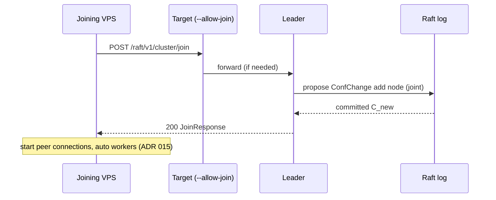

# ADR 016: Raft membership — full joint consensus early

**Status:** Accepted  
**Date:** 2026-07-05

## Context

[ADR 007](007-discovery.md) described dynamic `JOIN_ADDR` join but deferred **joint-consensus membership** to “Phase 6.” That conflicted with the product model: deploy VPS 2 → join → auto-spawn worker ([ADR 015](015-auto-spawn-on-join.md)).

Open question **#1** options were static bootstrap (A), simplified join (B), or **full membership early (C)**. User chose **C**.

## Decision

**Implement full Raft membership changes (joint consensus) in early core phases — not deferred.**

Dynamic join/leave via `JOIN_ADDR` and `--allow-join` is a **v1 requirement**, backed by correct joint-consensus config changes (`C_old,new` → `C_new`), not a simplified or static-only workaround.

### Scope in `craft-core`

| Feature | Required |
|---------|----------|
| Cluster config in replicated log | ✓ |
| **Add learner / add voter** (joint consensus) | ✓ |
| **Remove node** (joint consensus) | ✓ |
| Config commit → update peer set on all nodes | ✓ |
| Safe rejection of overlapping membership changes | ✓ |

Reference: Raft dissertation §4.3 (membership changes).

### Join flow (end-to-end)

1. Joining node contacts `JOIN_ADDR` (mTLS, `--allow-join` on target).
2. Leader proposes **membership change** through normal Raft replication.
3. Joint consensus completes; all nodes apply new config.
4. Joining node becomes full member; [ADR 015](015-auto-spawn-on-join.md) supervisor spawns auto workers.

Leave: `CraftCluster::leave()` → propose remove self (after actor migration, [ADR 013](013-cross-node-actors.md)).

### Join RPC

Dedicated operational handshake (see open-questions #4 — **recommended A**):

- `POST /raft/v1/cluster/join` — validate cert, `NODE_ID`, version
- Leader runs membership change internally
- Not a substitute for consensus — **membership still goes through the log**

### Implementation phasing (revised)

Membership is **not** a late add-on. Order:

| Phase | Deliverable |
|-------|-------------|
| 2 | `craft-core`: election, replication, **+ membership (joint consensus)** |
| 4 | `craft-net`: HTTP/3 + **`/cluster/join`** |
| 5 | `craft-actor`: join triggers supervisor + auto workers |
| 7 | `craft-sim`: membership + partition tests |

Snapshots and client polish may parallel membership; **join cannot ship without core membership**.

### Rejected alternatives

| Option | Why rejected |
|--------|--------------|
| **A — Static bootstrap only in v1** | Breaks VPS chain-deploy story |
| **B — Simplified join without joint consensus** | Safety debt; user chose correctness |
| **D — Hybrid simplified now, fix later** | User chose full membership upfront |

## Consequences

**Positive**

- Dynamic `JOIN_ADDR` is **safe** and matches Raft literature
- Auto-spawn on join has a real membership signal
- No throwaway join implementation

**Negative**

- **Largest early engineering cost** — membership is notoriously subtle
- Delays “hello world cluster” until membership tests pass
- Requires strong `craft-sim` coverage before actors depend on join

## Related

- [007-discovery.md](007-discovery.md)
- [012-elastic-cluster.md](012-elastic-cluster.md)
- [015-auto-spawn-on-join.md](015-auto-spawn-on-join.md)
- [013-cross-node-actors.md](013-cross-node-actors.md)
