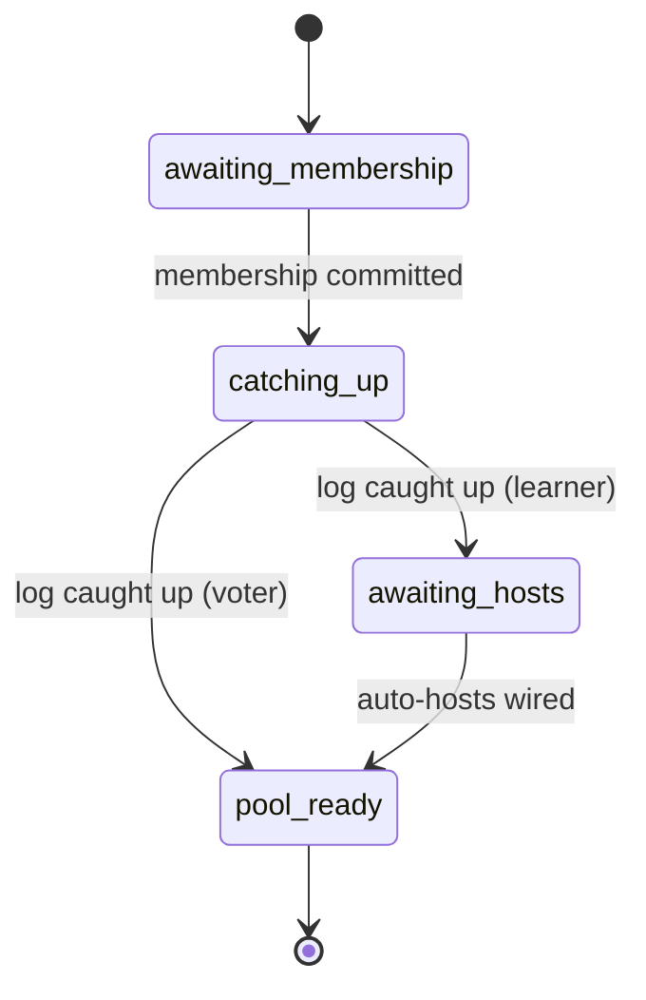

# Cluster elasticity & worker placement

**Status:** Accepted  
**Date:** 2026-07-05  

## Context

Users deploy the **same app** to multiple VPSes. Actors scale on demand across the cluster ([cross-node-actors](cross-node-actors.md)). Production model: **one worker per VPS**, horizontal scale by adding nodes, framework auto-spawns on join.

## Elastic cluster — VPS join & scaling

| Step | Behavior |
|------|----------|
| Seed node | omit `TREMBITA_JOIN_SEEDS`; `TREMBITA_ALLOW_JOIN=1` to accept joins |
| Joining node | `TREMBITA_JOIN_SEEDS=id@seed:port` → after membership → **auto workers spawned** |
| Leave | `cluster.leave().await?` → migrate actors, then Raft remove |

```bash
# Product app (see env.md):
TREMBITA_LISTEN=0.0.0.0:443 TREMBITA_ALLOW_JOIN=1 cargo run          # seed
TREMBITA_JOIN_SEEDS=1@vps1:443 cargo run   # joiner — framework spawns workers when joined
```

### On-demand scale scenarios

| User intent | Production |
|-------------|------------|
| Add VPS | Deploy with `TREMBITA_JOIN_SEEDS` → joins as **learner** → auto worker on new node |
| Match N VPSes | `scale_cluster(N)` or rely on auto workers = 1 per node |
| Message workers | `registry.cluster("workers")?.send(...)` |

Dev mode (`--dev-multi-workers`): `spawn_pool`, `scale_local` on one machine.

## One worker per VPS (production)

| Mode | How enabled | Max workers per VPS |
|------|-------------|---------------------|
| **Production** (default) | default | **1** |
| **Development** | `--dev-multi-workers` | unlimited |

| API call | Production behavior |
|----------|---------------------|
| `spawn` / `spawn_remote` | OK if no instance of `name` on that node yet |
| `spawn_pool(count > 1)` | **Rejected** — `SpawnError::MultiWorkerDisabled` |
| `scale_local(n > 1)` | **Rejected** |
| `scale_cluster(total)` | At most 1 per live node; `total ≤ live_node_count` |
| Second `spawn` same name on same node | **Rejected** — `SpawnError::WorkerAlreadyOnNode` |

Parallelism on a VPS lives **inside** the single worker via `ResourceProfile::UseAllAvailable` and `VpsResources` — not multiple worker actors.

Product apps register workers in [`AppManifest`](../../crates/trembita/src/app/manifest.rs) (`.workers`, `.actor_groups`); the runtime spawns them on each node after join ([cross-node-actors](cross-node-actors.md)). Tune compute via [`ResourceProfile`](../../crates/trembita-runtime/src/resources.rs) / [`WorkloadOpts`](../../crates/trembita-jobs/src/workload.rs) on worker opts.

Migration on node leave targets a node **without** an existing worker for that name.

## Auto-spawn on join

**Framework auto-spawns manifest-registered workers when a node becomes a cluster member.**

```rust
TrembitaApp::from_env()?
    .manifest(AppManifest::new().workers([WorkerOpts::new("workers")]))
    .run()
    .await?;
```

Low-level [`auto_workers`](../../crates/trembita-assembly/src/builder/cluster/config.rs) on [`trembita-assembly`](../../crates/trembita-assembly/src/builder/mod.rs) `TrembitaClusterBuilder` — integration / showcase tests only (not product API).

| Event | Framework action |
|-------|------------------|
| Seed node starts | After cluster ready → spawn auto workers on self |
| Node joins | After membership confirmed → spawn auto workers on that node |
| Node leaves | Migrate/stop per cross-node-actors; supervisor may respawn via `scale_cluster` |

**Who triggers:** (1) joining node's local supervisor after Raft reports member; (2) leader supervisor reconciles all nodes on membership change. Both paths idempotent by `(name, node_id, generation)`.

Disable: `.auto_workers([])` and manage manually.

## Scale targets

| Parameter | Default |
|-----------|---------|
| Cluster size | 3–5 VPSes typical |
| Workers cluster-wide | equals VPS count (1:1 in production) |
| Command size | small (<1 KiB) |
| Write throughput | moderate per group; scale via multi-Raft ([multi-raft](multi-raft.md)) |
| HTTP/3 | one QUIC conn per peer; batch append 256 |

`scale_cluster(10)` requires **10 live nodes** in production. More VPSes = more worker compute and ingress capacity, not growth of the Meta-Raft voter set.

## Voters vs learners (elastic scale-out)

**Elastic VPS nodes must not become Raft voters by default.** Each machine is a full peer (mTLS, ingress, workers, actors), but only a **small, stable voter set** (typically the 3–5 seed nodes) participates in quorum and queue replication fan-out. Adding workers through **`TREMBITA_JOIN_SEEDS`** joins as a **learner**: same traffic and compute role, no vote, not counted in queue `replicate_ops` fan-out.

| Role | Quorum / queue replication | Workers / ingress | When |
|------|---------------------------|-------------------|------|
| **Voter** | yes | yes | Bootstrap seeds; rare expansion via `JoinRole::Voter` + `allow_voter_join` |
| **Learner** | no (receives log) | yes | Default for every elastic join deploy |

When a voter is permanently unreachable, the leader **replaces** it: remove the dead voter, promote the **lowest-id caught-up learner** (deterministic). Brief reboots do not trigger replacement — grace is `6 ×` the reachability silence window.

Builder: `allow_voter_join(false)` (default), `voter_replacement(true)` (default). Wire: `JoinRole::Learner` (default on `/cluster/join`). Joiners request the role via [`join_as`](../../crates/trembita-assembly/src/builder/cluster/mod.rs) / `TREMBITA_JOIN_ROLE`; the seed must opt in with `allow_voter_join` / `TREMBITA_ALLOW_VOTER_JOIN=1`.

## Supervisor — leader-only reconciliation

**Only the Raft leader** runs cluster-wide supervisor decisions.

| Action | Who |
|--------|-----|
| Reconcile auto workers on all nodes | **Leader** `ClusterSupervisor` |
| `scale_cluster` placement plan | **Leader** |
| Migration target selection on node leave | **Leader** |
| Local `spawn` / `scale_local` (dev) | **Local node** |
| Execute `POST /actor/spawn` on target | Target node (instructed by leader) |

Non-leaders forward `scale_cluster` and post-join callbacks to leader ([client-and-routing](client-and-routing.md) forward pattern). During election: `503` / retry.

Leader reconciliation is **declarative**: desired state = N auto workers on N nodes; diff vs directory; idempotent spawns. Uses `placement_nodes()` (reachable voters + reachable learners) for liveness-aware planning ([cluster-membership](cluster-membership.md#liveness-vs-membership)).

**Rejected:** every node supervises cluster-wide (split-brain placement risk).

## Elastic join + HTTP LB proof (B-34)

**Shipped regression** tying elastic join to the **product** ingress story ([ingress-lb](../ops/ingress-lb.md#elastic-join--http-lb-proof-b-34)):

1. **Four members** — seed plus joiners (in-process sim or Docker `node4` profile).
2. **LB pool** — only backends with **`GET /ready` → 200** (see B-35 for join phases on joiners).
3. **Gateway session** — shared `TREMBITA_GATEWAY_SESSION_SECRET`; round-robin HTTP is safe for cookie-protected routes after login ([gateway-cluster-auth](gateway-cluster-auth.md)).
4. **PerNode capabilities** — directory pool grows with membership; boot [`scale_plan`](../../crates/trembita/src/app/scale_plan.rs) reports `PerNode`.

Fast tests: `./scripts/test-fast.sh -p trembita --test elastic_lb_product b34_`. Heavy Docker: `./e2e/elastic_lb.sh`. Scenario table: [capabilities § B-34](../scenarios/capabilities.md#elastic-join--lb-b-34).

**Not the same as B-39:** [founder-3node](../../dev/founder-3node/README.md) is a **3-node showcase** dev path (realtime ports **8290–8292**); B-34 proves **4th joiner + product E2E binary** under nginx.

## Join readiness pipeline (B-35)

Product joiners (`TREMBITA_JOIN_SEEDS`, default **learner** role) become **LB pool members** only after a fixed pipeline. Load balancers must health-check **`GET /ready`** (HTTP **200** only when `join_phase` is **`pool_ready`**); **`GET /health`** stays liveness-only ([ingress-lb § B-35](../ops/ingress-lb.md#join-readiness-pipeline-b-35)).

| Phase (`join_phase`) | Meaning | `/ready` |
|----------------------|---------|----------|
| `awaiting_membership` | Node id not yet in committed voters/learners | **503** |
| `catching_up` | Membership committed; `last_applied` < `commit_index` | **503** |
| `awaiting_hosts` | Log caught up (typical **learner**); no local auto-hosted workers/caps yet | **503** |
| `pool_ready` | Safe for product HTTP — voters after catch-up; learners after catch-up **and** `hosts_wired` | **200** |

Evaluation lives in [`evaluate_join_pipeline`](../../crates/trembita-assembly/src/join_pipeline.rs); [`Readiness::is_ready`](../../crates/trembita-dashboard/src/views.rs) returns true only when `!draining && join_phase == pool_ready` (legacy `member` alone is **not** enough for learners mid-pipeline).

**Observability**

| Route | Fields |
|-------|--------|
| **`GET /ready`** | `join_phase`, `committed_learner`, `log_caught_up`, `hosts_wired`, `workers`, optional `reason` |
| **`GET /introspect/join-status`** | Same pipeline snapshot as [`JoinStatusView`](../../crates/trembita-dashboard/src/views.rs) — includes `local_workers` ([production-runbook § B-35](../ops/production-runbook.md#join-readiness-b-35)) |

**Product boot:** when `TREMBITA_JOIN_SEEDS` is set, [`TrembitaApp`](../../crates/trembita/src/app/builder.rs) enables [`ReadyOpts::pool_membership`](../../crates/trembita-assembly/src/ready.rs) — `wait_until_ready` waits for the pipeline, not Raft leadership. Seeds keep queue/leader wait when configured.

**Relation to B-34:** elastic E2E assumes joiners eventually reach **`pool_ready`** before nginx marks a backend up ([capabilities § B-34](../scenarios/capabilities.md#elastic-join--lb-b-34)).



### Automated regression (B-35)

| Scenario | Test filter |
|----------|-------------|
| Phase table (membership → catch-up → hosts → pool) | `b35_join_pipeline_scenarios_table` (`trembita-assembly`) |
| `Readiness::is_ready` vs `join_phase` | `b35_is_ready_join_phase_*`, `b35_join_status_view_*` (`trembita-dashboard`) |
| `join_phase` JSON snake_case on `/ready` | `b35_join_phase_serializes_snake_case` (`trembita-http/ops_routes`) |
| `/introspect/join-status` payload | `b35_join_status_json_*` (`trembita-http/introspect_routes`) |
| Product boot `/ready` + ops route mounted | `b35_*` in `tests/ingress_lb_ops.rs` |

```bash
./scripts/test-fast.sh -p trembita-assembly --lib b35_join_pipeline_scenarios_table
./scripts/test-fast.sh -p trembita-dashboard --lib b35_
./scripts/test-fast.sh -p trembita-http --lib b35_
./scripts/test-fast.sh -p trembita --test ingress_lb_ops b35_
```

Scenario index: [capabilities § B-35](../scenarios/capabilities.md#join-readiness-pipeline-b-35).

## Consequences

**Positive:** Deploy story: `TREMBITA_JOIN_SEEDS` + same binary → worker appears; clear 1 VPS = 1 worker ops model; single planner consistent with Raft leadership.

**Negative:** `scale_cluster` cannot exceed node count; dev/prod behavioral split; brief placement unavailability during election; supervisor reconciliation adds complexity.

## Related

- [cluster-membership.md](cluster-membership.md)
- [cross-node-actors.md](cross-node-actors.md)
- [deployment-model.md](deployment-model.md)
- [drain-timeout.md](drain-timeout.md)
