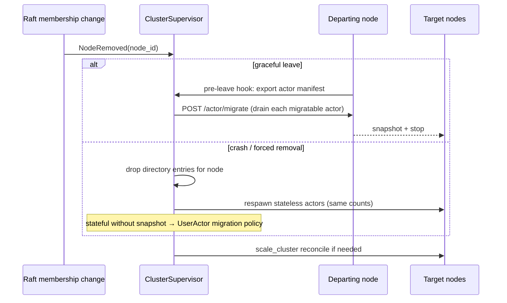

# Cross-node actors (v1)

**Status:** Accepted  
**Date:** 2026-07-05  
**Amended:** 2026-07-05 — `spawn_remote`, `scale_cluster`, automatic migration on node leave

## Context

Users deploy multiple VPSes with the same app. **All use cases are actors that scale on demand** across the cluster from v1:

- Cross-node **messaging**
- Cross-node **spawn and scale** from code (`spawn_remote`, `scale_cluster`)
- **Automatic actor migration** when a node leaves or fails

This ADR defines addressing, transport, directory, placement, migration, and the v1 API.

## Decision

### v1 scope (full)

| Capability | v1 |
|------------|-----|
| Local `spawn` / `spawn_pool` / `scale_local` / `stop` | ✓ |
| Cross-node `send` / `ask` | ✓ |
| Cluster directory + `cluster(name)` routing | ✓ |
| **`spawn_remote`** — spawn on a specific VPS from code | ✓ |
| **`scale_cluster`** — set cluster-wide pool size across nodes | ✓ |
| **Automatic migration** on graceful leave or node removal | ✓ |

### Actor identity

```rust
// crates/raft-proto/src/actor.rs

pub struct ActorId {
    pub node_id: NodeId,
    pub name: String,
    pub instance: u32,      // 0 singleton; 0..n-1 pool
    pub generation: u64,    // bumped on respawn/migrate
}
```

### Cluster directory

Merged view on every node:

```rust
pub struct ActorRegistration {
    pub id: ActorId,
    pub actor_type: ActorTypeId,  // compile-time type tag
    pub migratable: bool,
}
```

Publish on spawn/migrate via **`POST /raft/v1/actor/register`**. Revoke on stop or node leave.

### Cross-node transport (HTTP/3 + postcard)

| Route | Purpose |
|-------|---------|
| `POST /raft/v1/actor/deliver` | Message / ask delivery |
| `POST /raft/v1/actor/spawn` | Remote spawn (`spawn_remote`, migration target) |
| `POST /raft/v1/actor/migrate` | Transfer snapshot + spawn on target node |
| `POST /raft/v1/actor/register` | Directory publish/revoke |

All routes: mTLS peer auth ([security](security.md)).

#### Deliver

```rust
pub struct ActorEnvelope {
    pub to: ActorId,
    pub from: Option<ActorId>,
    pub req_id: Uuid,
    pub payload: Vec<u8>,
}
```

#### Spawn (remote control plane)

```rust
pub struct SpawnRequest {
    pub name: String,
    pub actor_type: ActorTypeId,
    pub instance: u32,
    pub config: Vec<u8>,       // postcard(A::Config)
    pub generation: u64,
}

pub struct SpawnResponse {
    pub id: ActorId,
}
```

Target node deserializes config, starts ractor cell, registers in directory.

#### Migrate

```rust
pub struct MigrateRequest {
    pub from: ActorId,
    pub to_node: NodeId,
    pub to_instance: u32,
    pub snapshot: Vec<u8>,     // optional; empty if stateless
    pub config: Vec<u8>,
    pub actor_type: ActorTypeId,
}
```

Target spawns replacement, applies snapshot via `UserActor::restore_migration`, publishes registration; source stops after ACK.

### Remote spawn & cluster scale (v1 API)

```rust
impl ActorRegistry {
    // local (existing)
    pub async fn spawn<A: UserActor>(&self, name: &str, config: A::Config) -> Result<ActorRef<A>, SpawnError>;
    pub async fn spawn_pool<A: UserActor>(&self, name: &str, count: usize, config: A::Config) -> Result<(), SpawnError>;
    pub async fn scale_local(&self, name: &str, count: usize) -> Result<(), ScaleError>;

    // remote / cluster (v1)
    pub async fn spawn_remote<A: UserActor>(
        &self,
        node_id: NodeId,
        name: &str,
        config: A::Config,
    ) -> Result<ActorRef<A>, SpawnError>;

    /// Set total instance count cluster-wide; placement spreads across live nodes
    pub async fn scale_cluster<A: UserActor>(
        &self,
        name: &str,
        total: usize,
        config: A::Config,
    ) -> Result<(), ScaleError>;

    pub async fn resolve(&self, id: ActorId) -> Result<ErasedActorRef, ResolveError>;
    pub async fn cluster(&self, name: &str) -> Result<ClusterRef, ResolveError>;
    pub async fn stop(&self, name: &str) -> Result<(), StopError>;
}
```

**`scale_cluster` placement:** governed by [cluster-elasticity](cluster-elasticity.md#one-worker-per-vps-production).

**Production (default):** at most **1 worker per VPS** per `name`. `scale_cluster(total)` sets cluster-wide count; `total ≤ live_node_count`. Scale out by adding VPSes, not stacking workers locally.

**Development (`--dev-multi-workers`):** multiple instances per node allowed; even spread across nodes still applies for `scale_cluster`.

Reconciliation steps:

1. Read live nodes from Raft membership.
2. Target `total` instances (capped by node count in production).
3. Assign **≤1 per node** (production) or even spread (dev).
4. Diff vs directory → `spawn_remote` / local spawn / stop.

`spawn_pool` / `scale_local(n>1)` **rejected in production**.

### Automatic migration on node leave

**Trigger:** node removed from Raft cluster config (graceful `leave()` or failure detected after timeout).

**Orchestrator:** `ClusterSupervisor` actor (one per process; coordinates via leader when membership changes):



**Stateless actors (`migratable: false` default):**

- Supervisor respawns same **count** on remaining nodes via `scale_cluster` / `spawn_remote`.
- No snapshot required.

**Stateful actors (`migratable: true`):**

- User implements on `UserActor`:

```rust
trait UserActor {
    fn migration_snapshot(&self) -> Result<Vec<u8>, MigrationError>;
    fn restore_migration(&mut self, data: &[u8]) -> Result<(), MigrationError>;
}
```

- **Graceful leave:** departing node runs drain → `/actor/migrate` per instance before Raft remove.
- **Crash:** best-effort — state lost unless also persisted via Raft `StateMachine`; document that authoritative state must go through `propose`.

**In-flight messages** during migration:

- Source stops accepting new `deliver` after drain marker.
- `ClusterRef` retries delivery to new registration after directory updates (short backoff).

### User API examples

```rust
// Production: 1 worker per VPS — need 5 VPSes for 5 workers
registry.scale_cluster::<Worker>("workers", 5, cfg).await?;  // errors if only 3 nodes

// Dev only (--dev-multi-workers)
registry.spawn_pool::<Worker>("workers", 4, cfg).await?;
registry.scale_local("workers", 4).await?;

// Messaging (unchanged)
registry.cluster("workers")?.send(WorkerMsg::Process(id)).await?;

// Graceful VPS shutdown — migrates actors before leave
cluster.leave().await?;  // triggers migration orchestrator
```

### Interaction with Raft

| Action | Path |
|--------|------|
| Authoritative state | `propose` → `StateMachine` |
| Actor messages | `/actor/deliver` |
| Actor placement / count | `spawn_*`, `scale_*`, supervisor (not Raft log) |
| Node membership | Raft config change → triggers migration |

Actor placement is **operational**, not consensus-logged. Only user **commands** that affect shared state go through Raft.

## Crate changes

| Crate | Add |
|-------|-----|
| `raft-proto` | `actor.rs` — all wire types |
| `raft-net` | `/actor/*` handlers |
| `raft-actor` | `directory`, `remote`, `placement`, `supervisor`, `migration` |
| `raft-macros` | `UserActor`, optional `#[actor(migratable)]` |

## Consequences

**Positive**

- Full elastic actor fabric from v1: scale, place, migrate, message
- Matches VPS chain-deploy mental model

**Negative**

- Highest v1 complexity: placement, migration races, directory consistency
- Crash migration of stateful actors limited without Raft-backed state
- `scale_cluster` reconciliation must be idempotent

**Mitigations**

- Leader-coordinated supervisor actions to avoid split placement decisions
- Idempotent spawn by `(name, node_id, instance, generation)`
- Extensive `raft-sim` tests: leave, crash, scale_cluster, deliver during migrate

## Related

- [cluster-elasticity](cluster-elasticity.md#one-worker-per-vps-production)
- [client-and-routing](client-and-routing.md#cluster-actor-routing)
- [cluster-elasticity](cluster-elasticity.md)
- [wire-protocol](wire-protocol.md)
- [state-machine.md](state-machine.md)
