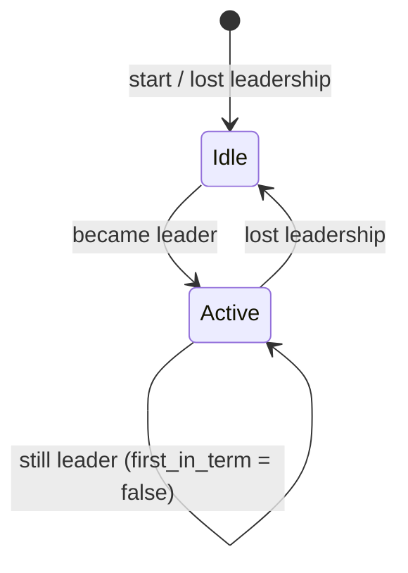

# Leader task primitive

**Status:** Accepted (implemented)  
**Date:** 2026-09-03  
**Epic:** [B-18](../backlog.md#b-18--leader-task-primitive)

## Context

Raft leadership is the cluster-wide **mutex** for side-effecting control-plane work: queue mutations, worker placement, external backlog feed, cron reconcile, actor-store GC, topic retention, upgrade grants. trembita documents this as **leader-only reconciliation** ([cluster-elasticity § supervisor](cluster-elasticity.md#supervisor--leader-only-reconciliation), [job-queue](job-queue.md), [external-backlog](external-backlog.md), [schedule-source](schedule-source.md)).

The public API exposes a **snapshot**:

- [`TrembitaCluster::is_leader`](../../crates/trembita/src/cluster_handle/mod.rs)
- [`ClusterState::is_leader`](../../crates/trembita-runtime/src/supervisor.rs) on [`ClusterFacts`](../../crates/trembita/src/cluster_handle/mod.rs)

There is **no primitive for “run this loop while I am leader”**. Every product feature that needs periodic leader work reimplements the same state machine:

| Internal loop | Location | Leader gate | Stop | Term / edge logic |
|---------------|----------|-------------|------|-------------------|
| Backlog feeder | [`run_backlog_feeder`](../../crates/trembita-jobs/src/external_backlog.rs) | in loop | `watch` | skip tick |
| Settle drainer | [`run_backlog_settle_drainer`](../../crates/trembita-jobs/src/external_backlog.rs) | in loop | `watch` | skip tick |
| Queue autoscaler | [`run_queue_autoscaler`](../../crates/trembita-jobs/src/queue_autoscale.rs) | in loop | none | cooldown across terms undocumented |
| Membership autoscaler | [`run_queue_membership_autoscaler`](../../crates/trembita-jobs/src/queue_autoscale.rs) | in loop | none | same |
| Schedule ticker | [`run_queue_schedule_ticker`](../../crates/trembita-jobs/src/queue_schedule.rs) | in `QueueService` | `watch` | loop unaware of leadership |
| Actor-store GC | [`run_actor_store_gc_ticker`](../../crates/trembita-actor-store/src/store_service.rs) | in `StoreService` | `watch` | same |
| Supervisor reconcile | [`ClusterSupervisor::reconcile`](../../crates/trembita-runtime/src/supervisor.rs) | in method | none | + immediate call from facts-refresher |
| Topic bootstrap / retention | inline in [`builder.rs`](../../crates/trembita/src/builder/cluster/mod.rs) | in loop | none | `bootstrapped` flag — one-shot per process |
| Upgrade coordinator | [`spawn_upgrade_coordinator`](../../crates/trembita/src/upgrade/coordinator.rs) | in `tick` | abort | leader vs local executor split |

Leadership checks also appear on **RPC hot paths** (`QueueService`, `StoreService`, `runtime.rs`) — leader-local apply vs forward-to-leader. That is a related but separate helper (see [Out of scope](#out-of-scope)).

When the library implements a pattern six-plus times internally and exports **zero** helpers for it, operators copying [`ScheduleSource`](schedule-source.md) or [`ExternalBacklog`](external-backlog.md) wiring still hand-roll:

```rust
tokio::spawn(async move {
    let mut interval = tokio::time::interval(period);
    loop {
        interval.tick().await;
        if !facts.is_leader() { continue; }
        do_work().await;
    }
});
```

Each copy must independently decide: run on acquire? reset state on release? avoid double bootstrap after re-election? honour shutdown?

## Decision

Add a **leader task** primitive in `trembita-runtime`, re-exported from the `trembita` facade.

### 1. `LeaderSession` — leadership term state machine

Pure sync helper (no I/O, no tokio):

```rust
/// Outcome of gating one iteration against [`ClusterState`].
pub enum LeaderGate {
    /// Not leader — skip body.
    Idle,
    /// Leader — run body; `first_in_term` is true on the first tick after
    /// acquiring leadership (including process start while already leader).
    Active { first_in_term: bool },
}

pub struct LeaderSession {
    was_leader: bool,
}

impl LeaderSession {
    pub fn gate(&mut self, state: &dyn ClusterState) -> LeaderGate { /* ... */ }
}
```

`gate` compares the previous and current `is_leader()` snapshot. Transitions:



Unit-testable without async runtime.

### 2. `run_leader_loop` — periodic leader-only task

Async helper shared by internal loops and user code:

```rust
pub struct LeaderLoopOpts {
    pub period: Duration,
    /// When true, call `tick` immediately after `Active { first_in_term: true }`
    /// before waiting for the first interval (supervisor-style prompt reconcile).
    pub run_on_acquire: bool,
}

pub async fn run_leader_loop(
    state: Arc<dyn ClusterState>,
    opts: LeaderLoopOpts,
    mut stop: tokio::sync::watch::Receiver<bool>,
    mut tick: impl FnMut(LeaderGate) -> Fut + Send,
);
```

Behaviour:

- Each interval: if `stop` → exit; else `LeaderSession::gate` → `Idle` skips body; `Active` invokes `tick(gate)`.
- When `run_on_acquire` and `first_in_term`: invoke `tick` once before the first `interval.tick()` (covers membership-triggered reconcile + periodic reconcile unification).
- Uses `tokio::select!` between interval and `stop.changed()` (same as feeder / drainer today).

**Not** included in v1: automatic cooldown reset on release, `OncePerTerm` registry — callers that need those pass explicit logic inside `tick` (document patterns in rustdoc).

### 3. Facade wiring

```rust
TrembitaClusterBuilder::on_leader(
    "my-reconciler",
    LeaderLoopOpts { period: Duration::from_secs(10), run_on_acquire: true },
    |gate| async move {
        if gate.first_in_term() {
            bootstrap_subscriptions().await;
        }
        reconcile().await;
    },
)
```

Returns a task handle tracked in the cluster shutdown bundle (same as other background loops in [`builder.rs`](../../crates/trembita/src/builder/cluster/mod.rs)).

For apps holding `Arc<ClusterFacts>` / `Arc<dyn ClusterState>` directly:

```rust
trembita_runtime::run_leader_loop(state, opts, stop_rx, |gate| async move { /* ... */ }).await;
```

### 4. Internal migration (same release train as B-18)

Replace ad-hoc loops with `run_leader_loop` + thin `tick` closures:

| Current | After |
|---------|-------|
| `run_backlog_feeder` | [`LeaderSession::gate`](../../crates/trembita-runtime/src/leader_task.rs) inline (stable public path; avoids `FnMut` feed state in `run_leader_loop`) |
| `run_backlog_settle_drainer` | same |
| `run_queue_autoscaler` / membership | `run_leader_loop` + mutex-held loop state |
| inline supervisor interval in builder | `run_leader_loop` → `reconcile()` |
| inline topic bootstrap loop | `run_leader_loop` + `first_in_term` bootstrap |
| `run_queue_schedule_ticker` / actor-store GC | `run_leader_loop` |
| `run_event_outbox_drainer` | `run_leader_loop` |

Wire-handler leader checks (`QueueService`, etc.) **stay** — they are request-scoped, not periodic.

### 5. Testing

| Layer | Test |
|-------|------|
| Unit | `LeaderSession` transitions: follower → leader → follower → leader (`first_in_term` twice) |
| Sim | Two-node election: task body runs only on leader; stops within one refresh period after step-down |
| Integration | Topic bootstrap: `first_in_term` runs once per leadership term, not every tick |

Update [testing-coverage.md](../testing-coverage.md) when tests land.

## Consequences

**Positive**

- Operators stop copying leader-election loops; aligns with [schedule-source](schedule-source.md) intent (“avoid bespoke leader-elected tickers”).
- One place to document failover semantics (`first_in_term`, `run_on_acquire`).
- Internal loops gain consistent stop/shutdown and fewer divergent `interval` vs `sleep` patterns.
- `LeaderSession` is sim-friendly — no wall clock in the state machine.

**Negative**

- Another public type to stabilize before 1.0 (`LeaderGate`, `LeaderLoopOpts`).
- Migration touches many crates — risk of subtle behaviour change (e.g. autoscaler cooldown across terms); each migrated loop needs explicit policy note in MR.
- Does not remove RPC-path `is_leader()` checks — total check count drops modestly until a separate forward helper exists.

## Out of scope (follow-ups)

| Item | Reason |
|------|--------|
| `LeaderOrForward` RPC helper | Request-scoped; different shape from periodic loops |
| Cross-node `LeaderTask` registry / observability | Defer until metrics port needs it |
| Immediate reconcile on **pure** leadership change (no membership delta) | Facts-refresher today only triggers supervisor on membership/reachability delta; changing that is a separate ADR |
| Running leader tasks on non-default Raft groups | Multi-Raft meta leader ≠ group-0 leader; document limitation in rustdoc |

## Alternatives considered

| Option | Verdict |
|--------|---------|
| Document the hand-rolled loop only | Rejected — library already proves the pattern is non-trivial |
| Export `ClusterFacts` + example in docs | Rejected — does not encode term transitions or shutdown |
| Single `spawn_leader_task(name, period, fn)` without `LeaderGate` | Rejected — topic bootstrap and upgrade coordinator need `first_in_term` |
| Push primitive into `trembita-core` | Rejected — depends on `ClusterState` / runtime facts, not pure Raft |
| Use external crate (e.g. `leader_election`) | Rejected — trembita leadership is `ClusterFacts` refreshed from local Raft status, not a separate election API |

## Related

- [cluster-elasticity.md § supervisor](cluster-elasticity.md#supervisor--leader-only-reconciliation)
- [schedule-source.md](schedule-source.md) — closes the execution gap the port left open
- [external-backlog.md](external-backlog.md) — feeder / drainer loops
- [upgrade-coordinator.md](upgrade-coordinator.md) — leader reconcile + per-node executor split
- [workload-governor.md](workload-governor.md) — intentional **non-leader** per-node loop (contrast)
