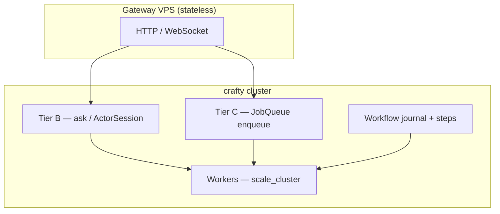

# Product scenarios — actor-first platform (no mandatory Redis)

**Status:** Accepted  
**Date:** 2026-08-28

## Context

crafty targets **product teams**, not infra teams running Kubernetes microservices. The deployment model is [library-first](deployment-model.md): **one Rust codebase**, **one binary**, **N identical VPS processes** that join a cluster incrementally. Scale unit = **actors and VPS count**, not new Deployments or service meshes.

Four application patterns cover most distributed product work:

| Scenario | User-facing name | Guide |
|----------|------------------|-------|
| Background jobs | Sidekiq-style durable queue | [background-jobs](../scenarios/background-jobs.md) |
| Stateful workers | Crash-safe actors + migration | [stateful-workers](../scenarios/stateful-workers.md) |
| Real-time / session | Sticky actors + stateless gateway | [realtime-sessions](../scenarios/realtime-sessions.md) |
| Workflow | Saga coordination (not embedded DB) | [workflows](../scenarios/workflows.md) |

All four compose on the same runtime. No separate job server, workflow server, or mandatory external KV.

## Decision

### Positioning

> **Crafty** — a **distributed coordination runtime**: cache hooks, job queue, actors, workflow machinery, cron. **Same [`CraftyApp`](../../crates/crafty/src/app.rs) API** on one laptop or N VPSes. Domain data stays in **your** Postgres / services — crafty is not an application database. Cluster membership is **automatic** (seed + join); graceful shutdown drains actors and can leave the cluster. No Kubernetes. No mandatory Redis.

### Coordination vs domain data

| Built into crafty | Stays external |
|-------------------|----------------|
| Job queue, cron, lease/ack | Business tables (Postgres, …) |
| Actors, sessions, directory | Authoritative domain SM as product DB |
| Saga / workflow **journal** | Long-running side effects via enqueue / HTTP / cast |
| `ActorStateStore` (idempotency, step keys) | Mandatory Redis |

Advanced teams may embed a custom [`StateMachine`](../../crates/crafty-core/src/lib.rs) via [`CraftyCluster`](../../crates/crafty/src/cluster.rs) — that is **not** the default [`CraftyApp`](../../crates/crafty/src/app.rs) product path.

### Three messaging tiers (product view)

| Tier | Mechanism | Product use |
|------|-----------|-------------|
| **B — Actor mailbox** | `send` / `ask` / `ActorSession` | RPC, sync HTTP, real-time session to a pinned worker |
| **C — Job queue** | `JobQueue` → `RedbJobQueue` | Async backlog, many workers, autoscale |
| **Workflow machinery** | Meta-Raft saga journal + steps | Multi-step processes with compensators; steps call B/C or external APIs |

Actor **workflow keys** (idempotency, step progress outside SM) use [`ActorStateStore`](actor-state-store.md) — default path **`redb`**, not Redis.

See [job-queue](job-queue.md) for why mailboxes and Raft logs are not misused as queues.

### Infrastructure stance

| Required | Optional |
|----------|----------|
| VPS / bare metal (or containers as packaging only) | `crafty-store-redis` — integration with non-crafty services |
| `data_dir` on disk (`group-*.redb`, `queue-*.redb`, …) | External PostgreSQL / Valkey adapters (future) |
| mTLS certs ([certificates](certificates.md)) | Load balancer in front of gateway nodes |

**Non-goals:** Kubernetes as core product, one-container-per-actor microservices, mandatory Redis/PostgreSQL/RabbitMQ.

### Unified product surface (0.3.0)

[`CraftyApp`](../../crates/crafty/src/app.rs) wraps the same runtime as `CraftyClusterBuilder`:

```rust
use std::time::Duration;
use crafty::{CraftyApp, GatewayOpts, QueueOpts, RunOpts};

CraftyApp::builder()
    .data_dir("/var/lib/crafty")
    .queue([QueueOpts::new("emails", Duration::from_secs(300))])
    .consumer(SendEmailConsumer, Default::default())
    .gateway(GatewayOpts::new("0.0.0.0:8090".parse()?).with_jobs_api(true))
    .run(RunOpts::default().with_wait_queue("emails"))
    .await?;
```

Declarative `.jobs(...)` / `.workers(..., scale: Auto)` registration remains aspirational — use `.queue`, `.consumer`, and `.actors(name, ActorGroupOpts::…)` today ([examples/](../../examples/README.md)).

### Scenario composition



Typical flows:

- **Async API:** HTTP `202` → `enqueue` (C) → worker `lease`/`ack` (C + W)
- **Sync API:** HTTP `200` → `ask` or `query` (B or A)
- **Session:** WebSocket → `ActorSession` → `ask_session` (B + W)
- **Workflow:** `run_workflow` / HTTP `/workflows/*` — journal in Meta-Raft; steps call actors, queue, or external HTTP

### What is shipped vs polish backlog

| Capability | Status | Notes |
|------------|--------|-------|
| `RedbJobQueue`, `ClusterJobQueue`, autoscale | **shipped** | — |
| Saga journal (`MetaRaftSagaJournal`, `CompositeSagaJournal`) | **shipped** | — |
| `ActorSession`, consistent-hash routing | **shipped** | — |
| Actor migration on leave/crash | **shipped** | — |
| `RedbActorStateStore` + voter replication + TTL/GC | **shipped** | B-01 ✅ |
| `CraftyApp` product facade + gateway | **shipped** | B-02 ✅ |
| HTTP jobs API (`202`, batch, DLQ requeue) | **shipped** | B-03 ✅ |
| Real-time showcase + `ActorsApi` on gateway | **shipped** | B-04 ✅ — [examples/realtime/](../examples/realtime/) |
| `WorkflowBuilder` + resume CLI | **shipped** | B-05 ✅ |
| `crafty init` template | **shipped** | B-06 ✅ — polish: richer worker stubs |
| Dashboard: queue depth + saga status | **shipped** | B-07 ✅ |
| Scenario docs (redb-first, no mandatory Redis) | **shipped** | B-08 ✅ |
| Gateway auth (beyond `GATEWAY_TOKEN` stub) | **polish** | — |
| E2E HTTP batch via gateway in docker | **polish** | QUIC queue E2E exists |

Full epic list: [backlog.md](../backlog.md) (P0–P3 ✅).

## Consequences

**Positive**

- Single story for product teams: actors + disk, not microservices + Redis cluster
- All four scenarios share ops (backup `data_dir`, rolling upgrade, certs)
- Clear boundary: consensus in SM, work in queue, session in actor + optional store

**Negative**

- Declarative `.jobs()` / `.workers()` builder sugar still aspirational — use `.queue`, `.consumer`, and `.actors(name, ActorGroupOpts::…)` today
- WebSocket gateway auth remains a thin stub (`GATEWAY_TOKEN`) — production apps add their own layer
- Stateful workers need `RedbActorStateStore` + SM discipline — keys without SM still require explicit design

## Related

- [deployment-model](deployment-model.md)
- [actor-state-store](actor-state-store.md)
- [job-queue](job-queue.md)
- [cross-node-actors](cross-node-actors.md)
- [actor-routing-tier3](actor-routing-tier3.md)
- [multi-raft](multi-raft.md#cross-shard-transactions)
- [scenarios/README.md](../scenarios/README.md)
- [backlog.md](../backlog.md)
