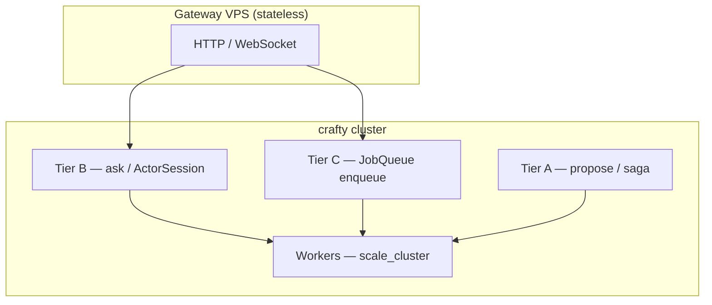

# Product scenarios — actor-first platform (no mandatory Redis)

**Status:** Accepted  
**Date:** 2026-08-28

## Context

crafty targets **product teams**, not infra teams running Kubernetes microservices. The deployment model is [library-first](deployment-model.md): **one Rust codebase**, **one binary**, **N identical VPS processes** that join a cluster incrementally. Scale unit = **actors and VPS count**, not new Deployments or service meshes.

Four application patterns cover most distributed product work:

| Scenario | User-facing name | Guide |
|----------|------------------|-------|
| Background jobs | Sidekiq-style durable queue | [background-jobs](../scenarios/background-jobs.md) |
| Stateful workers | Crash-safe actors + migration | [stateful-workers](../scenarios/stateful-workers.md) |
| Real-time / session | Sticky actors + stateless gateway | [realtime-sessions](../scenarios/realtime-sessions.md) |
| Workflow | Saga + queue as mini-Temporal | [workflows](../scenarios/workflows.md) |

All four compose on the same runtime. No separate job server, workflow server, or mandatory external KV.

## Decision

### Positioning

> **Crafty** — write actors; the cluster scales when you add VPSes. Jobs, stateful workers, sessions, and workflows are built in. Persistence defaults to **embedded `redb` + Raft** under `data_dir`. No Kubernetes. No mandatory Redis.

### Three persistence tiers (product view)

| Tier | Mechanism | Product use |
|------|-----------|-------------|
| **A — Consensus** | Raft → `StateMachine` | Orders, balances, config — linearizable domain data |
| **B — Actor mailbox** | `send` / `ask` / `ActorSession` | RPC, sync HTTP, real-time session to a pinned worker |
| **C — Job queue** | `JobQueue` → `RedbJobQueue` | Async backlog, many workers, autoscale |

Actor **workflow keys** (idempotency, step progress outside SM) use [`ActorStateStore`](actor-state-store.md) — default path **`redb`**, not Redis.

See [job-queue](job-queue.md) for why mailboxes and Raft logs are not misused as queues.

### Infrastructure stance

| Required | Optional |
|----------|----------|
| VPS / bare metal (or containers as packaging only) | `crafty-store-redis` — integration with non-crafty services |
| `data_dir` on disk (`group-*.redb`, `queue-*.redb`, …) | External PostgreSQL / Valkey adapters (future) |
| mTLS certs ([certificates](certificates.md)) | Load balancer in front of gateway nodes |

**Non-goals:** Kubernetes as core product, one-container-per-actor microservices, mandatory Redis/PostgreSQL/RabbitMQ.

### Unified product surface (target)

Today users assemble [`CraftyClusterBuilder`](../../crates/crafty/src/builder.rs) directly. The target **product API** wraps the same runtime:

```rust
// Target (backlog: CraftyApp) — not shipped yet; see docs/backlog.md
CraftyApp::from_env()
    .jobs("emails", EmailWorker::handle)
    .workers(EmailWorker, scale: Auto)
    .workflows([onboard_user])
    .http_routes(gateway_routes())
    .run_until_shutdown()
    .await?;
```

Until `CraftyApp` lands, each [scenario guide](../scenarios/README.md) documents the current builder-level wiring and points at examples.

### Scenario composition



Typical flows:

- **Async API:** HTTP `202` → `enqueue` (C) → worker `lease`/`ack` (C + W)
- **Sync API:** HTTP `200` → `ask` or `query` (B or A)
- **Session:** WebSocket → `ActorSession` → `ask_session` (B + W)
- **Workflow:** `run_saga` (A journal) with steps calling C, B, or A

### What is shipped vs backlog

| Capability | Status | Backlog id |
|------------|--------|------------|
| `RedbJobQueue`, `ClusterJobQueue`, autoscale | **shipped** | — |
| Saga journal (`MetaRaftSagaJournal`, `CompositeSagaJournal`) | **shipped** | — |
| `ActorSession`, consistent-hash routing | **shipped** | — |
| Actor migration on leave/crash | **shipped** | — |
| `InMemoryStore` for actor workflow keys | **shipped** (dev) | — |
| `RedbActorStateStore` + voter replication | **shipped** | — |
| `CraftyApp` product facade | **shipped** | — |
| HTTP jobs API helper (`202 + job_id`) | **backlog** | B-03 |
| `websocket_gateway` example | **backlog** | B-04 |
| Workflow fluent builder | **backlog** | B-05 |
| `crafty init` template (all four scenarios) | **backlog** | B-06 |
| Dashboard: queue depth + workflow status | **backlog** | B-07 |
| Scenario docs de-emphasize Redis in getting started | **backlog** | B-08 |

Full list: [backlog.md](../backlog.md).

## Consequences

**Positive**

- Single story for product teams: actors + disk, not microservices + Redis cluster
- All four scenarios share ops (backup `data_dir`, rolling upgrade, certs)
- Clear boundary: consensus in SM, work in queue, session in actor + optional store

**Negative**

- Current API is still builder-heavy until `CraftyApp` ships
- Stateful workers need `RedbActorStateStore` before production crash-safe workflow keys without external DB
- WebSocket gateway remains user-owned thin layer (by design — not a second server product)

## Related

- [deployment-model](deployment-model.md)
- [actor-state-store](actor-state-store.md)
- [job-queue](job-queue.md)
- [cross-node-actors](cross-node-actors.md)
- [actor-routing-tier3](actor-routing-tier3.md)
- [multi-raft](multi-raft.md#cross-shard-transactions)
- [scenarios/README.md](../scenarios/README.md)
- [backlog.md](../backlog.md)
