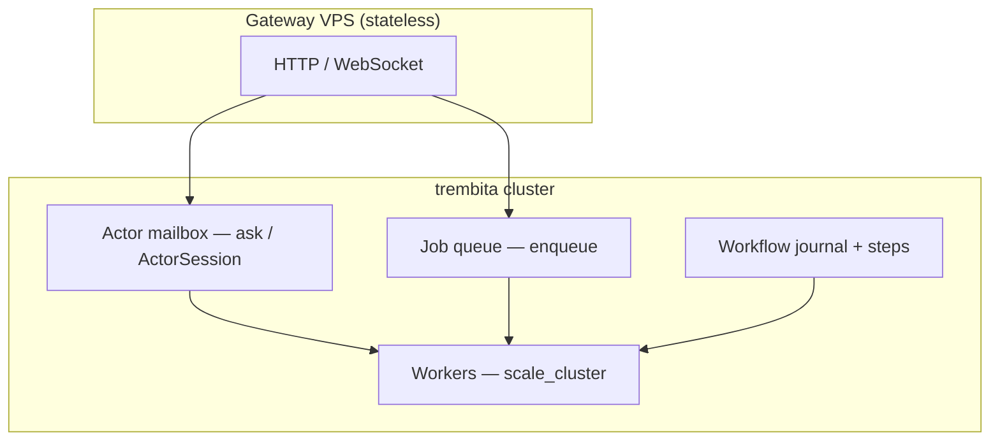

# Product scenarios — capability-first platform (no mandatory Redis)

**Status:** Accepted  
**Date:** 2026-08-28

## Context

trembita targets **product teams**, not teams whose primary job is wiring a separate microservice mesh. The deployment model is [library-first](deployment-model.md): **one Rust codebase**, **one binary**, **N identical VPS processes** that join a cluster incrementally. Product logic is registered as **capabilities**, jobs, and topics — not app-authored [`UserActor`](../../crates/trembita-runtime/src/registry/actor.rs) groups ([product-terminology](product-terminology.md)).

Five application patterns cover most distributed product work:

| Scenario | User-facing name | Guide |
|----------|------------------|-------|
| Background jobs | Sidekiq-style durable queue | [background-jobs](../scenarios/background-jobs.md) |
| Event topics | Pub/sub with independent subscribers | [event-topics](../scenarios/event-topics.md) |
| Stateful workers | Durable ops + cap store (advanced RAM migration demo) | [stateful-workers](../scenarios/stateful-workers.md) |
| Real-time / session | Sticky sessions + capability WS | [realtime-sessions](../scenarios/realtime-sessions.md) |
| Workflow | Saga coordination (not embedded DB) | [workflows](../scenarios/workflows.md) |

All five compose on the same runtime. No separate job server, workflow server, or mandatory external KV.

## Decision

### Positioning

> **Trembita** — a **distributed coordination runtime**: job queue, **typed capabilities**, workflow machinery, cron, event topics. **Same [`TrembitaApp`](../../crates/trembita/src/app/mod.rs) API** on one laptop or N VPSes. Domain data stays in **your** Postgres / services — trembita is not an application database. Cluster membership is **automatic** (seed + join); graceful shutdown drains runtime workers and can leave the cluster. No mandatory Redis.

### Coordination vs domain data

| Built into trembita | Stays external |
|-------------------|----------------|
| Job queue, cron, lease/ack | Business tables (Postgres, …) |
| Capability hosts, sessions, directory (runtime) | Authoritative domain SM as product DB |
| Saga / workflow **journal** | Long-running side effects via enqueue / HTTP / capability ops |
| **Cap store** (`trembita::capstore`, idempotency keys) | Mandatory Redis |

Advanced teams may embed a custom [`StateMachine`](../../crates/trembita-core/src/lib.rs) via [`TrembitaCluster`](../../crates/trembita/src/cluster.rs) — that is **not** the default [`TrembitaApp`](../../crates/trembita/src/app/mod.rs) product path.

### Three messaging layers (product view)

| Layer | Mechanism | Product use |
|-------|-----------|-------------|
| **Capabilities** | `CapRequest` + [`Route`](../../crates/trembita/src/capability/route.rs) (`Inline`, `Queued`, `Session`, …) | Default path: HTTP `cap_*`, in-process `.via(&app)`, cluster `CapWire` |
| **Job queue** | `JobQueue` → `RedbJobQueue` | Async backlog, consumers, autoscale |
| **Event topic** | `EventTopic` → `RedbEventTopic` | Fan-out domain events; per-subscription cursors ([event-topics](event-topics.md)) |
| **Workflow machinery** | Meta-Raft saga journal + steps | Multi-step processes; steps call capability ops, enqueue, or external APIs |
| **Sessions (realtime)** | `SessionHandle` + sticky routing | WebSocket / long-lived ingress ([realtime-sessions](../scenarios/realtime-sessions.md)) |

Durable op state (idempotency, step keys) uses [`trembita::capstore`](../../crates/trembita/src/capstore.rs) — default **`redb`**, not Redis. Raw **`cast`/`ask`** mailboxes are **advanced** ([product-terminology](product-terminology.md)).

See [job-queue](job-queue.md) for why mailboxes and Raft logs are not misused as queues.

### Infrastructure stance

| Required | Optional (via `trembita` features — [facade](facade.md)) |
|----------|----------|
| VPS / bare metal (or containers as packaging only) | `redis-store` — Redis `ActorStateStore` for non-trembita integration |
| `data_dir` on disk (`group-*.redb`, `queue-*.redb`, `topic-*.redb`, …) | `external-backlog` — Postgres `ExternalBacklog`; Valkey/other adapters as needed |
| mTLS certs ([certificates](certificates.md)) | `domain-outbox` — Postgres transactional outbox |
| | Load balancer in front of gateway nodes |

**Non-goals:** Orchestration-platform packaging as core product, one-container-per-actor microservices, mandatory Redis/PostgreSQL/RabbitMQ, static node roles as the primary scaling model (use homogeneous nodes + `.workload()`).

### Homogeneous nodes — compute tokens (B-16)

Every VPS runs the **same binary** (gateway when configured + job consumers + capability runtime). There is no fleet-wide “gateway pool vs worker pool” env switch.

When ingress is quiet, **job consumers use spare CPU** on that node (night batch scenario). When gateway load rises, a per-node **workload governor** throttles consumer parallelism so API latency stays bounded — without rescaling the cluster.

See [workload-governor](workload-governor.md). Subprocess / shell-out CPU: [external-load](external-load.md) (`JobOpts::compute_cost`, optional `ExternalLoad` on `WorkloadOpts`).

### Unified product surface

[`TrembitaApp`](../../crates/trembita/src/app/mod.rs) is the product entry; it boots the same runtime as [`trembita-assembly`](../../crates/trembita-assembly/src/builder/mod.rs) `TrembitaClusterBuilder` (not exported on the facade):

```rust
use std::time::Duration;
use trembita::{AppManifest, JobOpts, TrembitaApp, TrembitaConfigure, consumer};

#[consumer("emails")]
async fn send_email(_payload: &[u8]) -> Result<(), ()> {
    Ok(())
}

TrembitaApp::from_env()?
    .manifest(
        AppManifest::new().jobs([
            JobOpts::new("emails")
                .lease(Duration::from_secs(300))
                .consumer(&SendEmailConsumer)
                .http_enqueue(true),
        ]),
    )
    .configure(TrembitaConfigure::default().with_data_dir("/var/lib/trembita"))
    .run()
    .await?;
```

Register jobs, workers, topics, and workflows on [`AppManifest`](../../crates/trembita/src/app/manifest.rs) ([`.manifest()`](../../crates/trembita/src/app/builder.rs)) — see [framework-conventions](framework-conventions.md) and [env.md](../env.md).

### Scenario composition



Typical flows:

- **Async API:** HTTP `202` → `enqueue` (job queue) → worker `lease`/`ack`
- **Sync API:** HTTP `200` → `ask` or `query` (actor mailbox or Raft SM)
- **Session:** WebSocket → `ActorSession` → `ask_session` (actor mailbox + workers)
- **Workflow:** `run_workflow` / HTTP `/workflows/*` — journal in Meta-Raft; steps call actors, queue, or external HTTP

### Shipped capabilities and open work

This ADR states **product positioning and composition**. What is implemented today and what remains optional lives in [status.md](../status.md) (current index) and [backlog.md](../backlog.md#open-work) (open work) — not duplicated here.

## Consequences

**Positive**

- Single story for product teams: actors + disk, not microservices + Redis cluster
- All product scenarios share ops (backup `data_dir`, rolling upgrade, certs)
- Clear boundary: consensus in SM, work in queue, session in actor + optional store

**Negative**

- Prefer declarative `.jobs()` / `.workers()`; lower-level `.queue()`, `.consumer()`, and `.actors()` remain available for custom wiring
- WebSocket gateway auth: [`GatewayBearerIdentity`](../../crates/trembita/src/gateway/identity.rs) covers bearer tokens on product routes; session/OAuth/JWT for custom WebSocket handlers remains app-owned via `.identity()` and custom routes
- Stateful workers need `RedbActorStateStore` + SM discipline — keys without SM still require explicit design

### Scale on N identical VPS (B-28–B-54)

Shipped — live index: [status § Product scale wave](../status.md#product-scale-wave-b-28b32) (**B-28 … B-54**). Planning archives: [B-28–B-32](../archive/backlog-wave-b28-b32.md) · [B-33–B-41](../archive/backlog-wave-b33-b41.md). Regression commands: [testing-coverage § B-28–B-32](../testing-coverage.md#shipped-backlog-b-28b32) · [§ B-33–B-41](../testing-coverage.md#shipped-backlog-b-33b41) · [§ B-42+](../testing-coverage.md#shipped-backlog-b-42).

## Related

- [deployment-model](deployment-model.md)
- [actor-state-store](actor-state-store.md)
- [job-queue](job-queue.md)
- [cross-node-actors](cross-node-actors.md)
- [actor-routing](actor-routing.md)
- [multi-raft](multi-raft.md#cross-shard-transactions)
- [scenarios/README.md](../scenarios/README.md)
- [backlog.md](../backlog.md)
