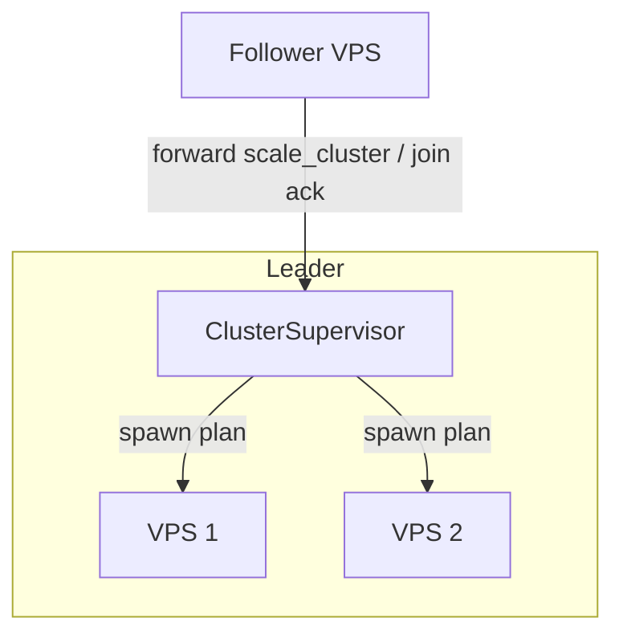

# ClusterSupervisor — leader-only reconciliation

**Status:** Accepted  
**Date:** 2026-07-05

## Context

Open question **#6**: who runs cluster-wide actor placement — auto-spawn on join ([auto-spawn-on-join](auto-spawn-on-join.md)), `scale_cluster`, migration ([cross-node-actors](cross-node-actors.md))?

User chose **Option A — leader only**.

## Decision

**Only the Raft leader** runs **cluster-wide** supervisor decisions. Followers and candidates do **not** initiate cross-node spawn, scale reconcile, or migration planning.

### Responsibilities

| Action | Who |
|--------|-----|
| Reconcile auto workers on all nodes | **Leader** `ClusterSupervisor` |
| `scale_cluster` placement plan | **Leader** |
| Migration target selection on node leave | **Leader** |
| Local `spawn` / `scale_local` (dev) | **Local node** (still allowed) |
| Execute `POST /actor/spawn` on target VPS | Target node ( instructed by leader ) |

### Leader supervisor loop

On events:

- **Membership change committed** ([membership-early](membership-early.md)) → reconcile auto workers for new/removed nodes
- **`scale_cluster` API call** (any node forwards to leader) → leader computes plan → issues spawns/stops
- **`leave()` / node failure detected** → leader plans migration → `/actor/migrate` ([cross-node-actors](cross-node-actors.md))

### Forwarding

- Non-leaders receiving `scale_cluster` or post-join callbacks **forward to leader** (same pattern as client forward, [client-routing](client-routing.md)).
- During election: operations return `503` / retry until leader elected.

### Idempotency

Leader reconciliation is **declarative**: desired state = N auto workers on N nodes ([one-worker-per-vps](one-worker-per-vps.md)); diff vs directory; idempotent spawns by `(name, node_id, generation)`.

### Rejected

| Option | Why |
|--------|-----|
| **B — every node supervises cluster-wide** | Split-brain placement risk |

## Consequences

**Positive**

- Single planner; consistent with Raft leadership
- Safe auto-spawn on join with [auto-spawn-on-join](auto-spawn-on-join.md)

**Negative**

- Brief unavailability of placement during election
- Leader does extra orchestration work

## Related

- [auto-spawn-on-join.md](auto-spawn-on-join.md)
- [cross-node-actors.md](cross-node-actors.md)
- [membership-early.md](membership-early.md)
- [one-worker-per-vps.md](one-worker-per-vps.md)
