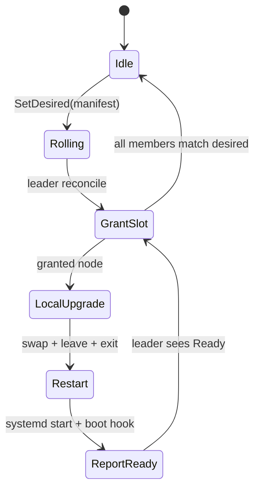

# Self-update coordinator — leader reconcile in StateMachine

**Status:** Accepted  
**Date:** 2026-08-31

## Context

Operators running crafty on **N identical VPS processes** ([deployment-model](deployment-model.md))
need rolling upgrades without Ansible/Kubernetes. Manual steps are documented in
[rolling-upgrade.md](../ops/rolling-upgrade.md): drain, leave, replace binary, restart,
verify `/ready`.

Users asked for a **maximally elegant** path:

- **No external orchestrator** — no CI loop over SSH, no sidecar process.
- **Self-updating binary** — each node downloads an artifact, atomically replaces itself,
  calls `leave()`, exits; **systemd** (`Restart=always`) starts the new build.
- **No service downtime** — for patch upgrades on **≥3 nodes**, remaining members keep
  quorum and serve traffic while one node restarts.

Crafty already has the primitives: Raft **leader-only** reconciliation
([cluster-elasticity#supervisor--leader-only-reconciliation](cluster-elasticity.md#supervisor--leader-only-reconciliation)),
graceful `leave()` + drain ([drain-timeout](drain-timeout.md)), wire N/N−1
([cluster-membership#version-skew--hard-reject](cluster-membership.md#version-skew--hard-reject)),
admin `/ready`.

This ADR defines a **reference pattern** for application authors: upgrade state lives in the
user's **StateMachine**; the Raft leader runs a declarative reconcile loop; each node executes
locally when granted a slot.

**Non-goals for crafty core (v1 of this ADR):**

- Embedding download/replace logic inside the `crafty` crate.
- Replacing systemd or artifact hosting.
- Zero-risk rolling of **breaking** `app_version` / SM semantics without user migration
  discipline.

## Decision

### Architecture



| Role | Who | Responsibility |
|------|-----|----------------|
| **Coordinator** | Raft **leader only** | Diff desired vs actual; grant **one** slot at a time |
| **Executor** | Every node (local) | Download, verify, atomic install, graceful shutdown, `exit(0)` |
| **Process supervisor** | **systemd** on each VPS | Restart after exit; not a cluster orchestrator |
| **Operator** | Human or one-shot API call | `SetDesired(manifest)` — fleet rolls automatically |

Followers **never** grant slots (same rule as `ClusterSupervisor` — no split-brain placement).

Upgrade progress is **durable in the Raft log** via the user's SM so a new leader continues
the same rolling plan after failover.

### StateMachine contract (application-owned)

Types below are illustrative; apps may nest them in existing command enums.

```rust
/// Published by ops (propose on any node; leader applies).
struct ArtifactManifest {
    app_version: String,       // must match CRAFTY_APP_VERSION after restart
    url: String,
    sha256: [u8; 32],
    min_protocol: u32,         // optional guard vs PROTOCOL_VERSION band
}

enum UpgradeCommand {
    /// Start or replace a rolling upgrade target.
    SetDesired(ArtifactManifest),
    /// Leader-only: assign the next node (written by leader reconcile tick).
    Grant { node_id: NodeId },
    /// Executor reports lifecycle (any member, idempotent).
    Report { node_id: NodeId, phase: UpgradePhase },
    /// Ops abort / rollback marker.
    Abort { reason: String },
}

enum UpgradePhase {
    Downloading,
    Installed,   // binary on disk, not yet restarted
    Restarting,
    Ready,       // post-boot: version matches + /ready
    Failed { message: String },
}

struct UpgradeState {
    desired: Option<ArtifactManifest>,
    granted: Option<NodeId>,
    completed: BTreeSet<NodeId>,
    last_report: BTreeMap<NodeId, UpgradePhase>,
    aborted: Option<String>,
}

struct UpgradeView {
    desired: Option<ArtifactManifest>,
    granted: Option<NodeId>,
    completed: BTreeSet<NodeId>,
    pending: Vec<NodeId>,   // members not in completed
    fleet_ready: bool,
}
```

**Leader-only commands:** `Grant` must only commit when `apply` runs on the leader's proposal
path, or the leader tick proposes `Grant` and followers reject non-leader origin — same
discipline as cluster-wide scale RPCs.

**Queries:** `UpgradeView` is derived from `UpgradeState` + committed membership (voter set).

### Reconcile algorithm (leader tick)

Run on a timer (e.g. every 5–15s) when `is_leader()` and `UpgradeState.desired` is set:

1. If `aborted` → stop granting.
2. Build `pending = live_nodes \ completed`.
3. If `pending` is empty → clear `desired` (rolling complete) or mark fleet at target.
4. If `granted` is set and last report ≠ `Ready`/`Failed` → wait (or timeout → `Failed`).
5. Else pick **next grant**:
   - Exclude current leader until `pending.len() == 1` (**leader last** — preserves
     coordinator during follower rolls).
   - Among eligible, choose **lowest `NodeId`** — deterministic across leader failovers.
6. Propose `Grant { node_id }`.

This mirrors `ClusterSupervisor::reconcile`: declarative desired state, idempotent diff,
`reachable_nodes()` may exclude crashed hosts from pending eligibility
([cluster-membership#liveness-vs-membership](cluster-membership.md#liveness-vs-membership)).

### Local executor (every node)

Background task (or `CraftyApp` hook):

```text
loop:
  view = query(UpgradeView)
  if view.granted != self.node_id: continue
  if running_version == view.desired.app_version:
    propose(Report { Ready }); continue

  propose(Report { Downloading })
  tmp = download(view.desired.url)
  verify_sha256(tmp, view.desired.sha256)
  atomic_install(tmp)          // rename or symlink swap; see below
  propose(Report { Installed })

  shutdown_graceful(leave=true)  // CraftyApp / cluster.leave()
  exit(0)                        // systemd Restart=always
```

**Boot hook** (first lines of `main` after cluster ready):

```text
if post_upgrade_boot():
  propose(Report { node_id, phase: Ready })
```

**Atomic install** (Linux):

```bash
# Option A — symlink fleet (recommended for rollback)
install -m755 "$tmp" "/opt/app/app-$VERSION"
ln -sfn "/opt/app/app-$VERSION" "/opt/app/current"

# Option B — in-place replace (same path as ExecStart)
mv "$tmp" "/opt/app/current"   # running process keeps old inode until exit
```

`ExecStart=/opt/app/current` in systemd; `TimeoutStopSec` ≥ `CRAFTY_DRAIN_TIMEOUT`.

### Operator surface

Minimal HTTP on admin/gateway (forward to leader if needed):

```http
POST /cluster/upgrade/desired
Content-Type: application/json

{
  "app_version": "1.2.3",
  "url": "https://releases.example/myapp-1.2.3-x86_64-unknown-linux-gnu",
  "sha256": "…"
}
```

Maps to `propose(SetDesired(…))`. Optional: leader polls a manifest URL and proposes when
version increases.

Optional query:

```http
GET /cluster/upgrade
→ UpgradeView JSON
```

### Version axes (must align with membership ADR)

| Upgrade kind | Mixed fleet during roll | Coordinator notes |
|--------------|-------------------------|-------------------|
| **Patch / wire-only** (same `app_version`, new crafty wire) | Safe if `protocol_version` in N/N−1 band | Default happy path; zero-downtime on ≥3 nodes |
| **App semver** (SM / command change) | **Unsafe** unless `apply` backward-compatible for overlap window | Roll fast; do not expand membership until all `Ready`; consider `Abort` on first `Failed` |
| **Breaking SM** | Requires migration commands or maintenance | Coordinator can run, but ops must design SM compatibility or stop writes |

See [rolling-upgrade.md](../ops/rolling-upgrade.md) — this ADR **automates** that runbook, it
does not relax `app_version` exact-match on join.

### Failure handling

| Event | Behaviour |
|-------|-----------|
| Node fails verify / download | `Report(Failed)`; leader stops granting (policy: manual `Abort` or retry same node) |
| Node exits but wrong version on boot | Stays not `Ready`; leader timeout → `Failed` |
| Leader election mid-roll | New leader reads SM; same `granted` / `completed`; reconcile continues |
| Quorum would be lost | Require **≥3 voters** and **max_parallel = 1**; never grant two slots |
| Bad artifact fleet-wide | First `Failed` → propose `Abort`; ops rollback symlinks + `SetDesired` previous manifest |

Pre-upgrade: `crafty-ops backup export` remains recommended ([backup-restore.md](../ops/backup-restore.md)).

### Security

- Manifest URL over HTTPS; pin CA or use object storage with signed URLs.
- **Verify SHA-256** before install; prefer **minisign/cosign** in manifest for production.
- Install path owned by service user; runtime need not run as root.
- Admin `POST /cluster/upgrade/desired` must be authenticated (mTLS admin, `GATEWAY_TOKEN`, or
  network ACL) — same bar as other cluster mutations.

### What stays outside crafty core

| Concern | Owner |
|---------|--------|
| `UpgradeCommand` / `UpgradeState` types | User `StateMachine` |
| Leader reconcile tick | User actor or `CraftyApp` extension |
| Download / install / exit | User binary |
| systemd unit | Operator |
| Artifact registry | Operator |

Optional future **crafty** crate additions (not required for the pattern):

- `crafty::upgrade` reference SM + reconcile helper (like `crafty_core::kv`).
- Admin routes in `crafty-dashboard` for `GET/POST /cluster/upgrade`.
- Example in `examples/` or template in `crafty init`.

## Consequences

**Positive**

- Self-updating cluster without Ansible/K8s; aligns with library-first VPS model.
- Reuses leader-only supervisor mental model — one coordinator, deterministic grants.
- Durable rolling state survives leader failover.
- Patch upgrades achieve **service availability** on ≥3 nodes (one member maintenance at a time).

**Negative**

- Application authors own SM compatibility for semver bumps.
- Brief client blips (drain, `/ready` flap) remain possible.
- systemd + artifact host are still required infrastructure.
- Incorrect reconcile implementation could grant two nodes — must enforce `max_parallel = 1`.

**Rejected alternatives**

| Alternative | Why not |
|-------------|---------|
| Sidecar updater process | Extra moving part; same mechanics, less elegant |
| Each node polls manifest independently | Race — full fleet restart |
| In-memory coordinator on leader | Lost on failover |
| Embed updater in `crafty` core | Violates ports/adapters; app paths and SM differ per product |
| Kubernetes operator | Explicit non-goal ([product-scenarios](product-scenarios.md)) |

## Implementation backlog

Reference implementation (optional, not blocking 1.0):

| Id | Item | Layer |
|----|------|-------|
| O-05a | ADR | docs ✅ |
| O-05b | `crafty_core::upgrade` reference SM + unit tests | crafty-core ✅ |
| O-05c | `UpgradeReconciler` / `spawn_upgrade_coordinator` | crafty facade ✅ |
| O-05d | Example `examples/self-update` | examples ✅ |
| O-05e | [rolling-upgrade.md](../ops/rolling-upgrade.md) + integration test | docs + crafty/tests ✅ |

## Related

- [deployment-model.md](deployment-model.md) — one binary, N VPS
- [cluster-elasticity.md#supervisor--leader-only-reconciliation](cluster-elasticity.md#supervisor--leader-only-reconciliation)
- [cluster-membership.md#version-skew--hard-reject](cluster-membership.md#version-skew--hard-reject)
- [drain-timeout.md](drain-timeout.md)
- [certificates.md](certificates.md) — external agent + hot reload (same ops pattern)
- [rolling-upgrade.md](../ops/rolling-upgrade.md) — manual runbook this ADR automates
