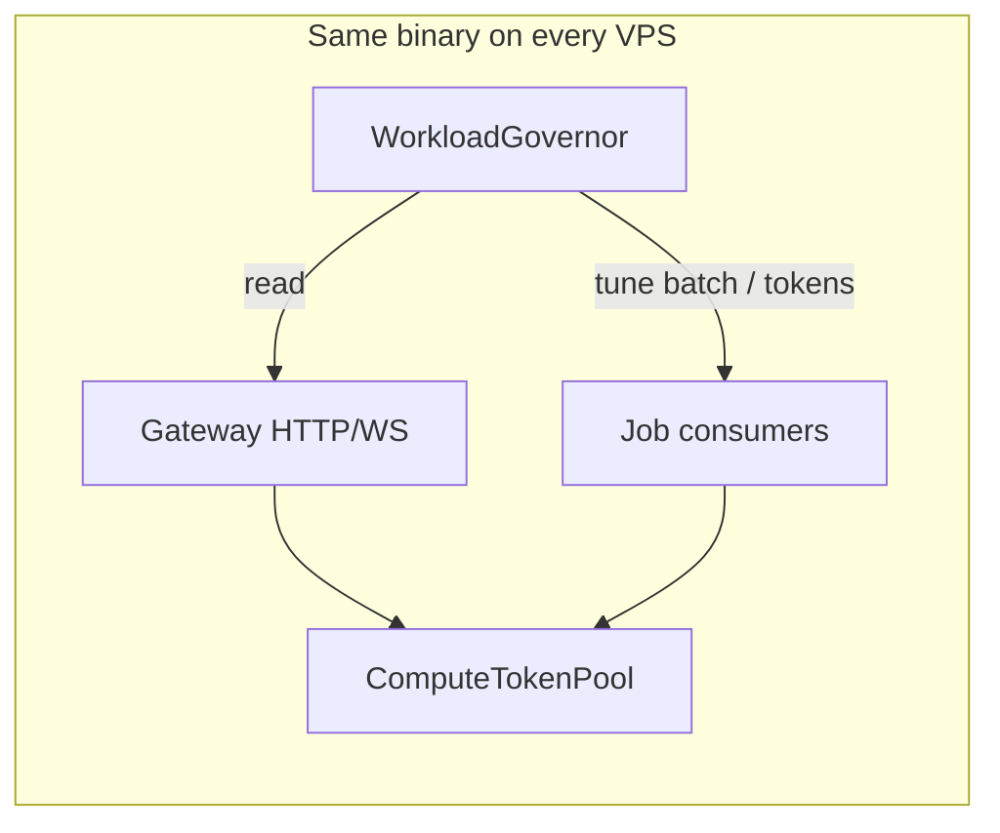

# Workload governor — compute tokens on homogeneous nodes

**Status:** Accepted (implemented)  
**Date:** 2026-09-02  
**Epic:** [B-16](../backlog.md#b-16--workload-governor-compute-tokens)

## Context

Product stance ([product-scenarios](product-scenarios.md)): **one binary, N homogeneous VPSes** — every node runs gateway (when configured), job consumers, and supervised actors. Scale unit = add VPS, not reconfigure roles.

Teams rejected **static node roles** (`TREMBITA_ROLE=gateway|worker`) as the primary model:

- At night API is idle but jobs are heavy — nobody should resize the cluster or flip roles.
- The same machine should **use spare capacity** for jobs when ingress is quiet.
- During the day, **API latency must win** when gateway and consumers compete on one tokio runtime.

Today autoscale reads **queue depth only** ([job-queue](job-queue.md)). It does not observe **local gateway load**. Aggressive consumer settings (`batch`, `instances`, short `idle_sleep`) can starve HTTP/WebSocket handlers on the same node.

`TREMBITA_ROLE` was an advanced env split for edge-only nodes. It conflicted with the homogeneous vision and was **removed in B-16g** (after a deprecation phase in B-16f).

## Decision

Introduce a **per-node workload governor** backed by a shared **`ComputeTokenPool`**:

| Piece | Role |
|-------|------|
| **`ComputeTokenPool`** | Process-wide semaphore: at most `N` concurrent “heavy compute” units (gateway request handling + job handler + actor ask) |
| **`WorkloadGovernor`** | Background loop on each node: adjusts effective token budget and consumer knobs from **ingress signals** |
| **`WorkloadOpts`** | Builder/API: presets, ceilings, API protection thresholds |

No cluster topology change. No leader election for this loop. No `TREMBITA_ROLE`.

### Signals (inputs)

| Signal | Source today | Use |
|--------|--------------|-----|
| Active gateway connections | [`ConnectionTracker`](../../crates/trembita/src/gateway/drain.rs) | Low → more tokens for jobs; high → protect API |
| In-flight HTTP (future) | Axum middleware counter | Same, finer than connections alone |
| Queue depth (local view) | `JobQueue::metrics` / external backlog | Opportunistic job boost when API quiet **and** work waiting |
| Consumer in-flight (future) | governor-owned counter | Avoid over-subscription |

### Actions (outputs)

| Action | Mechanism |
|--------|-----------|
| **Hard cap** | Acquire token before running gateway handler body / consumer handler / actor ask (cluster + typed [`ActorRef`](../../crates/trembita-runtime/src/registry.rs)) |
| **Soft throttle** | Governor publishes `ConsumerTune { batch, idle_sleep, max_in_flight }` via `watch` channel — [`run_queue_consumer`](../../crates/trembita-jobs/src/queue.rs) already uses `watch` for stop |
| **Preset expansion** | When `connections.active == 0` and depth > 0 → raise token ceiling toward `WorkloadOpts::max_tokens` |

Default preset **`Balanced`**: protect API when hot; jobs consume slack automatically.

### API sketch

```rust
TrembitaApp::builder()
    .data_dir("/data")
    .workload(WorkloadOpts::balanced()
        .max_compute_tokens(available_parallelism())
        .api_protect( ApiProtect::when_connections_above(32) ))
    .gateway(GatewayOpts::new("0.0.0.0:8090".parse()?))
    .jobs([JobOpts::new("imports").consumer(&ImportConsumer)])
```

Gateway routes and consumer loops **acquire** a token for the duration of handler work (RAII guard). Token starvation delays new leases / accepts backpressure — it does not kill in-flight work.

### Homogeneous cluster behaviour



**Night:** few connections → governor raises job throughput (more tokens to consumers, larger batch).  
**Day:** many connections → governor tightens consumers; API keeps tokens.

Cluster-wide autoscale ([`AutoscalePolicy`](../../crates/trembita-jobs/src/queue_autoscale.rs)) remains for **worker actor count across VPSes**. The governor is **local fairness** between ingress and compute on one machine.

## Removed: `TREMBITA_ROLE`

**Removed in B-16g.** Homogeneous nodes use `.workload()` and deployment choice (register consumers or not) instead of role env vars.

| Phase | Item |
|-------|------|
| **B-16a** | Documented roles as deprecated; showcases use homogeneous env |
| **B-16f–g** | Removed `NodeRole`, `node_role_from_env`, `TREMBITA_ROLE`, `TREMBITA_GATEWAY_ONLY`, `TREMBITA_NO_CONSUMER` |

Edge-only ingress without local consumers is achieved by **not registering** `.jobs()` / `.workers()` on those nodes (deployment choice), or by setting consumer `instances(0)` — not by a role env var.

## Consequences

- Homogeneous fleet matches product story; no role-based ops playbooks
- CPU-bound handlers must release tokens quickly or block peers — document RAII pattern
- Token pool is **cooperative** (same process); subprocess / shell-out load uses
  [`compute_cost`](external-load.md) and optional [`ExternalLoad`](external-load.md)
- Governor adds one background task per node; metrics: `trembita_compute_tokens_in_use`, `trembita_consumer_tune_events`

## Alternatives considered

| Option | Verdict |
|--------|---------|
| `TREMBITA_ROLE=gateway/worker` pools | Rejected — ops burden; contradicts night-time utilisation goal |
| Separate tokio runtime for gateway vs jobs | Rejected for v1 — heavy; tokens + tuning sufficient |
| Kubernetes pod roles | **Non-goal** ([product-scenarios](product-scenarios.md)) |
| Queue depth autoscale only | Keep, but insufficient alone for API vs jobs on same node |

## References

- [cluster-elasticity](cluster-elasticity.md) — one worker/VPS; parallelism inside actor
- [resources.rs](../../crates/trembita-runtime/src/resources.rs) — `ResourceProfile` sizes worker internals, not ingress/compute split
- [background-jobs](../scenarios/background-jobs.md) — consumer tuning knobs today
