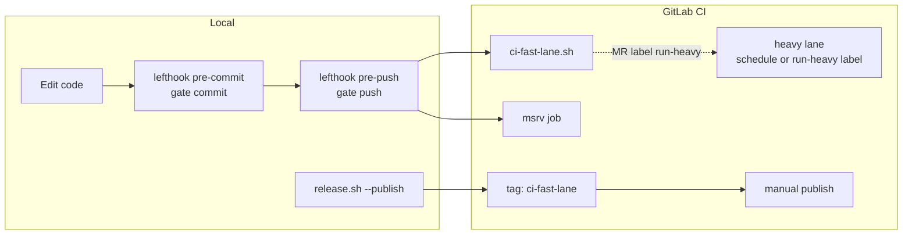

# Development process

How code moves from local edits to crates.io. See also [CONTRIBUTING.md](../CONTRIBUTING.md), [releasing.md](releasing.md), and [testing-strategy](decisions/testing-strategy.md).

## Flow overview



## Quality gate tiers

All gates are invoked via `./scripts/gate.sh --tier …`. Thin wrappers remain for compatibility.

| Tier | Command | When | Checks |
|------|---------|------|--------|
| **commit** | `gate.sh --tier commit` | Every commit (lefthook) | staged autofix, doc-links, clippy |
| **push** | `gate.sh --tier push` | Before push / MR | autofix (optional commit), **ci-fast-lane**, examples, showcase, MSRV, release build (opt-in) |
| **release** | `gate.sh --tier release` | Before tag/publish | push tier + **MSRV strict** + full-workspace autofix |

**CI fast lane** (`scripts/ci-fast-lane.sh`) — shared by GitLab MR/branch pipelines and tag `publish-dry-run`:

fmt → clippy → tests → doctests → doc → shellcheck → doc-links → publish dry-run

Local **push** adds examples, showcase, and MSRV on top of ci-fast-lane.

## Hooks (lefthook)

```bash
lefthook install
```

| Hook | Behavior |
|------|----------|
| **pre-commit** | `gate.sh --tier commit --staged-only` + staged shellcheck |
| **pre-push** | one lefthook job per step (`gate-step.sh fmt`, `clippy`, `tests`, …) — plain output, no spinner |
| **commit-msg** | conventional commit format |

Lefthook uses `no_tty: true` so cargo/nextest output streams live instead of a silent spinner. Each pre-push step appears as its own job (`fmt`, `clippy`, `tests`, …).

Opt-out / tuning:

```bash
LEFTHOOK=0 git commit                    # skip hooks
TREMBITA_NO_AUTOFIX_COMMIT=1 git push      # fail on unfixed fmt/clippy instead of chore commit
TREMBITA_HOOK_LOG=1 git push               # log to target/test-run.log
lefthook run pre-push --tags release     # include release build
```

## CI lanes

| Job | Trigger | Script |
|-----|---------|--------|
| **fast** | every MR / branch push | `ci-fast-lane.sh` |
| **msrv** | every MR / branch push | `cargo check` on Rust 1.90 |
| **heavy** (e2e, store-redis) | nightly schedule **or** MR label `run-heavy` | e2e scripts / redis tests |
| **publish-dry-run** | version tag `v*.*.*` | full `ci-fast-lane.sh` |
| **publish** | manual on tag | `publish-workspace.sh` + `post-publish-docs.sh` |

Add label **`run-heavy`** to an MR to run e2e and Redis integration without waiting for the nightly schedule.

## Release

Recommended one-liner (gate + bump + tag + publish + push + release build):

```bash
# 1. Move CHANGELOG [Unreleased] → new version section
./scripts/release.sh 0.7.0 --publish
```

`--publish` implies **git push** (commits + tag) and **release build** unless you pass `--no-push`.

| Command | Purpose |
|---------|---------|
| `./scripts/release.sh --dry-run` | Same as `release-gate.sh` (with autofix) |
| `./scripts/release.sh 0.7.0` | Prepare only: gate, bump, tag |
| `./scripts/release.sh 0.7.0 --publish` | Full release + push |
| `./scripts/release.sh 0.7.0 --publish --no-push` | Publish to crates.io, no git push |
| `./scripts/release.sh 0.7.0 --publish-only` | Publish existing tag |

Real uploads always go through `publish-workspace.sh` (rate-limit safe). Never `cargo publish --workspace` for real uploads.

## Script map

| Script | Role |
|--------|------|
| `gate.sh` | Unified entry — `--tier commit\|push\|release` |
| `gate-step.sh` | Single step (used by lefthook pre-push for live progress) |
| `ci-fast-lane.sh` | CI + push core checks (calls gate-step) |
| `gate-autofix.sh` | fmt + clippy `--fix` (`--staged-only`, `--stage`) |
| `quality-gate-pre-commit.sh` | → `gate.sh --tier commit` |
| `quality-gate-pre-push.sh` | → `gate.sh --tier push` |
| `release-gate.sh` | → `gate.sh --tier release` |
| `release.sh` | Version bump, tag, publish, push |
| `test-fast.sh` / `test-with-log.sh` | Fast iteration (not gates) |

## Autofix policy

- **Pre-commit:** fmt + clippy `--fix` on **staged crates only**; lefthook re-stages into the current commit.
- **Pre-push:** full-workspace autofix; fixable changes auto-committed as `chore: apply fmt/clippy autofix` (disable with `TREMBITA_NO_AUTOFIX_COMMIT=1`).
- **Release:** autofix included in `chore(release): …` commit when preparing a new version.

Non-fixable clippy pedantic lints still fail the gate — autofix never hides real issues.
