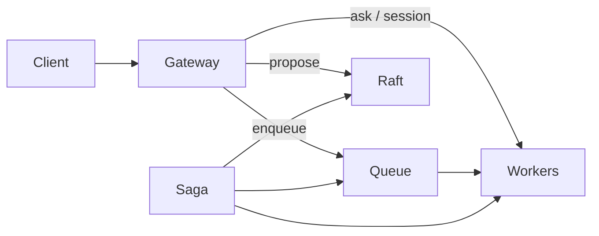

# Product scenarios

Guides for building on trembita **without mandatory Redis or Kubernetes**. Each scenario uses the same binary and `data_dir`; scale by adding VPSes ([deployment-model](../decisions/deployment-model.md)).

**Decision record:** [product-scenarios](../decisions/product-scenarios.md)  
**Implementation backlog:** [backlog.md](../backlog.md)

## Choose your pattern

| I need… | Guide | Runtime today | Product polish |
|---------|-------|---------------|----------------|
| Async work, retries, many workers | [Background jobs](background-jobs.md) | ✅ `RedbJobQueue`, E2E, HTTP `202` | Dashboard queue view |
| One publish, many independent subscribers | [Event topics](event-topics.md) | ✅ `EventTopic`, voter replication | Metrics dashboard |
| Actor state survives VPS crash | [Stateful workers](stateful-workers.md) | ✅ `RedbActorStateStore`, migration | — |
| WebSocket / live session to one worker | [Real-time sessions](realtime-sessions.md) | ✅ `ActorSession`, gateway showcase | `GatewayBearerIdentity` + `protect_product_apis` |
| Multi-step process with compensation | [Workflows](workflows.md) | ✅ `WorkflowBuilder`, Meta-Raft journal | Dashboard saga view |
| Where to put state (queue vs SM vs store) | [State placement](state-placement.md) | ✅ cheat sheet | — |
| Same binary everywhere; API vs jobs on one node | [Workload governor](../decisions/workload-governor.md) | ✅ compute tokens + consumer tune | — |

## Shared persistence model

```
data_dir/
├── group-0.redb           # Raft — StateMachine (domain data)
├── group-meta.redb        # Meta-Raft — saga journal, catalog (multi-Raft)
├── queue-{stream}.redb    # JobQueue backlog
├── topic-{name}.redb      # EventTopic log (one file per topic)
├── mailbox-spool.redb     # durable cross-node deliver (optional)
└── actor-store.redb       # ActorStateStore (RedbActorStateStore)
```

## Messaging layers (do not mix)

| Layer | API | When |
|-------|-----|------|
| **Raft state machine** | `propose` / `query`, `run_saga` | Authoritative replicated domain data |
| **Actor mailbox** | `send` / `ask`, `ActorSession` | Talk to a specific actor now |
| **Job queue** | `enqueue` / `lease` / `ack` | Shared durable backlog |
| **Event topic** | `publish` / `lease` / `ack` (per subscription) | Fan-out domain events |

See [job-queue](../decisions/job-queue.md#three-messaging-layers-explicit-split) and [event-topics](../decisions/event-topics.md).

## Compose scenarios

Typical product stack on one codebase:

1. **HTTP gateway** (any VPS) — sync `ask`, async `enqueue`, WebSocket → session
2. **Workers** — `auto_workers` + optional `scale_cluster`
3. **Domain SM** — orders, accounts via `propose`
4. **Workflows** — onboarding saga calling enqueue + propose steps



## Examples (current)

| Scenario | Example |
|----------|---------|
| Background jobs | `./scripts/run-example.sh background-jobs` |
| Stateful workers | `./scripts/run-example.sh stateful-workers` |
| Real-time / session | `./scripts/run-example.sh realtime` |
| Workflows | `./scripts/run-example.sh workflows` |

Full index: [examples/README.md](../../examples/README.md).

E2E: `./e2e/queue.sh` (QUIC/mTLS, failover). Product HTTP/WS: [`examples/`](../../examples/README.md) + `./scripts/check-examples.sh`.

## Related

- [status.md](../status.md) — shipped vs deferred
- [architecture.md](../architecture.md) — crate graph
- [getting-started.md](../getting-started.md) — TrembitaApp tutorial
- [ops/production-runbook.md](../ops/production-runbook.md) — VPS deployment checklist
- [deployment-model](../decisions/deployment-model.md) — one binary, N VPS
