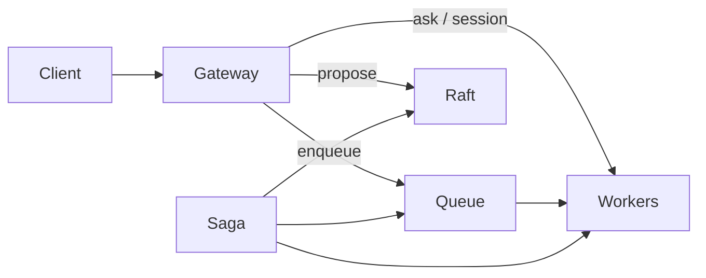

# Product scenarios

Guides for building on trembita **without mandatory Redis** — same binary on each VPS, scale by adding nodes ([deployment-model](../decisions/deployment-model.md)).

**Decision record:** [product-scenarios](../decisions/product-scenarios.md)  
**Backlog:** [open work](../backlog.md#open-work) (no open P0–P2 epics) · **Shipped:** [status.md](../status.md)  
**Scale & ops wave (B-28–B-54):** [status § Product scale wave](../status.md#product-scale-wave-b-28b32) · archives [B-28–B-32](../archive/backlog-wave-b28-b32.md) · [B-33–B-41](../archive/backlog-wave-b33-b41.md) · [testing-coverage](../testing-coverage.md#shipped-backlog-b-28b32)

## Choose your pattern

| I need… | Guide | Runtime today | Product polish |
|---------|-------|---------------|----------------|
| Async work, retries, many workers | [Background jobs](background-jobs.md) | ✅ `RedbJobQueue`, E2E, HTTP `202` | Dashboard queue view |
| One publish, many independent subscribers | [Event topics](event-topics.md) | ✅ `EventTopic`, voter replication | Metrics dashboard |
| Actor state survives VPS crash | [Stateful workers](stateful-workers.md) | ✅ `RedbActorStateStore`, migration | — |
| WebSocket / live session to one worker | [Real-time sessions](realtime-sessions.md) · [WebSocket wiring](websocket-wiring.md) | ✅ `ActorSession`, gateway showcase | `GatewayBearerIdentity` + `AuthMode::Identity` on protected routes |
| Multi-step process with compensation | [Workflows](workflows.md) | ✅ `WorkflowBuilder`, Meta-Raft journal | Dashboard saga view |
| Where to put state (queue vs SM vs store) | [State placement](state-placement.md) | ✅ cheat sheet | — |
| R1–R4 limits, reads vs query, saga/2PC guarantees | [Structural limits](structural-limits.md) · [Write scaling](write-scaling.md) | ✅ product cheat sheet | — |
| Typed ops + inline/queued/event routes (capability DX) | [Capabilities](capabilities.md) · [parity matrix](capability-parity.md) | ✅ [ADR](../decisions/capability-dx.md) · [greenfield wire](../decisions/capability-greenfield-wire.md) | — |
| Cron + events + long runs (how they compose) | [Triggers & pipelines](triggers-and-pipelines.md) · [Cookbook](cookbook-async-work.md) | ✅ patterns + `WorkTrigger` + schedule HTTP | — |
| Same binary everywhere; API vs jobs on one node | [Workload governor](../decisions/workload-governor.md) | ✅ compute tokens + consumer tune; subprocess [`ExternalLoad`](../decisions/external-load.md) | Finer HTTP / consumer in-flight signals (ADR future) |
| Auto cap hosts when cluster grows (B-28) | [Capabilities § Group scale](capabilities.md#group-scale-b-28) | ✅ `resolved_scale` defaults | — |
| LB + `/ready` pool health (B-30) | [ops/ingress-lb.md](../ops/ingress-lb.md) | ✅ ops routes on `TREMBITA_LISTEN` | — |
| Cookie sessions on any gateway node (B-29) | [Real-time § B-29](realtime-sessions.md#cluster-session-cookies-b-29) | ✅ `TREMBITA_GATEWAY_SESSION_SECRET` | — |
| Manifest scale foot-guns (B-31) | [Capabilities § Product scale](capabilities.md#product-scale-b-31) | ✅ `trembita doctor` | — |
| Sharded queue / product multi-Raft (B-32) | [Capabilities § Coordination scale](capabilities.md#coordination-scale-b-32) | ✅ manifest + `TREMBITA_*` | — |

## Shared persistence model

```
data_dir/
├── group-0.redb           # Raft — StateMachine (domain data)
├── group-meta.redb        # Meta-Raft — saga journal, catalog (multi-Raft)
├── queue-{stream}.redb    # JobQueue backlog
├── topic-{name}.redb      # EventTopic log (one file per topic)
├── mailbox-spool.redb     # durable cross-node deliver (optional)
└── actor-store.redb       # ActorStateStore (RedbActorStateStore)
```

## Messaging layers (do not mix)

| Layer | API | When |
|-------|-----|------|
| **Raft state machine** | `propose` / `query`, `run_saga` | Authoritative replicated domain data |
| **Actor mailbox** | `send` / `ask`, `ActorSession` | Talk to a specific actor now |
| **Job queue** | `enqueue` / `lease` / `ack` | Shared durable backlog |
| **Event topic** | `publish` / `lease` / `ack` (per subscription) | Fan-out domain events |

See [job-queue](../decisions/job-queue.md#three-messaging-layers-explicit-split) and [event-topics](../decisions/event-topics.md).

## Compose scenarios

Typical product stack on one codebase:

1. **HTTP gateway** (any VPS) — sync `ask`, async `enqueue`, WebSocket → session
2. **Workers** — `auto_workers` + optional `scale_cluster`
3. **Domain SM** — orders, accounts via `propose`
4. **Workflows** — onboarding saga calling enqueue + propose steps
5. **Triggers** — cron starts a run; domain commits enqueue notifications ([triggers-and-pipelines](triggers-and-pipelines.md))



## Examples (current)

| Scenario | Example |
|----------|---------|
| Background jobs | `./scripts/run-example.sh background-jobs` |
| Stateful workers | `./scripts/run-example.sh stateful-workers` |
| Real-time / session | `./scripts/run-example.sh realtime` |
| Workflows | `./scripts/run-example.sh workflows` |

Full index: [examples/README.md](../../examples/README.md).

E2E: `./e2e/queue.sh` (QUIC/mTLS, failover). Product HTTP/WS: [`examples/`](../../examples/README.md) + `./scripts/check-examples.sh`.

## Related

- [status.md](../status.md) — shipped vs deferred
- [architecture.md](../architecture.md) — crate graph
- [getting-started.md](../getting-started.md) — TrembitaApp tutorial
- [ops/production-runbook.md](../ops/production-runbook.md) — VPS deployment checklist · [deploy/](../../deploy/README.md) — systemd + env templates (B-45)
- [deployment-model](../decisions/deployment-model.md) — one binary, N VPS
