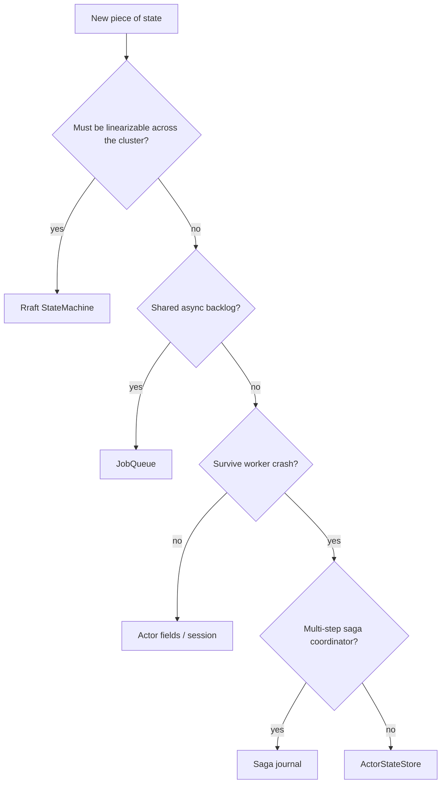

# Where to put state — cheat sheet

One page for choosing between trembita storage layers. See scenario guides for full patterns.

| Data | Store | API | Durability | Example |
|------|-------|-----|------------|---------|
| **Authoritative business facts** (orders, balances, config you audit) | Raft state machine | `propose` / `query` | Replicated log | Order total, account balance |
| **Async work backlog** (emails, exports, retries) | [`JobQueue`](../../crates/trembita-actor/src/queue.rs) | `enqueue` / `lease` / `ack` | `queue-*.redb` | `POST /jobs/emails` → worker |
| **Hot session / handler cache** (loss on crash OK) | Actor struct + [`ActorSession`](../../crates/trembita-actor/src/session.rs) | `cast` / `ask` | In-memory | Chat history in RAM |
| **Idempotency / step progress** (survive worker crash) | [`ActorStateStore`](../../crates/trembita-actor/src/store.rs) | `get` / `set` / CAS | `actor-store.redb` (default) | "order-42 processed" marker |
| **Multi-step workflow journal** | Meta-Raft saga journal | `run_saga` / `resume_saga` | Meta-Raft log | Onboarding saga steps |

## Decision flow

## Idempotency layers (queues)

Job delivery is **at-least-once**. Use three layers together for effectively-once:

1. **Enqueue** — `EnqueueOptions::dedup_key` / HTTP `?dedup=` (safe client retry)
2. **Processing** — `ConsumerOpts::idempotency` or CAS in `ActorStateStore` ([background-jobs § Effectively-once recipe](background-jobs.md#effectively-once-recipe))
3. **Workflow steps** — `TrembitaApp::enqueue_workflow_step` / [`WorkflowBuilder::step_dedup_key`](../../crates/trembita/src/workflow.rs)

## Anti-patterns

| Don't | Why |
|-------|-----|
| Put job payloads in the Raft log | R1 write ceiling; use `JobQueue` |
| Use actor mailbox as a job queue | Unbounded RAM; no lease/ack |
| Put authoritative balances only in `ActorStateStore` | Not consensus-linearizable; use SM |
| Expect `exactly_once: true` on the queue | Delivery is at-least-once by design |

## Related

- [background-jobs](background-jobs.md) · [stateful-workers](stateful-workers.md) · [workflows](workflows.md)
- [job-queue ADR](../decisions/job-queue.md) · [actor-state-store ADR](../decisions/actor-state-store.md)
