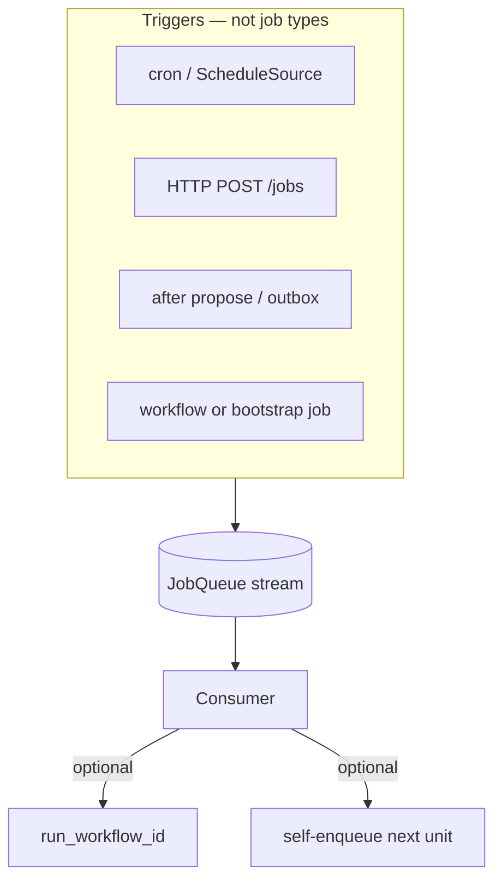

# Work triggers and pipelines

How to combine **cron**, **domain events**, and **long-running work** on one codebase. trembita does not define job “types” — every handler sees the same [`JobQueue`](../../crates/trembita-jobs/src/queue/mod.rs) contract. Your product defines **payload enums**, **streams**, and **where state lives** ([state-placement](state-placement.md)).

**Related:** [background-jobs](background-jobs.md) · [workflows](workflows.md) · [event-topics](event-topics.md) · [cookbook-async-work](cookbook-async-work.md) · [schedule-source](../decisions/schedule-source.md) · [external-backlog](../decisions/external-backlog.md)

## One execution model

| trembita knows | Your app knows |
|----------------|----------------|
| `stream` name | What the bytes mean (`enum Work { … }`) |
| `enqueue` / `lease` / `ack` | When to enqueue (API, cron, after `propose`, outbox) |
| [`RecurringJob`](../../crates/trembita-jobs/src/queue_schedule.rs) cron ticks | Campaign / run ids in Postgres or Raft SM |
| Saga journal | Multi-step processes with compensation |



## Pattern cheat sheet

| You need | Trigger | Work shape | State for progress |
|----------|---------|------------|-------------------|
| Weekly batch (SEO crawl, reports) | [`.cron()`](../../crates/trembita/src/app/builder.rs) or [`ScheduleSource`](../decisions/schedule-source.md) | One **start** job → many **unit** jobs (`self-enqueue` or [`ExternalBacklog`](../decisions/external-backlog.md)) | Run + rows in **your** DB, or queue depth |
| Periodic maintenance (log cleanup every N **calendar** days) | [`RecurringJob::every_calendar_days`](../../crates/trembita-jobs/src/queue_schedule.rs) / HTTP `every_days` + `anchor_ms` | Single idempotent job per tick | None (or last-run marker in SM) |
| Domain event → email / side effect | **`enqueue` after commit** — not cron | One job per notification | Idempotency: `dedup_key` + [effectively-once recipe](background-jobs.md#effectively-once-recipe) |
| Multi-step with rollback | HTTP `/workflows/run` or bootstrap job → [`run_workflow_id`](../../crates/trembita/src/app/runtime.rs) | Saga steps call `enqueue` / `propose` | Meta-Raft journal |
| Atomic DB write + fan-out event | [`EventOutboxSource`](../decisions/event-outbox.md) → topic | Subscribers may `enqueue` | Your outbox table |
| **One-shot at time T** (not recurring) | [`enqueue_at`](../../crates/trembita/src/app/runtime.rs) / `EnqueueOptions::at_unix_ms` / HTTP `run_at_ms` | Single delayed job in queue | Queue `delayed` lifecycle until T |

## Every N calendar days (not cron `*/N`)

Cron `0 4 */3 * *` means “every **3rd day of the month** at 04:00”, not “every three calendar days since install”. For strict calendar spacing (1 Jan → 4 Jan → 7 Jan at the same clock time), use **interval mode**:

```rust
use trembita_jobs::RecurringJob;

// Fixed anchor (e.g. first rollout at a known instant):
let job = RecurringJob::every_calendar_days("log-cleanup", 3, anchor_unix_ms, b"cleanup");

// Or: first fire at 04:00 UTC on or after registration, then +3 calendar days:
let job = RecurringJob::every_calendar_days_at_utc("log-cleanup", 3, 4, 0, b"cleanup")?;
```

HTTP upsert (leader-replicated):

```bash
curl -X PUT "http://127.0.0.1:8090/jobs/maintenance/schedules/log-cleanup" \
  -H 'Content-Type: application/json' \
  -d '{"every_days":3,"anchor_ms":1704081600000,"payload":"cleanup","enabled":true}'
```

Leave `cron` empty when `every_days > 0`. The leader stores `next_run_ms` and advances by `every_days` with chrono calendar days after each tick.

## One-shot schedule at time T

Recurring cron is the wrong tool for “run once on 15 March at 09:00”. Use the queue’s **`not_before_ms`** visibility:

```rust
use trembita::cluster::EnqueueOptions;

// Absolute instant (unix ms):
app.enqueue_at("maintenance", b"cleanup", run_at_ms).await?;

// Or relative delay:
app.enqueue_opts(
    "maintenance",
    b"cleanup",
    EnqueueOptions::delayed(Duration::from_secs(3600)),
)
.await?;
```

HTTP (same semantics as [`POST /jobs/{stream}`](background-jobs.md)):

```bash
# Query
curl -X POST "http://127.0.0.1:8090/jobs/maintenance?run_at_ms=1710000000000" \
  -d 'run-log-rotation'

# JSON envelope
curl -X POST "http://127.0.0.1:8090/jobs/maintenance" \
  -H 'Content-Type: application/json' \
  -d '{"payload":"run-log-rotation","run_at_ms":1710000000000}'
```

Use `delay_ms` instead of `run_at_ms` for “N milliseconds from now”. Do not pass both. Until T the job appears as **`delayed`** in `GET /jobs/{stream}/{id}` and `/jobs/{stream}?state=delayed`.

Scheduling uses **wall-clock** unix milliseconds (`SystemTime`), not the Tokio test clock.

## Cron → pipeline (including workflow)

Built-in cron **only enqueues** into a registered stream. It does not call workflows directly.

1. Register cron with a **bootstrap payload** — use [`CronOpts::starts_workflow`](../../crates/trembita/src/cron_opts.rs) / [`WorkTrigger`](../../crates/trembita-jobs/src/work_trigger.rs), or your own enum bytes.
2. In the consumer, call [`dispatch_work_trigger`](../../crates/trembita/src/work_trigger.rs) or handle `NotTrigger` with domain decoding.

Runnable wiring: [examples/background-jobs/src/cron_bootstrap.rs](../../examples/background-jobs/src/cron_bootstrap.rs). Full templates: [cookbook-async-work.md](cookbook-async-work.md).

```rust
.scheduled_workflows(
    ScheduledWorkflowOpts::new().workflow("weekly", "0 3 * * 1", "weekly-report"),
)
.workflows([/* WorkflowOpts */])
```

Manual wiring (`queue` + `cron` + consumer) remains available; see [cookbook-async-work.md](cookbook-async-work.md).

Keep **one tick = one short job**. Long work belongs in follow-up jobs or saga steps so lease, retry, and ops metrics stay meaningful.

## Long runs (“until the list is empty”)

Do **not** model the whole run as a single leased job for hours.

| Approach | When |
|----------|------|
| **Self-enqueue** | Moderate list size; each job carries `run_id` + `item_id` |
| **External backlog** | Large SQL-backed queue; operator UI on `pending` rows |
| **Actor + state** | Strictly one mutator; queue only for bursts |

Cron (or manual HTTP enqueue) should only **start** or **refill** the window — same as [external-backlog](../decisions/external-backlog.md) feeder semantics.

## Domain events → async work

| Event lives in | Link to queue |
|----------------|---------------|
| Raft SM | In the command handler after successful `propose`, call `app.enqueue("emails", …)` |
| Postgres (same transaction) | Outbox row → [`EventOutboxSource`](../decisions/event-outbox.md) or app drainer → `enqueue` |
| Already on [`EventTopic`](event-topics.md) | Subscription handler → `enqueue` |

Use a **dedicated stream** per SLO class (`emails`, `exports`, `maintenance`), not one mega-stream with dozens of variants unless you prefer a payload `enum`.

## Operator HTTP

When [`.jobs(…).http_enqueue(true)`](../../crates/trembita/src/job_opts.rs) is enabled, the default gateway also mounts schedule admin (B-20):

| Route | Role |
|-------|------|
| `GET /jobs/{stream}/schedules` | List recurring jobs (cron, enabled, next run) |
| `PUT /jobs/{stream}/schedules/{name}` | Upsert schedule (leader-replicated) |
| `DELETE /jobs/{stream}/schedules/{name}` | Remove schedule |

Opt out with [`.without_schedules_api()`](../../crates/trembita/src/app/builder.rs). Imperative API: [`TrembitaApp::list_schedules`](../../crates/trembita/src/app/runtime.rs), `upsert_schedule`, `remove_schedule`.

[`ScheduleSource`](../decisions/schedule-source.md) polling remains for bulk sync from an external DB; HTTP/facade ops are for **direct** control-plane edits.

## Example product layout (three streams)

```text
seo-parse       cron weekly → bootstrap + ParseKeyword jobs (payload enum)
maintenance     every 3 calendar days → LogCleanup job
notifications   enqueue-only ← domain handlers / outbox subscribers
```

Define `enum SeoJob { StartRun { run_id }, ParseKeyword { … } }` in **your** crate; decode in the `#[consumer("seo-parse")]` handler.

## Anti-patterns

| Don't | Why |
|-------|-----|
| Put “job kind” in trembita APIs | Use streams + payload; keeps one queue port |
| One cron job that loops for hours | Bad lease/retry; invisible progress |
| Cron for reactive email | Use enqueue on domain commit |
| Store authoritative keyword lists only in cron payload | Use DB + backlog or self-enqueue |

## Related examples

| Example | Shows |
|---------|--------|
| `./scripts/run-example.sh background-jobs` | Queue, consumer, bridge to actors |
| `./scripts/run-example.sh workflows` | Saga + HTTP trigger |
| [cron_bootstrap.rs](../../examples/background-jobs/src/cron_bootstrap.rs) | Cron → workflow or follow-up enqueue |
